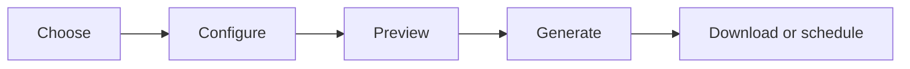

## Reports Overview

The Reports module helps you convert fleet activity into structured information that can be reviewed, downloaded, shared, and scheduled.

You can use ready-made reports for common operational requirements, or build a custom report using selected data, columns, filters, grouping, and totals.

### Why teams use reports

Live tracking answers *where is the vehicle right now*. Reports answer the harder questions - the ones that come up in a Monday review, a customer dispute, or a fuel-cost conversation.

| The question                                | The report that answers it                                    |
|---------------------------------------------|---------------------------------------------------------------|
| How much did we actually run last month?    | [Summary](#summary-report)                                    |
| Why is this route always late?              | [Trip](#trip-report) + [Stop and Idle](#stop-and-idle-report) |
| Which drivers are braking hard, and where?  | [Events](#events-report)                                      |
| The customer says we never arrived. Did we? | [Positions](#positions-report)                                |
| How much time are we burning at idle?       | [Stop and Idle](#stop-and-idle-report)                        |
| How many incidents this quarter?            | [Incident Summary](#incident-summary-report)                  |

*Typical questions Reports is used to settle.*

### Standard vs custom reports

|                 | Standard report                                          | Custom report                                                   |
|-----------------|----------------------------------------------------------|-----------------------------------------------------------------|
| **What it is**  | A ready-made report with sensible columns already chosen | A report you assemble from one or more base reports             |
| **Best for**    | The common question, asked often                         | The specific question nobody built a report for                 |
| **You choose**  | Assets and date range                                    | Base reports, assets, dates, columns, filters, grouping, totals |
| **Time to run** | A minute                                                 | Five to fifteen, the first time                                 |
| **Where**       | Web and mobile                                           | Built on web. Saved templates can be *run* from mobile.         |

### Generated vs scheduled

A **generated report** is a file. You asked for it, it was produced, and it now sits in your reports list until it expires. A **scheduled report** is a standing instruction - run this configuration every Monday at 07:00 and email it to these three people. The schedule produces generated reports; it is not one itself.

> **Note:** Deleting a schedule does not delete the reports it already produced. Those files stay until their own retention window ends.

### The report journey

### Where Reports is available

| Capability                                       | Web | Mobile |
|--------------------------------------------------|-----|--------|
| Create or edit a custom report                   | Yes | No     |
| Configure columns, filters, grouping, and totals | Yes | No     |
| Run a saved report template                      | Yes | Yes    |
| Apply runtime filters                            | Yes | Yes    |
| Monitor generation status                        | Yes | Yes    |
| Download or share a generated report             | Yes | Yes    |
| Create or edit a schedule                        | Yes | No     |
| View schedule status                             | Yes | Yes    |

### Recommended reading path

1.  ##### Understand the module

    You are here.

2.  ##### Choose the correct report type

    [Report catalogue](#report-catalogue) and the [decision table](#choosing-the-correct-report).

3.  ##### Generate a basic report

    [Quick start](#reports-quick-start).

4.  ##### Create a custom report

    [Custom report builder](#build-a-custom-report), once you understand [hierarchy](#report-hierarchy-and-compatibility).

5.  ##### Configure columns, filters, grouping, totals

    [Columns](#selecting-and-managing-columns), [Filters](#filters-and-date-ranges), [Grouping](#grouping-and-aggregation).

6.  ##### Preview and generate

    [Generating a report](#generating-a-report).

7.  ##### Save or schedule

    [Templates](#saved-reports-and-templates), [Schedules](#scheduling-reports).

8.  ##### Download, share, or use on mobile

    [Reports on mobile](#reports-on-mobile).

9.  ##### Fix what went wrong

    [Troubleshooting](#troubleshooting).

------------------------------------------------------------------------

