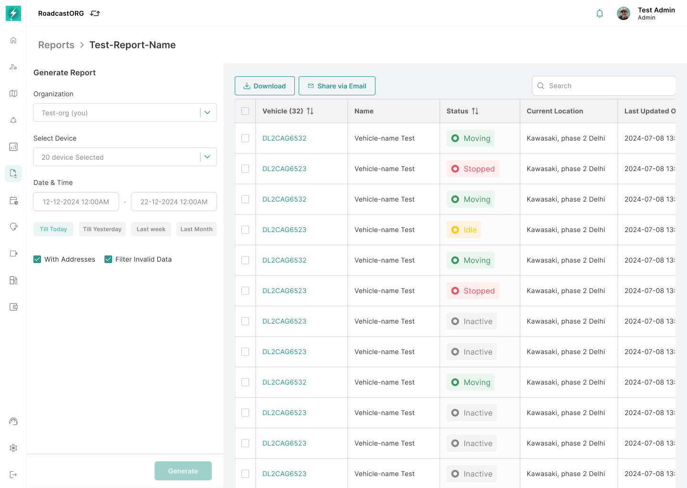
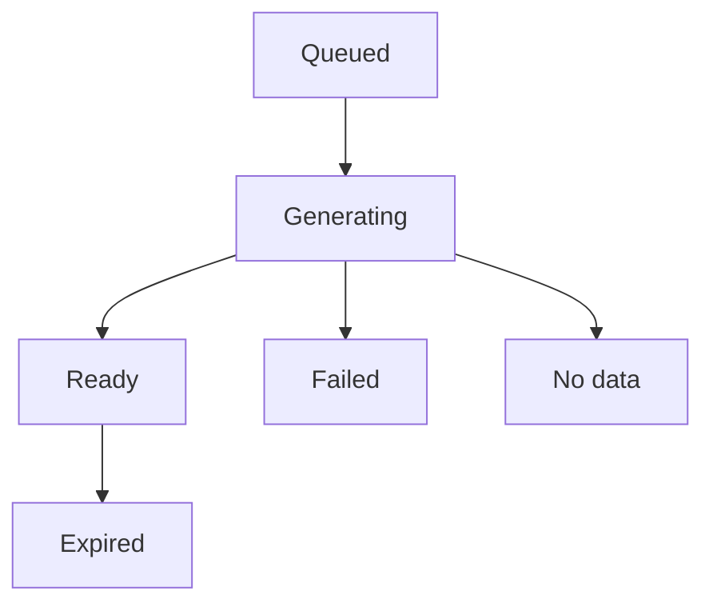

## Generating a Report

What happens after you press Generate, what each status means, and what to do about it.

### How generation works

<figure><figcaption></figcaption></figure>

*A generated report with status, filters, download actions, and the resulting data table.*

1.  ##### Your configuration is validated

    Missing base report, missing asset, missing identifying column - caught here, before anything runs.

2.  ##### The request is queued

    Your report joins the queue. Large reports wait behind others.

3.  ##### Progress is shown

    The status moves to Generating. You can leave the page.

4.  ##### Generation completes

    Status becomes Ready.

5.  ##### The file becomes available

    Download it, or share it. Until it expires.

> **Tip:** You do not have to wait on the page. Reports keep generating in the background - come back to the reports list later.

### Report statuses

| Status         | What it means                         | Action needed?                         | Available actions                              |
|----------------|---------------------------------------|----------------------------------------|------------------------------------------------|
| **Queued**     | Accepted, waiting to run.             | No - wait.                             | Cancel if supported                            |
| **Generating** | Running now.                          | No - wait.                             | Cancel if supported                            |
| **Ready**      | Done. File available.                 | Yes - download it.                     | Download, Share, Regenerate                    |
| **Failed**     | Could not be generated.               | Yes - review and retry.                | Try again, Edit configuration, Contact support |
| **No data**    | Ran fine. Nothing matched.            | Yes - widen the configuration.         | Edit configuration, Change date range          |
| **Expired**    | Past its retention window. File gone. | Yes - regenerate if you still need it. | Regenerate                                     |
| **Cancelled**  | Stopped before completion.            | Optional.                              | Regenerate                                     |

> **Needs product confirmation:** Whether a queued or generating report can be cancelled, and the exact retention window before Expired, are not stated in the supplied material.

### Status messages

> **Queued:** Your report is queued. It will start shortly.

> **Generating:** Generating your report. You can leave this page - we'll keep working.

> **Ready:** Report ready. Download it or share it with your team.

> **Failed:** The report could not be generated. Review your selected filters and try again. If the issue continues, contact Roadcast Support.

> **No data:** No data matched this configuration. Widen the date range, check the selected vehicles, or remove a filter.

> **Expired:** This report has expired and is no longer available to download. Generate it again with the same configuration.

### Downloading and sharing

A Ready report can be downloaded as often as you like until it expires. Sharing sends the generated file rather than the configuration - the recipient gets the numbers, not the ability to rerun it.

> **Download expired:** This download link has expired. Generate the report again to get a fresh file.

> **Warning:** Downloading takes longer than expected? A Positions report over a wide date range is a very large file. Narrow the range.

------------------------------------------------------------------------

