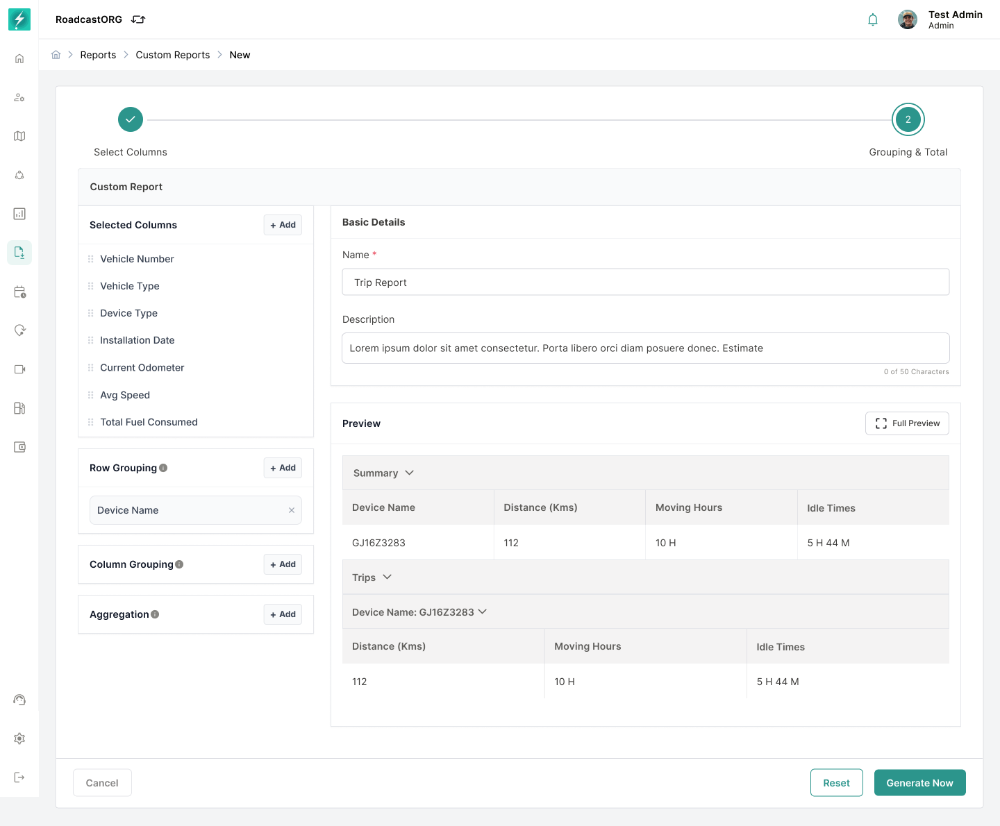
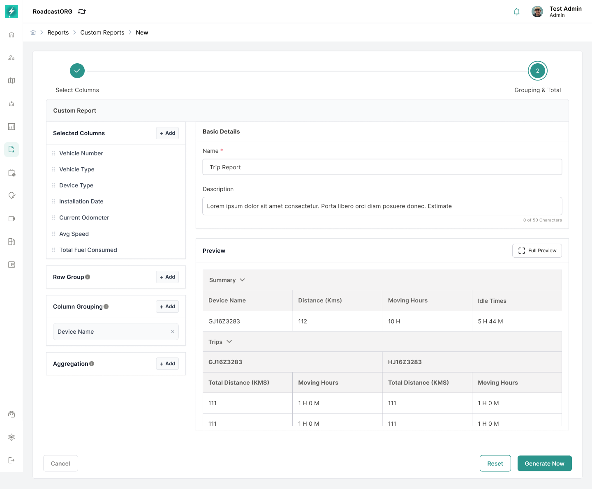

## Grouping and Aggregation

Grouping decides how rows cluster. Aggregation decides what the numbers at the bottom mean.

### Grouping

<figure><figcaption></figcaption></figure>

*Configure row grouping to organize records by a selected dimension.*

Without grouping you get a flat list, newest first. With grouping, related rows sit together and you can total each cluster.

| Group by       | What you get                                                    | Good for               |
|----------------|-----------------------------------------------------------------|------------------------|
| **Vehicle**    | All trips for MH12-AB-1234, then all trips for the next vehicle | Comparing vehicles     |
| **Driver**     | All idle records for one driver together                        | Coaching conversations |
| **Date**       | Every result from Monday, then Tuesday                          | Spotting a bad day     |
| **Event type** | All harsh braking, then all overspeed                           | Behaviour reviews      |

> **Tip:** Group by the thing you want to compare. If the question is "which vehicle is worst", group by vehicle and read the subtotals.

### Aggregation

<figure><figcaption></figcaption></figure>

*Configure column grouping when the comparison needs values arranged across columns.*

| Function    | Answers                                     |
|-------------|---------------------------------------------|
| **Count**   | How many? (trips, events, stops)            |
| **Sum**     | How much in total? (distance, idle minutes) |
| **Average** | What is typical? (average trip length)      |
| **Minimum** | What is the smallest value in the group?    |
| **Maximum** | What is the largest? (top speed recorded)   |

### Subtotals and grand total

|                | Row grouping                   | Column grouping                | Subtotal                 | Grand total                     |
|----------------|--------------------------------|--------------------------------|--------------------------|---------------------------------|
| **What it is** | Rows cluster by a chosen field | Values arranged across columns | A total per group        | A total across the whole report |
| **Appears**    | Throughout the table           | In the header                  | At the end of each group | At the foot of the report       |

> **Important:** Grand total is off by default. Turn it on if you want a figure for the whole report, not just per group.

> **Warning:** Averaging an average is not an average. If you group by vehicle and average trip distance per vehicle, the grand-total row is the average of those averages - not the fleet average trip distance. Sum the distance and sum the trips instead.

------------------------------------------------------------------------

