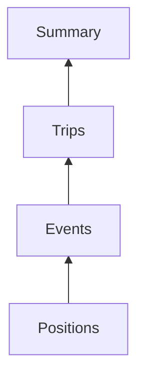

## How Reports Works

One idea underpins the entire Reports module. Understand it and every rule, restriction and error message stops feeling arbitrary.

### The one idea

Your vehicles are constantly sending one thing: **position pings**. A coordinate, a speed, a timestamp, every few seconds. That is all the hardware produces. Everything else in BOLT is built by interpreting those pings.

Read that diagram from the bottom:

- The device sends **positions**.
- BOLT notices a hard deceleration between two pings and calls it an **event**.
- BOLT notices the vehicle moved, then stopped for a long time, and calls that span a **trip**.
- BOLT adds all the trips for a day together and calls it a **summary**.

> **Important:** Every report is the same data, at a different zoom level. Summary is not a different dataset from Positions - it is the same dataset, viewed from further away. This single fact explains the hierarchy, the combination rules, the file sizes, and why some reports refuse to sit together.

### Why the hierarchy exists

Because a summary *contains* trips, and a trip *contains* events, and an event *sits at* a position, the four levels nest naturally:

When you combine reports, BOLT nests them in that order - the highest one you selected becomes the **primary** and organises everything else. You cannot nest a summary inside a trip, because that is not how the data is shaped. That is the whole rule.

### Why file size explodes as you go down

One vehicle. One day. The same day, seen at each level:

| Level     | Rows       | Why                                |
|-----------|------------|------------------------------------|
| Summary   | **1**      | The whole day, added up.           |
| Trip      | **6**      | One per journey.                   |
| Events    | **23**     | One per flagged behaviour.         |
| Positions | **~8,600** | A ping every few seconds, all day. |

> **Warning:** This is why a Positions report over a month, across thirty vehicles, fails. It is not a bug - you asked for roughly 7.7 million rows. Ask the question at the highest level that can answer it.

### The rule for choosing

> **Tip:** Start high. Go lower only when the higher level cannot answer you. Summary says vehicle 12 has four hours of idle. Then go to Stop and Idle to see where. Then go to Positions only if someone disputes it. Three reports, each one narrower than the last, each one prompted by a question the previous one raised.

Most people run reports that are far more detailed than the question requires, wait a long time, and then read the first summary row. Ask at the right zoom level and the answer arrives in seconds.

### Then what?

##### [See all 8 reports](#report-catalogue)

What each one shows and when to reach for it.

##### [Hierarchy & rules](#report-hierarchy-and-compatibility)

The combination rules, with an explorer you can click.

##### [Run one now](#reports-quick-start)

Five minutes, start to finish.

------------------------------------------------------------------------

