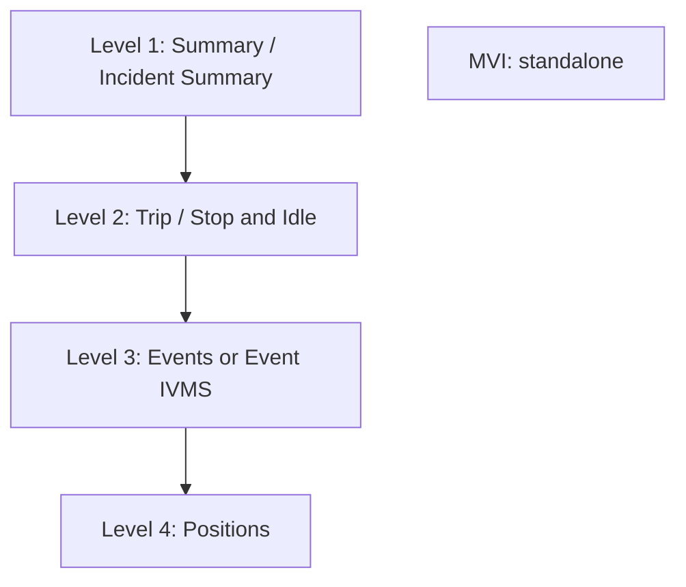

## Report Hierarchy and Compatibility

Reports sit at levels. Understand the levels and every combination rule in BOLT stops feeling arbitrary.

### The four levels

Higher-level reports give you broader information. Lower-level reports give you more detailed records. A Summary row can contain many trips; a trip can contain many events; an event sits at a single position.

### The highest report you pick becomes the primary

When you select more than one base report, BOLT uses the highest selected level to organise the result. That report is the **primary**. Everything else nests underneath it.

| You select                          | Primary | What the output looks like                            |
|-------------------------------------|---------|-------------------------------------------------------|
| Summary + Trip                      | Summary | Trip records grouped under summary-level information. |
| Trip + Events                       | Trip    | Events shown against the trip they belong to.         |
| Trip + Positions                    | Trip    | Detailed position data attached to each trip.         |
| Summary + Trip + Events + Positions | Summary | Four levels, nested top to bottom.                    |

### Companion reports

| Report                      | Sits at | Behaves like                                          |
|-----------------------------|---------|-------------------------------------------------------|
| **Incident Summary**        | Level 1 | A companion to Summary - same level, added alongside. |
| **Stop and Idle**           | Level 2 | A companion to Trip - same level, added alongside.    |
| **Events** / **Event IVMS** | Level 3 | Two formats of the same level. Pick one.              |
| **MVI**                     | \-      | Standalone. Never combines.                           |

### The four-report limit

- You can select up to **four base reports** in one custom report.
- The selection must read from a higher level down to a lower one.
- Only one primary report per hierarchy level.
- Select **MVI** and the limit drops to one - MVI has to be generated on its own.

### Combinations that work

<figure><figcaption></figcaption></figure>

*A custom report using more than one compatible base report.*

These are examples, not an exhaustive list.

| Combination                         | Primary    | Reads as                                  |
|-------------------------------------|------------|-------------------------------------------|
| Summary + Trip                      | Summary    | Trips under each summary                  |
| Summary + Incident Summary          | Summary    | Incident totals beside summary totals     |
| Summary + Trip + Events             | Summary    | Events under trips, trips under summaries |
| Summary + Trip + Event IVMS         | Summary    | As above, IVMS format                     |
| Summary + Trip + Events + Positions | Summary    | All four levels - large output            |
| Trip + Stop and Idle                | Trip       | Every stop inside each trip               |
| Trip + Positions                    | Trip       | GPS trace per trip                        |
| Trip + Stop and Idle + Positions    | Trip       | Stops and raw trace per trip              |
| Events + Positions                  | Events     | Where each event happened                 |
| Event IVMS + Positions              | Event IVMS | As above, IVMS format                     |

### Combinations that don't work

| You cannot combine                | Because                                           | Do this instead                             |
|-----------------------------------|---------------------------------------------------|---------------------------------------------|
| Events / Event IVMS Incidents     | These reports use incompatible record structures. | Generate them as two separate reports.      |
| MVI anything                      | MVI must be generated independently.              | Run MVI on its own.                         |
| Stop and Idle Events / Event IVMS | Incompatible record structures.                   | Run Stop and Idle, then Events, separately. |
| Stop and Idle Incidents           | Incompatible record structures.                   | Two reports, generated separately.          |

These four restrictions are confirmed.

> **Conflict message:** Events cannot be combined with Incidents. Remove Incidents to continue with Events.

> **Replace confirmation:** Selecting Events will remove Incidents from this report. Do you want to continue?

> **Note:** Where a combination is not allowed, the option is disabled in the builder rather than failing at generation. You will not get a surprise error twenty minutes into a run.

### Check compatibility before building

Use the allowed and blocked combination tables above before selecting multiple base reports. In the builder, incompatible reports are disabled automatically.

------------------------------------------------------------------------

