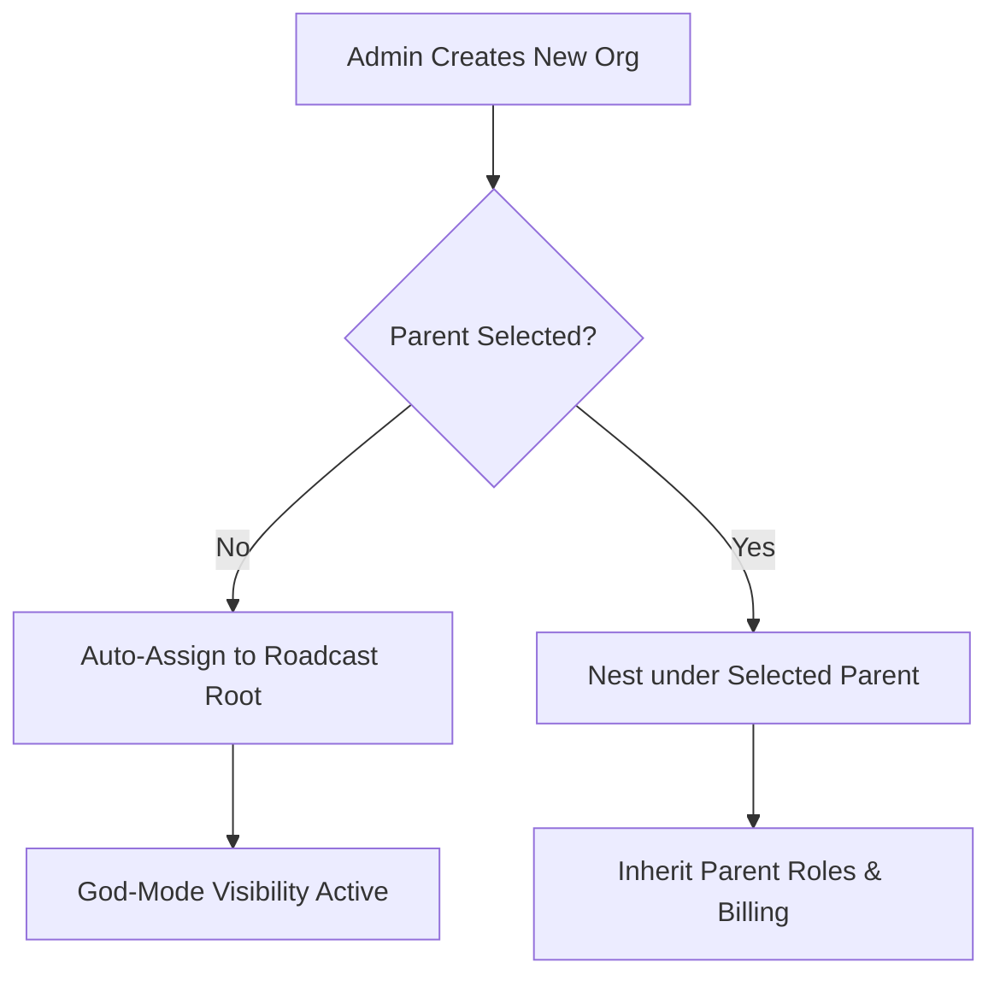

# Core Operational Logic & Expected Behaviors

#### Financial & Billing Scenarios (Case 9.1)

The system manages funds differently based on the organization's billing configuration.

<table data-header-hidden><thead><tr><th></th><th width="143"></th><th></th><th></th></tr></thead><tbody><tr><td>Scenario</td><td>Mode</td><td>Expected Behavior</td><td>Financial Impact</td></tr><tr><td><strong>Purchase with 0 local balance</strong></td><td>Centralized</td><td><strong>Success:</strong> The system automatically identifies the Parent Wallet and deducts funds.</td><td>Parent Org is charged.</td></tr><tr><td><strong>Purchase with 0 local balance</strong></td><td>Decentralized</td><td><strong>Failure:</strong> The transaction is blocked instantly.</td><td>No charge; user must recharge.</td></tr><tr><td><strong>Add-on activation</strong></td><td>Either</td><td>The system verifies the wallet type before initiating the Razorpay handshake.</td><td>Depends on wallet mapping.</td></tr></tbody></table>

#### Hierarchy & Permissions Scenarios (Case 9.2)

Bolt V2 uses a "Safety Net" logic for organization management to ensure no data is ever lost or orphaned.

**Organization Assignment Flow**

* **Direct URL Access Case:** If a standard user attempts to bypass the navigation menu by typing a restricted URL (e.g., `/admin/device-models`), the frontend interceptor checks the **RBAC Store**. Since the permission is missing, the system kills the request and displays a **403 Forbidden** screen.

#### Security & Session Scenarios (Case 9.3)

Security protocols are hard-coded to prioritize data integrity over active sessions.

**The Suspension Flow:**

1. **Trigger:** An Admin marks a user (e.g., a Driver) as **Suspended**.
2. **Logic:** The system updates the `SessionVersion` in the central database.
3. **Action:** The user's current JWT (JSON Web Token) is invalidated.
4. **Result:**
   * **Normal Case:** The user is kicked to the login screen on their next click.
   * **On-Trip Case:** The Driver App terminates the session immediately. The vehicle's active trip is handed over to the **TripHub** for supervisor management to prevent "Ghost Trips."

#### Forensic Audit Pattern

To maintain enterprise accountability, every sensitive action in the system is logged using a standardized forensic string. This allows for deep auditing during security reviews.

**Standard Log Format:** `User [ID] performed [ACTION] on Target [ID] at [TIMESTAMP]`

**Impersonation Note:** If an action is performed while an Admin is "Logged in as" a client, the log is appended with the `[PERFORMED_BY_IMPERSONATOR]` tag. This ensures that client-side changes can be traced back to administrative intervention.

#### Enterprise Readiness & Success Criteria

For large-scale enterprise deployments, the following scenarios must be validated to confirm a successful setup.

<table data-header-hidden><thead><tr><th width="189"></th><th width="239"></th><th></th></tr></thead><tbody><tr><td>Validation Area</td><td>Success Scenario (Test Case)</td><td>Expected System State</td></tr><tr><td><strong>Onboarding</strong></td><td>Full Enterprise Client Creation</td><td>Admin can successfully create an Org, map Users, and assign Roles in one sequence.</td></tr><tr><td><strong>Financial API</strong></td><td>Automated Billing Handshake</td><td>Centralized/Decentralized flows function without manual backend intervention.</td></tr><tr><td><strong>Security API</strong></td><td>Real-time Blacklisting</td><td>Suspended users cannot make ANY API calls, even if their token has not physically expired.</td></tr><tr><td><strong>Data Continuity</strong></td><td>TripHub Handover</td><td>Active trips continue logging data to the backend even if the driver's frontend session is killed.</td></tr></tbody></table>

**Enterprise Note:** These criteria ensure that Bolt V2 can be handed over to a client as a "Ready-to-Use" environment. If any of these scenarios fail, the system is not considered enterprise-ready.
