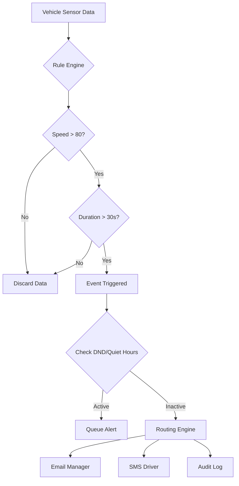

# Advanced Notifications

The **Advanced Notification System** in Bolt V2 is a premium, rule-driven engine that goes beyond simple alerts. It allows Fleet Managers to configure precise, condition-based policies (e.g., "Alert me only if speeding persists for >30 seconds" or "Notify me of Harsh Braking only during Night Shifts").

This system is designed to reduce "Alert Fatigue" by ensuring you only receive notifications for meaningful operational violations.

#### 1. Creating a New Rule

All notifications are managed via a centralized Wizard.

1. Navigate to **Management Hub > Notification Manager**.
2. Click **"Create Notification"**.
3. Select **"Advanced Notification"** to launch the Rule Wizard.

The Wizard is divided into three logical steps: **Event Rules**, **Devices**, and **Notifications**.

<figure><figcaption></figcaption></figure>

#### 2. Step 1: Event Rules Configuration

This is the "Brain" of your notification. Here you define _what_ triggers the alert.

**2.1 Basic Configuration**

* **Event Type Source:** Select the primary trigger (e.g., Overspeeding, Geofence Entry, Power Cut, Harsh Acceleration).
* **Priority:** Assign a severity level (Low, Normal, High, Critical). Critical alerts can bypass "Do Not Disturb" settings on mobile apps.
* **Repeat Delay:** Define how often the alert should re-trigger if the condition persists (e.g., "Don't repeat for 300 seconds").

**2.2 Advanced Conditions (The Filter)**

Instead of alerting on _every_ spike, adding "Advanced Conditions" allows you to filter out noise.

**Common Use Cases:**

* **Duration-Based:** "Speed > 80km/h" **AND** "Duration > 30 seconds." (Ignores momentary overtaking).
* **Value-Based:** "Power Cut" **AND** "Voltage < 11.5V." (Ignores minor fluctuations).
* **Time-Based:** "Geofence Entry" **AND** "Time is between 10:00 PM - 5:00 AM." (Night shift security).

<figure><figcaption></figcaption></figure>

<figure><figcaption></figcaption></figure>

#### 3. Step 2: Target Devices

This step defines _who_ (which vehicles) the rule applies to.

* **Granular Selection:** You can select entire **Device Groups** (e.g., "North Region Trucks") or individual assets.
* **Filtering:** Use the sidebar to filter by Device Type (GPS, Dashcam, Fuel Sensor) or Status (Active/Inactive).
* **Summary:** The footer displays a "Selection Summary" (e.g., "Rule applies to 45 Devices").

<figure><figcaption></figcaption></figure>

#### 4. Step 3: Routing & Recipient Logic

This step defines _where_ the alert goes when triggered. Unlike simple systems, Bolt V2 allows "Multi-Channel Routing."

**4.1 Routing Rules**

You can add multiple rules for a single alert:

1. **Rule A (Operations):** Send an **In-App Notification** to the "Dispatcher Group" immediately (24x7).
2. **Rule B (Management):** Send an **Email Digest** to the "Fleet Manager" only if the priority is "Critical."
3. **Rule C (Driver):** Send an **SMS** to the driver's registered mobile number immediately.

**4.2 Global Policies**

* **Quiet Hours (DND):** Configure a global "Silence Window" (e.g., weekends) where non-critical alerts are suppressed or queued.
* **Deduplication:** The system automatically merges identical alerts that occur within a short window (e.g., 1 minute) to prevent spamming your inbox.

<figure><figcaption></figcaption></figure>

#### 5. Managing & Simulating Rules

Once created, rules appear in the **Notification Manager** list.

* **Toggle Status:** You can instantly Pause/Resume a rule using the toggle switch without deleting it.
* **Edit:** Rules remain fully editable. Adding a new condition to an existing rule applies it to all linked devices immediately.
* **Simulation (Preview):** Before enabling a strict rule, use the "Test" or "Preview" function (if available) to see how many alerts _would_ have been generated yesterday based on historical data.

#### 6. Logic Flow: From Sensor to SMS

#### 7. Troubleshooting

| Issue                     | Likely Cause      | Solution                                                                               |
| ------------------------- | ----------------- | -------------------------------------------------------------------------------------- |
| **Alerts not arriving**   | DND / Quiet Hours | Check if the event occurred during a configured "Quiet Hour" window.                   |
| **Too many alerts**       | Threshold too low | Increase the "Duration" or "Value" threshold in Step 1 to filter out minor violations. |
| **"No Rules Configured"** | Draft State       | You may have saved the wizard as a Draft without clicking "Finish & Apply."            |
