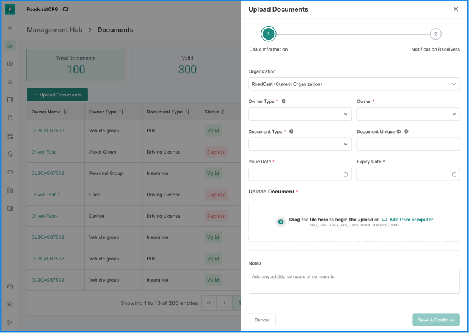
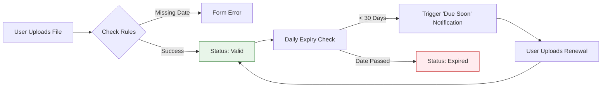

# Documents Management System

The **Documents Management System (DMS)** is a centralized vault within the Management Hub. It allows Fleet Owners and Operations Managers to securely store, track, and share critical compliance files—ranging from Driver Licenses and Insurance Policies to vehicle Maintenance Records.

By digitizing these assets, Bolt V2 automatically calculates expiry dates and triggers renewal alerts, ensuring your fleet never faces downtime due to missing paperwork.

#### 1. Document Categories

To keep your digital filing cabinet organized, documents are classified by their "Owner Type."

| Owner Category     | Description                                                                                                             | Examples                                                       | Expiry Logic                                    |
| ------------------ | ----------------------------------------------------------------------------------------------------------------------- | -------------------------------------------------------------- | ----------------------------------------------- |
| **User (Driver)**  | Personal documents tied to a specific individual. These travel with the person, regardless of which vehicle they drive. | Driving License, Health Card, Background Check.                | **Mandatory** (e.g., License expiry).           |
| **Vehicle Group**  | Legal compliance documents tied to the vehicle chassis.                                                                 | Insurance, RC (Registration), PUC (Pollution), Permits.        | **Mandatory** for compliance docs.              |
| **Asset Group**    | Service and repair logs for hardware or heavy machinery.                                                                | Oil Change Receipt, Battery Replacement Log, Brake Inspection. | **Optional/None** (treated as historical logs). |
| **Personal Group** | Private documents for record-keeping that don't impact fleet operations.                                                | Personal ID Proofs, Private Insurance.                         | **Optional**.                                   |
| **Devices**        | Tech-specific paperwork for GPS units or sensors.                                                                       | Warranty Card, Calibration Certificate.                        | **Optional**.                                   |

> **Pro Tip:** Service records (Asset Group) typically do not expire. Use them to build a "Resale Value" profile for your vehicles by documenting every repair.

#### 2. Uploading a New Document

Adding a document is a streamlined 2-step process designed to ensure data accuracy.

1. Navigate to **Management Hub > Documents**.
2. Click the **"Add Documents"** button.

**Step 1: Basic Information**

* **Owner Type:** Select who this document belongs to (e.g., "Vehicle").
* **Owner Name:** Search and select the specific vehicle (e.g., "Truck-101").
* **Document Type:** Choose from the standardized list (e.g., "National Permit").
* **Dates:** Enter the **Issue Date** and **Expiry Date**.
  * _Note:_ If you select a non-expiring type (like an Oil Change), the Expiry Date field will automatically disable.
* **File Upload:** Drag and drop your file (PDF, JPG, PNG). Max size is 20MB.

**Step 2: Notification Receivers**

Who should be alerted when this document is about to expire?

* Select specific **Users** (e.g., the Fleet Manager).
* Choose channels: **Email, SMS,** or **Push Notification**.

<figure><figcaption></figcaption></figure>

#### 3. Monitoring Compliance & Expiry

The main **Documents Dashboard** acts as your compliance control tower.

**3.1 Status Indicators**

The system automatically tags every document based on today's date:

* 🟢 **Valid:** Document is active and compliant.
* 🟠 **Due Soon:** Expiry is within the next 30 days. Renewal is recommended.
* 🔴 **Expired:** The date has passed. Immediate action required.

**3.2 Filtering & Folders**

* **Table View:** Good for sorting by "Due In" days to prioritize renewals.
* **Folder View:** Groups documents visually (e.g., a "Permits" folder containing all vehicle permits).

<figure><figcaption></figcaption></figure>

#### 4. Document Actions: Share & Edit

You no longer need to download files to email them.

* **Secure Share:** Click the **Share** action to generate a temporary, time-bound link. Send this link to auditors or authorities. The link expires automatically, protecting your data.
* **Edit:** Update metadata (like a wrong Issue Date) without needing to re-upload the file.
* **Download:** Retrieve the original file for printing.

<figure><figcaption></figcaption></figure>

#### 5. Document Lifecycle Logic

The following diagram illustrates how Bolt V2 manages the life of a compliance document.

#### 6. Troubleshooting

| Issue                      | Likely Cause   | Solution                                                                                |
| -------------------------- | -------------- | --------------------------------------------------------------------------------------- |
| **"Expiry Date Required"** | Legal Document | You selected a compliance document (like Insurance) which legally requires an end date. |
| **Cannot find Vehicle**    | Owner Type     | Ensure you selected "Vehicle Group" as the Owner Type, not "User" or "Asset."           |
| **File Upload Failed**     | Format/Size    | Check that your file is under 20MB and is a supported format (PDF/Image).               |
