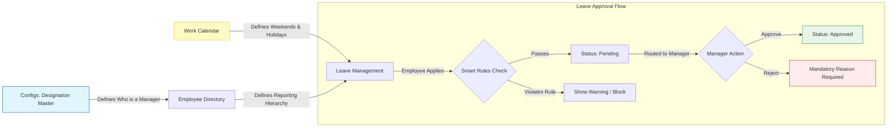

# Employee Management System (EMS)

The **Employee Management System (EMS)** is a comprehensive, rule-driven add-on module designed to centralize your workforce operations. It connects employee records, working calendars, and leave policies into a single automated workflow.

> **Availability Note:** EMS is a premium add-on. Access to this module is controlled via organization-level entitlements. If your organization has not purchased this add-on, the EMS menu will not be visible.

#### 1. The Dashboard (Command Center)

The EMS Dashboard serves as your landing page and navigational hub. It provides a high-level snapshot of workforce activities and offers quick access to the four core pillars of the system:

* **Employee Directory**
* **Work Calendar**
* **Leave Management**
* **Configs**

#### 2. Configs & Designations (The Foundation)

Before adding employees or managing leaves, you must configure your organization's roles. This is handled in the **Configs > Designation Master**.

* **Defining Managers:** When you create a role (e.g., "Senior Developer" or "Fleet Supervisor"), you must explicitly toggle whether this designation is a **Reporting Manager**.
* **Impact:** Only employees with a "Reporting Manager" designation will be able to see the _Leave Requests_ tab and approve/reject leaves for their subordinates.

#### 3. Employee Directory

The **Employee Directory** is the single source of truth for all staff records, combining personal details, employment dates, and reporting hierarchies.

**3.1 Adding Employees**

You can populate the directory in four ways:

1. **Manual Entry:** A simple 3-step form (Personal Details -> Employment Details -> Shift Assignment).
2. **Bulk Upload:** Import a CSV file for large teams.
3. **Fetch from Org Users:** Import existing dashboard users.
4. **Fetch from Drivers:** Import active fleet drivers.

**3.2 Employee Status Lifecycle**

The system automatically updates an employee's status based on calendar dates:

* **On Probation:** Automatically applied based on the joining date + defined probation period.
* **Active:** Triggers automatically once the probation period is completed.
* **Serving Notice:** Applied when a resignation date is entered into the system.
* **Inactive:** Automatically applied once the employee's "Last Working Day" has passed.

<figure><figcaption></figcaption></figure>

#### 4. Work Calendar

The **Work Calendar** defines the operational schedule (working days, weekends, and holidays) for your organization. This calendar feeds directly into the Leave Management engine.

**4.1 Calendar Setup Rules**

* **One Per Org:** Only one active calendar is allowed per organization.
* **Parent/Child Inheritance:** A Parent Organization can create a calendar and push it to a Child Organization. If this happens, the Child Organization cannot edit or override that calendar.
* **Weekends & Shifts:** You can define alternate weekends (e.g., 1st and 4th Saturday off) and choose your financial year structure.

**4.2 Adding Holidays**

When adding holidays (National, Festival, or Custom), you can specify which **Designations** the holiday applies to, ensuring shift workers and office staff are handled correctly.

<figure><figcaption></figcaption></figure>

<figure><figcaption></figcaption></figure>

#### 5. Leave Management

The Leave Management module is divided into three distinct tabs based on user permissions.

**5.1 Leave Tracker (For All Employees)**

This is the self-service portal where employees can view their available balances and apply for time off.

* **Smart Alerts:** When an employee applies for leave, the system checks the Work Calendar. If they violate a rule (e.g., the "Sandwich Rule" or applying for leave during probation), the system will display a smart warning before submission.

<figure><figcaption></figcaption></figure>

**5.2 Leave Requests (For Managers Only)**

Visible _only_ to users with a "Reporting Manager" designation.

* Managers can view pending requests from their direct reports.
* **Approval/Rejection:** Managers can approve leaves or reject them (which requires a mandatory rejection reason).
* **Automated Requests:** System-generated flags (like weekend deployment or unsanctioned work) will also appear here for manager approval.

<figure><figcaption></figcaption></figure>

**5.3 Leave Types (For Admins)**

This is where HR/Admins define the rules for Casual Leave, Sick Leave, Paid Leave, etc. Each type has its own configuration for carry-forward limits and probation restrictions.

#### 6. EMS Architecture & Process Flow

The EMS is a strictly rule-aware system. The following diagram illustrates how the core configurations control the daily operations.

