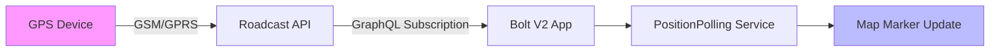

# Real-time Map Navigation

The Live Tracking map is the primary workspace for dispatchers and fleet managers. It provides a real-time, consolidated view of all assets within your selected organization. This guide covers how to navigate the map, switch layers, and interact with vehicle markers.

#### 1. Navigating the Map Workspace

The map workspace is divided into two functional areas: the **Interactive Map** (center) and the **Asset Sidebar** (left).

* **Panning & Zooming:** Use your mouse wheel to zoom in for street-level detail or out for a regional overview. You can click and drag the map to move across different territories.
* **Auto-Fit Bounds:** Clicking the "Global View" icon will automatically adjust the zoom level to fit all active vehicles into a single screen.

<figure><figcaption></figcaption></figure>

#### 2. Map Layers & Data Overlays

Bolt V2 allows you to customize your visual context using the **Layer Selector** located at the bottom-right of the map.

* **Standard View:** A clean, vector-based map optimized for performance and marker clarity.
* **Satellite View:** High-resolution aerial imagery, useful for verifying if a vehicle is parked in a specific bay or off-road.
* **Traffic Overlay:** Real-time Google Traffic data integrated directly onto the map to help you understand delay causes.




<figure><figcaption></figcaption></figure>



<figure><figcaption></figcaption></figure>



#### 3. Finding Assets & Locations

The platform provides two distinct search methods to help you find data quickly.

**3.1 Asset Search (Sidebar)**

Use the search bar at the top of the vehicle list to find a vehicle by its **Plate Number**, **Driver Name**, or **IMEI**. Clicking a result will instantly center the map on that vehicle.

**3.2 Geographic Search (GeoSearch)**

The search bar on the map itself allows you to find addresses or coordinates. This is useful for checking how far a vehicle is from a specific client location.

<figure><figcaption></figcaption></figure>

#### 4. Interacting with Vehicle Markers

Vehicle markers are not just static dots; they are interactive nodes.

1. **Hover:** Hovering over a marker reveals a "Mini-Card" with the Plate Number and current Speed.
2. **Click:** Clicking a marker triggers the **Side Panel Workflow**. According to our UI standard, this detail view slides out from the right, ensuring you never lose your map context.

#### 5. Tracking Data Flow

The following diagram illustrates how the platform ensures you are seeing "Real-Time" data.

#### 6. Common Interaction Shortcuts

| Action               | Control           | Result                                                                               |
| -------------------- | ----------------- | ------------------------------------------------------------------------------------ |
| **Locate Vehicle**   | Click Sidebar Row | Map pans and zooms to the vehicle.                                                   |
| **View Geofences**   | Toggle Fence Icon | Displays defined boundaries on the map.                                              |
| **Measure Distance** | Ruler Tool        | Click two points on the map to see the direct distance.                              |
| **Cluster Toggle**   | Zoom Out          | Markers group together (Clustering) to prevent screen clutter in high-density areas. |

> **Operational Rule:** If a vehicle is moved while you are watching, the marker will move across the map in a smooth animation. This is powered by the **Position Polling Service**, which ensures the UI reflects the most recent GPRS packet received from the hardware.
