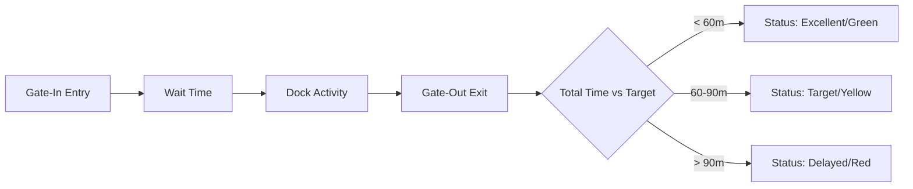

# Reports & Analytics

Reports in Bolt V2 are designed to provide a "Single Source of Truth" for your fleet and facility operations. By combining real-time tracking data with organizational logic, the platform generates high-fidelity insights into driver behavior, fuel efficiency, and warehouse productivity.

#### 1. Generating a Standard Report

Standard reports focus on traditional fleet metrics. All reports are "Organization-Scoped," meaning you will only see data for the workspace you are currently in.

1. Navigate to **Reports**.
2. Select the category of required Report.
3. **Select Asset(s):** Choose individual vehicles or entire "Device Groups" (e.g., North Region Trucks).
4. **Define Timeframe:** Use the date-time picker to select your range.
5. **Run Report:** Click the "Generate" button. The data will appear in a high-performance grid.

#### 2. Specialized Report Modules

Bolt V2 categorizes data into specialized views based on your operational needs.

**2.1 Yard & TAT Reports**

Used primarily for warehouse efficiency.

* **Gate-to-Gate TAT:** Measures the total time from "Gate-In" to "Gate-Out."
* **Dock Escalations:** Highlights vehicles that exceeded their planned loading/unloading time.

**2.2 TripHub & Service Execution (Waste Management)**

Based on the **Execution-First** philosophy, these reports track service integrity.

* **Target Completion Report:** Shows which bins/service points were serviced, skipped, or missed.
* **Exception Log:** A visual gallery of "Bulky Waste" or "Inaccessible" service points, complete with "Before" and "After" photos captured by drivers.

> \[!SCREENSHOT\_MARKER] **Capture Location:** The TripHub detailed execution report (`uploaded:TRIP_HUB_SOLUTION.pdf` logic). **Target:** A row in the report showing a "Skipped" bin with its corresponding Reason Code and GPS timestamp.

**2.3 Financial & Wallet Ledger**

Provides full transparency into your organization's spending.

* **Transaction History:** Logs every license purchase and wallet recharge.
* **Impersonation Audit:** Specifically flags actions performed by an Admin on behalf of a user (Case 9.1).

#### 3. Visualizing Performance: The TAT Gauge

For a high-level summary, the **Analytics Dashboard** features a visual Gauge that calculates your facility's efficiency in real-time.

**Efficiency Calculation Logic:**

> \[!SCREENSHOT\_MARKER] **Capture Location:** The TAT Gauge visualization component (`tat_gauge.html`). **Target:** The half-circle gauge showing the "Avg. Gate-to-Gate" time.

#### 4. Custom Report Builder

If standard reports do not meet your specific needs, the **Custom Report Engine** allows you to build your own data views.

1. **Select Base Entity:** (e.g., Vehicle, Trip, or User).
2. **Choose Columns:** Drag and drop fields like "Max Speed," "Idle Time," or "Fuel Consumed."
3. **Apply Logic:** Filter by specific triggers (e.g., "Only show trips with > 5 stoppages").

<figure><figcaption></figcaption></figure>

#### 5. Exporting & Scheduling

* **Manual Export:** Download any report instantly as a **PDF** (for presentations) or **Excel/CSV** (for deep data analysis).
* **Automated Scheduling:** Configure the system to email the "Daily Efficiency Report" to your supervisor every morning at 8:00 AM.

#### 6. Frequently Asked Questions

**Q: Why is my report showing "No Data Found"?** **A:** Ensure that the vehicles selected were active during the chosen time range. Also, check if the device was in an "Inactive" (Grey) state due to GPRS connectivity issues.

**Q: Can I see reports for a Child Branch from the Parent account?** **A:** Yes. Following **Logic Case 9.2**, a Parent Organization has full visibility into all its sub-nodes. Simply switch your "Organization Context" in the navbar to the desired branch and run the report.
