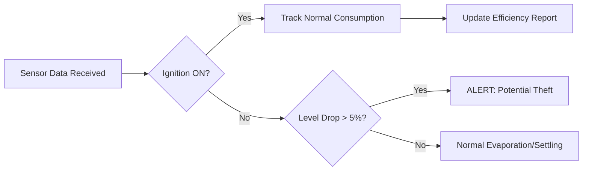

# Fuel Management & Monitoring

The Fuel Management module provides high-precision visibility into your fleet's energy consumption. By integrating specialized hardware sensors with the Bolt V2 logic engine, operators can detect theft, monitor refuels, and optimize fuel efficiency.

#### 1. Real-Time Fuel Monitoring

Fuel data is visualized directly within the **Vehicle Detail Card** on the live map. This interface is driven by the `sensor-card.component` found in the portal's vehicle tracking view.

**1.1 The Sensor Card Interface**

When a vehicle equipped with a fuel sensor is selected, the **Sensor Card** displays real-time telematics:

* **Current Fuel Level:** Rendered as a circular gauge or horizontal progress bar showing the percentage (%) and absolute liters (L) remaining.
* **Fuel Trend:** A real-time sparkline chart that visualizes fluctuations over the last 24 hours. This allows dispatchers to see consumption patterns during trips vs. stationary periods.
* **Consumption Rate:** A calculated metric showing the average fuel spent per 100km, derived from the hardware data and the vehicle's odometer.

> \[!SCREENSHOT\_MARKER] **Capture:** The right-hand slide-out panel (`src/app/portal/maps/components/mapsScreen/components/tabs/vehicles/vehicles-view/components/sensor-card.html`) highlighting the Fuel Level Gauge and Sparkline Trend.

#### 2. Operational Logic: Alerts & Security

The platform uses advanced algorithmic checks (defined in the `Position Polling` and `Notification` services) to distinguish between normal usage and security events.

**2.1 Fuel Theft Detection (PRD Case 9.3)**

* **The Logic:** The system monitors the fuel level while the vehicle ignition is **OFF**. If the level drops by more than the configured threshold (e.g., 5%) while the engine is stationary, it is classified as a potential theft.
* **Result:** A high-priority "Fuel Theft" notification is pushed to the dashboard and SMS recipients, and the event is logged in the **Audit Trail** with a `CRITICAL` tag.

**2.2 Refuel Verification**

* **The Logic:** When a sharp increase in fuel level is detected while the vehicle is at a known POI (Point of Interest) or fuel station, the system logs a "Refuel Event."
* **Validation:** These events include the timestamp and location, allowing managers to verify the refill against physical fuel station receipts.

#### 3. Hardware Calibration & Mastery

For the software to correctly translate hardware voltage signals into liters, a calibration table must be configured.

* **Calibration Mapping:** Managed under **Admin > Master > Device Additional Information**. This screen allows admins to map specific voltage readings from the fuel probe to liter values (e.g., 0.5V = 10L, 4.5V = 100L).
* **Inheritance (PRD Case 9.2):** If a Parent Organization defines a calibration table for a "BharatBenz Heavy Truck" model, all **Child Branches** using that same vehicle model will automatically inherit the calibration logic.

> \[!SCREENSHOT\_MARKER] **Capture:** The **Device Additional Information** management screen (`src/app/admin/master/components/device-additional-information/`) showing the Calibration Table grid.

#### 4. Fuel Analytics & Efficiency

Data from the fuel sensors feeds into the **Analytics Module** to provide long-term insights.

* **Idling Waste:** The system calculates fuel consumed while the vehicle ignition was **ON** but the speed was **0**. This helps identify drivers who keep engines running during breaks.
* **Mileage Integrity:** By comparing fuel consumption against the synced digital odometer, the system identifies vehicles with declining fuel efficiency, indicating a need for maintenance.

#### 5. Logic Flow: Fuel Event Processing

The following diagram explains how the system decides whether to alert you of a fuel change.

#### 6. Troubleshooting Fuel Data

If fuel data appears incorrect, use the diagnostic steps mapped from the `TroubleshootComponent`:

1. **GPRS Status:** Ensure the device is **Active (Green/Yellow)**. If the marker is **Grey**, fuel data is stale.
2. **Analog Input Check:** Open the **Troubleshoot Tool** side-panel. If the "Analog Input" field shows 0V despite the tank being full, the sensor wiring may be compromised.
3. **Sync Odometer:** Ensure the digital odometer is calibrated. Accurate mileage is required for consumption rate calculations.

> **RAG Data Summary:** Bolt V2 manages fuel via hardware sensor cards on the map. It handles theft detection logic (drops while engine is OFF) and relies on calibration tables managed in the Admin Master section.
