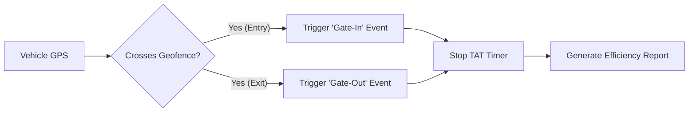

# Geofences & Points of Interest (POI)

A Geofence is a virtual boundary drawn on the map. It acts as a trigger zone for alerts and reporting.

**1.1 Creating a Geofence**

1. Navigate to **Maps > Geofence Tab** (or **Admin > Maps > Geofence** for master management).
2. **Draw the Shape:** Use the drawing tools to create a:
   * **Circle:** Best for simple radius checks (e.g., "Within 1km of HQ").
   * **Polygon:** Best for precise boundaries (e.g., outlining a specific factory yard or parking lot).
   * **Line (Geopath):** Best for route corridors.
3. **Assign Properties:** Give it a name (e.g., "Central Depot") and assign it to a specific **Organization**.

> \[!SCREENSHOT\_MARKER] **Capture Location:** The Geofence creation screen with the Leaflet drawing toolbar active. **Target:** A map showing a "Polygon" being drawn around a building or area.

**1.2 Operational Logic: Alerts**

Once a geofence is active, you can link it to specific rules in the **Notification Manager**.

* **Entry Alert:** "Notify me when _Truck A_ enters _Client Zone B_."
* **Exit Alert:** "Alert Security if _Vehicle X_ leaves the _Parking Yard_ after 10 PM."
* **Speeding in Zone:** "Trigger an alarm if speed > 20km/h inside the _School Zone_."

***

#### 2. Points of Interest (POI)

A POI is a specific landmark pinned to a coordinate. Unlike a geofence which is an "Area," a POI is a "Spot."

**2.1 Managing POIs**

Use POIs to mark key locations that are relevant to your business but don't necessarily need a boundary alert.

* **Common Use Cases:** Fuel Stations, Driver Rest Stops, Customer Offices, Blackspots (Accident Prone Areas).
* **Visual Customization:** You can assign custom icons (e.g., a "Fuel Pump" icon) to make the map easier to read.

> \[!SCREENSHOT\_MARKER] **Capture Location:** The POI list or creation side-panel (`src/app/portal/maps/components/poi`). **Target:** The form showing the "Icon Picker" and "Address Search" fields.

***

#### 3. Difference Between Geofence & POI

| Feature         | Geofence                        | Point of Interest (POI)           |
| --------------- | ------------------------------- | --------------------------------- |
| **Geometry**    | Area (Polygon/Circle)           | Single Point (Pin)                |
| **Primary Use** | Security & Alerts (Entry/Exit)  | Navigation & Reference            |
| **Analytics**   | Used for TAT (Turn-Around Time) | Used for "Nearest Vehicle" search |
| **Visuals**     | Colored Shape on Map            | Icon/Marker on Map                |

> \[!SCREENSHOT\_MARKER] **Capture Location:** The main Map View (`maps-screen.component.html`). **Target:** A view showing both a Polygon Geofence (colored area) and a POI Marker (icon) simultaneously to illustrate the visual difference.

***

#### 4. Advanced Logic: Yard Automation

Geofences are the engine behind the **Yard Management** module.

* **Auto-Gate-In:** When a vehicle crosses the "Gate Geofence," the system automatically creates a "Gate-In" timestamp in the **TripHub**.
* **Dock Association:** You can draw small geofences around individual loading docks (e.g., "Dock 1," "Dock 2"). This allows the system to track exactly _which_ bay a truck is using and for how long.

