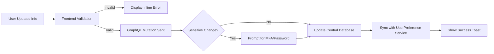

# User Profile & Preferences

Your User Profile is the central hub for managing your identity, security credentials, and personal experience within the Bolt V2 platform. These settings allow you to customize how data is displayed to you across all your accessible organizations.

#### 1. Accessing Your Profile Settings

To manage your account, locate the **User Avatar** or your initials in the top right corner of the application dashboard.

1. Click on the profile icon to open the **User Account Menu**.
2. Select **"Profile"** from the list.
3. You will be directed to the main settings page where your information is categorized into tabs (General, Security, Preferences).

<figure><figcaption></figcaption></figure>

#### 2. Personal Information

The **General** tab contains your primary identity details used for communication and audit logging.

* **Full Name:** How you appear to other members of your organization and in generated reports.
* **Email Address:** Your primary login identifier.
* **Phone Number:** Your mobile contact, which is critical for receiving SMS-based MFA codes and emergency alerts.

<figure><figcaption></figcaption></figure>

#### 3. Security & Authentication

Maintaining the integrity of your fleet data starts with a secure account.

**3.1 Password Updates**

You can change your password at any time. The system requires you to enter your **Current Password** before setting a new one to prevent unauthorized changes.

**3.2 Multi-Factor Authentication (MFA)**

Bolt V2 supports enhanced security via MFA. You can toggle your preferred verification method (Email, SMS, or Authenticator App) from the **Security** tab.

#### 4. Localization & Display Preferences

In the **Preferences** tab, you can tailor the interface to your local operational standards. These settings are tied to your user ID and persist even if you switch organizations.

* **Language:** Switch the entire platform interface between supported languages (e.g., English, Hindi).
* **Measurement Units:** Choose between **Metric** (Kilometers, Liters) and **Imperial** (Miles, Gallons).
* **Timezone:** Set your local timezone to ensure all "Time Since" markers and Report timestamps are accurate to your location.
* **Default Map View:** Set your preferred starting map layer (Standard, Satellite, or Traffic).

<figure><figcaption></figcaption></figure>

#### 5. Profile Management Workflow

The following diagram illustrates how the system handles updates to your profile to ensure data consistency and security.

#### 6. Troubleshooting Profile Issues

| Issue                            | Potential Cause   | Solution                                                             |
| -------------------------------- | ----------------- | -------------------------------------------------------------------- |
| **Cannot edit email**            | Enterprise Policy | In some configurations, only Admins can change user emails.          |
| **Units don't change**           | Session Lag       | Try refreshing the page after saving to force a UI re-calculation.   |
| **Timezone is wrong in reports** | User Override     | Check if your "Preferences" timezone matches your physical location. |

> **Audit Note:** Every change you make to your profile is logged in the system **Audit Trail** (Admin Only). This includes changes to phone numbers and security settings, ensuring a clear chain of accountability.
