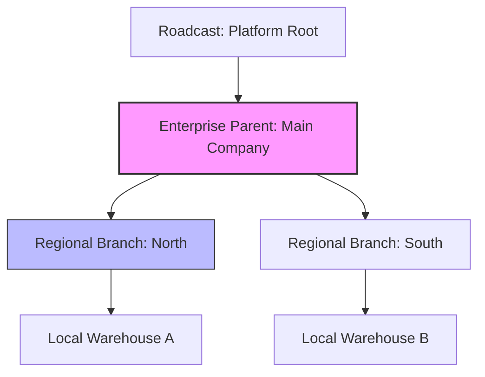
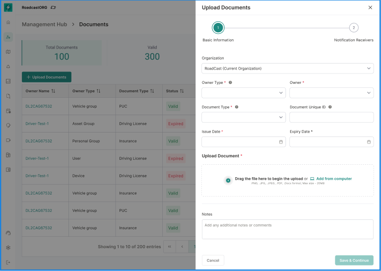

# Workspace & Organization Selection

In Bolt V2, every asset (vehicle, geofence, driver) is owned by an **Organization**, not a user. This documentation explains how to select, search, and switch between different business units within your enterprise hierarchy.

#### 1. Understanding the Organization Hierarchy

Before selecting a workspace, it is important to understand how your data is structured. Bolt V2 uses a "Tree Model" where permissions and configurations flow downward.

**Hierarchy Flow Diagram:**

* **Inheritance:** If your admin sets a "Speeding Alert" at the **Enterprise Parent** level, it is automatically active for all **Regional Branches**.
* **Isolation:** A user assigned to "Regional Branch: North" cannot see vehicles or data from "Regional Branch: South."

#### 2. The Selection Screen (Post-Login)

After you successfully authenticate via your username, password, and MFA (Multi-Factor Authentication), the system will present the **Select Organisation** screen. This screen acts as a gateway to your operational data.

**2.1 Navigating the Workspace Tiles**

If you are a member of multiple organizations, they will appear as interactive tiles. Each tile shows the Organization name and its position in the tree.

<figure><figcaption></figcaption></figure>

**2.2 Using Search for Large Enterprises**

For users with access to hundreds of sub-branches (e.g., Super Admins), use the search bar at the top of the selection screen.

1. Type the name or unique ID of the branch.
2. The list will filter in real-time.
3. Click the tile to enter that specific workspace.

> .png>)

#### 3. Operational Impact of Selection

Once a workspace is selected, the Bolt V2 engine performs a **Contextual Filter**.

* **Filtered State:** Every module you visit (Maps, Reports, Yard Management) will only pull data belonging to the selected `OrgId`.
* **Permission Mapping:** Your "Role" might change between workspaces. You may be an **Admin** in one branch but only a **Viewer** in another.

#### 4. Real-Time Context Switching

You do not need to log out to switch to a different organization. This is handled via the **Contextual Navbar**.

**4.1 How to Switch**

1. Look at the **Top Navigation Bar**.
2. The name of your current active organization is displayed next to the Bolt logo.
3. Click the name to reveal a dropdown list of your other accessible workspaces.
4. Select a new organization; the screen will perform a "Soft Refresh" and update your asset list instantly.

<figure><figcaption></figcaption></figure>

#### 5. Frequently Asked Questions

**Q: Why can't I see any vehicles after selecting an organization?** **A:** Ensure you have selected the correct branch. If the branch is new, hardware may not yet be assigned to it by the Parent Org.

**Q: Can I view two organizations at the same time?** **A:** No. To maintain data integrity and prevent security leaks, the system only allows one active "Org Context" per session. To view two branches, you must open them in separate browser profiles or tabs.

**Q: What is an "Orphaned Organization"?** **A:** According to **Logic Case 9.2**, if an organization is created without a parent, it is automatically docked under the **Roadcast Root**. If you see "Roadcast" as your parent, you are at the highest level of the platform.
