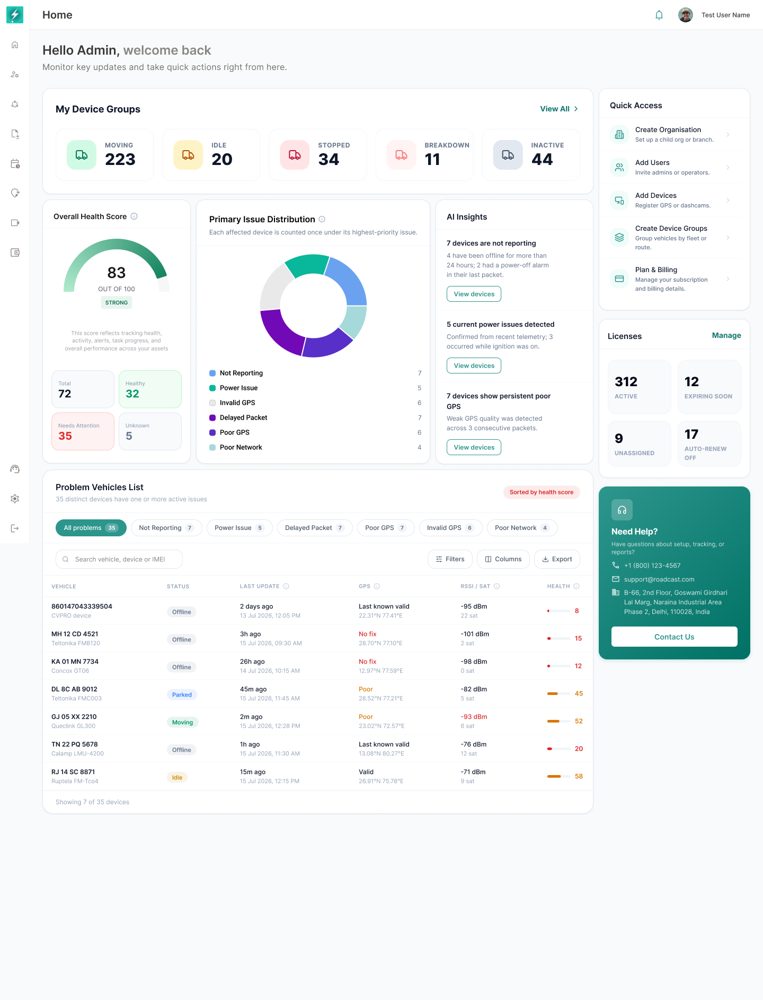

## 11. Completed-Onboarding Experience

*After onboarding is complete, the setup checklist is removed and operational monitoring moves directly below My Device Groups.*

The completed state is shown when all required onboarding tasks satisfy the completion policy.

### 11.1 Composition changes

- Get Started with Bolt is removed.
- Overall Health Score, Primary Issue Distribution, and AI Insights move upward.
- Problem Vehicles follows the health row.
- Quick Access, Licenses, and Need Help remain unchanged.

### 11.2 Completion rule

The onboarding component should be removed only when the configured completion policy is satisfied. The backend must return a resolved onboarding state rather than requiring the client to infer completion from visible data.

The completion policy must define whether:

- All tasks must be completed.
- Skipped tasks count toward removal.
- Organisation-level completion applies to every user.
- Some tasks are user-level and others are organisation-level.

---
