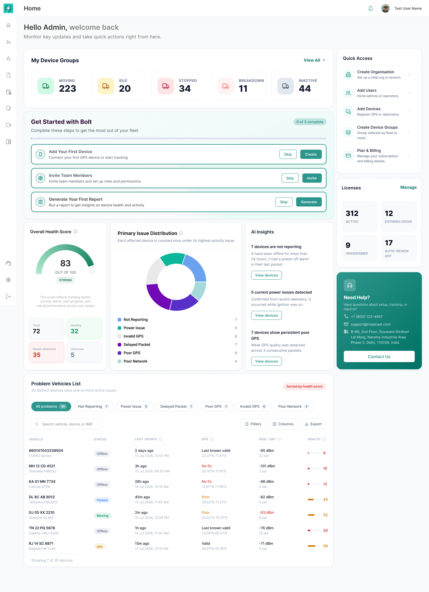

## 10. Existing User with Device Data

*When device data exists, Home combines onboarding progress with operational health and problem-vehicle monitoring.*

This state applies when operational data is available but the setup checklist still remains active.

### 10.1 Visible sections

- My Device Groups.
- Get Started with Bolt.
- Overall Health Score.
- Primary Issue Distribution.
- AI Insights.
- Problem Vehicles List.
- Quick Access.
- Licenses.
- Need Help.

### 10.2 Layout behavior

- Onboarding stays above operational health while it remains incomplete.
- Health cards appear in a three-part row beneath onboarding.
- Problem Vehicles uses the full width of the main column.
- The utility column remains aligned to the top of the page.
- Long tables must not push Quick Access or Licenses into the main content column.

---
