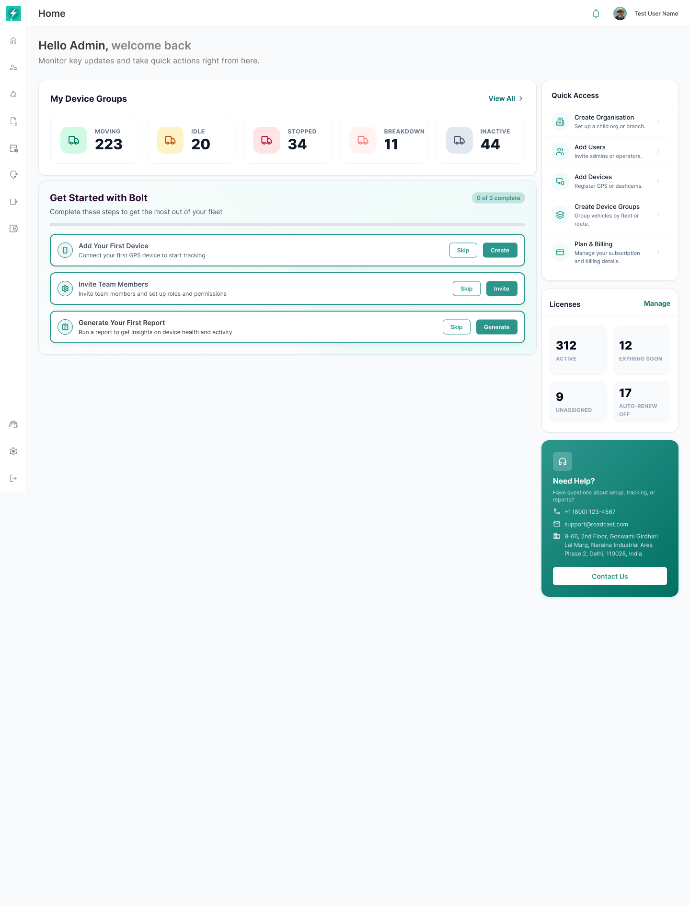

## 9. First-Time User Experience

*The first-time state prioritizes setup while retaining device-group, Quick Access, license, and support visibility.*

The first-time state is shown when core onboarding tasks have not been completed. The approved state displays `0 of 3 complete`.

### 9.1 Visible sections

- My Device Groups.
- Get Started with Bolt.
- Quick Access.
- Licenses.
- Need Help.

Operational health sections are not required to display until relevant device data is available. The empty lower page area must not show false scores or misleading zero-value charts.

### 9.2 First-time behavior

- The checklist must be visually dominant in the main column.
- The progress indicator must reflect stored onboarding state.
- Each task must have a clear primary action.
- A permitted task may also provide Skip.
- Quick Access remains available so experienced administrators are not forced through a linear wizard.
- License and support cards remain visible because they may be needed during setup.

---
