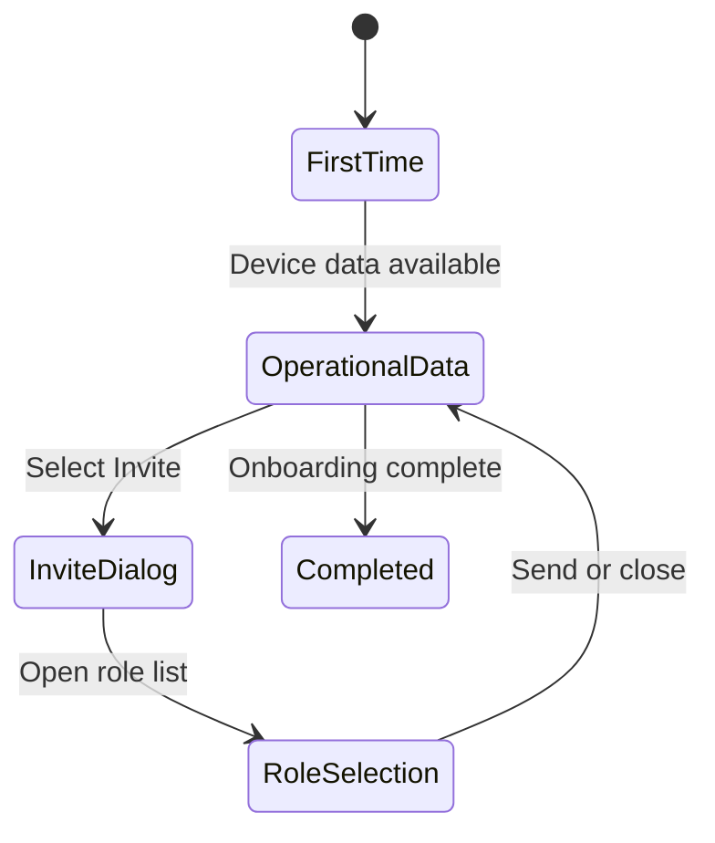

## 8. Home State Model

The visible Home composition depends on onboarding progress, available device data, permissions, and whether an overlay workflow is active.

### 8.1 State precedence

The application should resolve states in the following order:

1. Validate user and organisation context.
2. Load onboarding progress.
3. Load permitted operational summaries.
4. Render the appropriate base Home state.
5. Render an active modal or dropdown above that state.

An overlay must not cause the underlying Home data or scroll position to reset.

### 8.2 State persistence

- Onboarding progress must remain consistent across sessions.
- Completing a task in another module must update Home when the user returns.
- Skipped and completed tasks must remain distinguishable in stored state.
- Closing the Invite Users dialog must return to the same Home state.
- Refreshing during an incomplete invitation must not create duplicate invitations.

---
