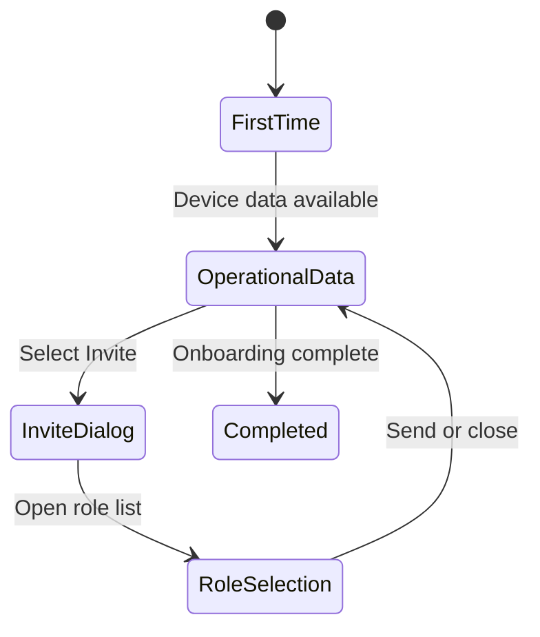
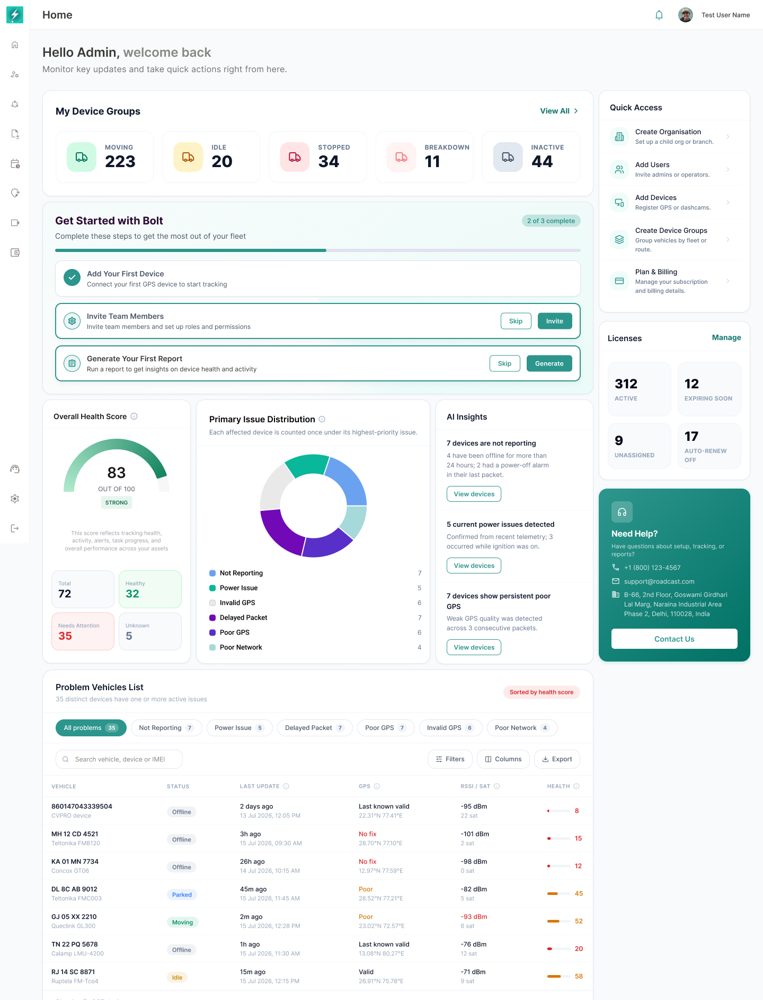
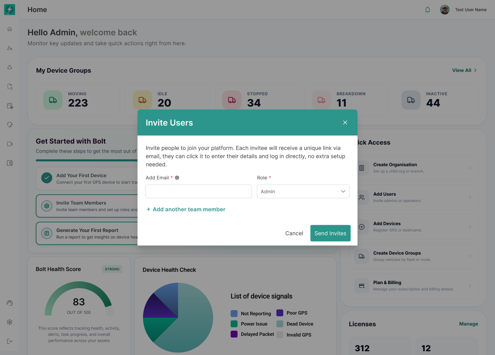

# Bolt Home — Product and Functional Guide

**Version:** 1.1 — Development-ready specification  
**Prepared for:** Roadcast / Bolt  
**Module:** Home  
**Platform:** Bolt Web  
**Status:** Ready for product, engineering, and QA alignment  
**Last updated:** 24 July 2026

---

## 1. Overview

Home is the default landing page for Bolt users after login. It gives users an immediate view of fleet status, device health, setup progress, license health, and the actions that need attention.

The page is designed to answer four questions:

- What is the current operating state of my fleet?
- Which devices or vehicles need attention?
- Is my Bolt account fully set up?
- Where should I go next to complete an action?

Home is not a replacement for detailed operational modules. It is a summary and routing layer that helps the user understand the current situation and move into the correct workflow with the right context.

---

## 2. Documentation Scope

This guide covers only the approved **Development Ready Homepage** experience.

The documented implementation states are:

| State | Purpose |
|---|---|
| First-time user | Shows the initial onboarding checklist and the persistent utility cards. |
| User with device data | Adds operational health, issue distribution, insights, and the problem-vehicle table. |
| Invite-user entry | Shows onboarding at `2 of 3 complete` before the invitation action. |
| Invite Users dialog | Captures one or more email addresses and assigns a role. |
| Role dropdown | Allows an existing role to be selected or a new role to be created. |
| Completed onboarding | Removes the setup checklist and prioritizes operational monitoring. |

Draft screens, exploratory components, and flows outside these approved states are not included in this package.

Screenshots are embedded beside the workflows they explain. Every image uses a relative `assets/...` path so this package can be imported into GitBook without external design links.

> **Important:** Example counts, names, dates, coordinates, contact information, and device identifiers shown in screenshots are demonstration data. Production values must come from the selected organisation and the authenticated user's permissions.

---

## 3. Problem Statement

Bolt users currently need information from several modules to understand whether their organisation is operationally healthy. A user may need to check the Map for movement, Devices for connectivity, Reports for activity, Users for setup, and Plan & Billing for license risk.

This creates four problems:

- New customers do not always know which setup task to complete next.
- Operators lack one immediate view of device and tracking health after login.
- Administrators may discover license or reporting issues only after they affect operations.
- Common actions require users to remember where each workflow is located.

Home solves this by combining onboarding guidance, operational health, prioritized exceptions, and direct navigation in one landing page.

---

## 4. Product Goals

### 4.1 User goals

- Understand fleet movement and device-group status immediately after login.
- Complete the essential setup steps without support assistance.
- Identify the devices and vehicles with the lowest health first.
- Understand the primary reason a device needs attention.
- Move from a summary card to the correct detailed module.
- Invite users and assign roles without leaving the onboarding context.
- Review license risks before they interrupt tracking or platform access.
- Contact support from a clear and persistent location.

### 4.2 Business goals

- Reduce time to first value for new Bolt customers.
- Reduce onboarding dependency on implementation and support teams.
- Improve early detection of device, GPS, power, network, and packet issues.
- Increase adoption of Devices, Device Groups, Reports, User Management, and Plan & Billing.
- Create a consistent operational starting point for different user roles.

### 4.3 Engineering goals

- Keep the landing page fast even when an organisation contains a large fleet.
- Load independent widgets without allowing one failed service to block the page.
- Keep onboarding state separate from live operational state.
- Enforce organisation hierarchy and permissions across every metric and action.
- Deep-link to destination modules with relevant filters or entity context.

---

## 5. Scope

### 5.1 In scope

- Bolt web shell, collapsed navigation, page header, and user context.
- Welcome heading and supporting message.
- My Device Groups status summary.
- Get Started with Bolt checklist.
- Onboarding progress and skip behavior.
- Invite Team Members dialog.
- Multiple invitee rows.
- Existing-role selection and Create New Role entry.
- Overall Health Score.
- Health category totals.
- Primary Issue Distribution.
- AI Insights.
- Problem Vehicles List.
- Problem filters, search, columns, and export entry points.
- Quick Access.
- License summary.
- Need Help card.
- Loading, empty, restricted, stale, and error behavior.
- Backend aggregation, navigation, analytics, accessibility, and acceptance criteria.

### 5.2 Out of scope

- Mobile Home redesign.
- User-configurable widget order.
- Custom dashboard builder.
- Editing a device directly inside Home.
- Full device diagnostics inside Home.
- Full report creation and report-builder behavior.
- Full role-creation workflow beyond the entry point in the role dropdown.
- License purchase, renewal, and payment flows.
- AI chat or conversational investigation.
- Detailed module behavior after the user follows a Home deep link.

---

## 6. Users and Permissions

### 6.1 Primary users

- **Organisation Admin:** completes setup, invites users, monitors device health, and manages licenses.
- **Fleet Operator:** reviews operating status, health issues, insights, and problem vehicles.
- **Support or Implementation User:** validates setup and investigates data-quality issues while assisting an organisation.
- **Organisation Owner:** reviews high-level status, subscription risk, and next actions.
- **Roadcast Admin:** views an organisation in the correct impersonation context where this capability exists.

### 6.2 Permission principles

- Every metric must be calculated within the user's permitted organisation scope.
- Actions must be validated at both UI and API level.
- A user must not see restricted operational or billing data through Home.
- A deep link must not send the user to a destination they cannot access.
- Hidden actions are preferred when the capability is irrelevant to the user.
- Disabled actions with an explanation are preferred when visibility helps the user understand that administrator access is required.

### 6.3 Suggested permissions

| Capability | Suggested permission |
|---|---|
| Open Home | `home:view` |
| View device-group status | `device_group:view` |
| View device health | `device_health:view` |
| View problem vehicles | `device_health:view_problems` |
| Export problem vehicles | `device_health:export` |
| Add devices | `device:manage` |
| Invite users | `user:invite` |
| View or create roles | `role:view` / `role:manage` |
| Generate a report | `report:generate` |
| Create an organisation | `organisation:create` |
| Create device groups | `device_group:manage` |
| View licenses | `license:view` |
| Manage plans and billing | `billing:manage` |

---

## 7. Information Architecture

Home uses a two-column desktop layout below the global header.

### 7.1 Main column

The main column contains operational and onboarding content:

1. My Device Groups.
2. Get Started with Bolt, when onboarding remains applicable.
3. Overall Health Score.
4. Primary Issue Distribution.
5. AI Insights.
6. Problem Vehicles List.

### 7.2 Utility column

The right utility column remains available across approved Home states:

1. Quick Access.
2. Licenses.
3. Need Help.

### 7.3 Priority rule

The page must prioritize information in this order:

1. Immediate operational status.
2. Unfinished setup.
3. Health risks and recommended action.
4. Common navigation.
5. License and support information.

Home must not become a collection of unrelated dashboards. Every section must either summarize an important state or provide a clear next action.

---

## 8. Home State Model

The visible Home composition depends on onboarding progress, available device data, permissions, and whether an overlay workflow is active.

### 8.1 State precedence

The application should resolve states in the following order:

1. Validate user and organisation context.
2. Load onboarding progress.
3. Load permitted operational summaries.
4. Render the appropriate base Home state.
5. Render an active modal or dropdown above that state.

An overlay must not cause the underlying Home data or scroll position to reset.

### 8.2 State persistence

- Onboarding progress must remain consistent across sessions.
- Completing a task in another module must update Home when the user returns.
- Skipped and completed tasks must remain distinguishable in stored state.
- Closing the Invite Users dialog must return to the same Home state.
- Refreshing during an incomplete invitation must not create duplicate invitations.

---

## 9. First-Time User Experience

*The first-time state prioritizes setup while retaining device-group, Quick Access, license, and support visibility.*

The first-time state is shown when core onboarding tasks have not been completed. The approved state displays `0 of 3 complete`.

### 9.1 Visible sections

- My Device Groups.
- Get Started with Bolt.
- Quick Access.
- Licenses.
- Need Help.

Operational health sections are not required to display until relevant device data is available. The empty lower page area must not show false scores or misleading zero-value charts.

### 9.2 First-time behavior

- The checklist must be visually dominant in the main column.
- The progress indicator must reflect stored onboarding state.
- Each task must have a clear primary action.
- A permitted task may also provide Skip.
- Quick Access remains available so experienced administrators are not forced through a linear wizard.
- License and support cards remain visible because they may be needed during setup.

---

## 10. Existing User with Device Data

*When device data exists, Home combines onboarding progress with operational health and problem-vehicle monitoring.*

This state applies when operational data is available but the setup checklist still remains active.

### 10.1 Visible sections

- My Device Groups.
- Get Started with Bolt.
- Overall Health Score.
- Primary Issue Distribution.
- AI Insights.
- Problem Vehicles List.
- Quick Access.
- Licenses.
- Need Help.

### 10.2 Layout behavior

- Onboarding stays above operational health while it remains incomplete.
- Health cards appear in a three-part row beneath onboarding.
- Problem Vehicles uses the full width of the main column.
- The utility column remains aligned to the top of the page.
- Long tables must not push Quick Access or Licenses into the main content column.

---

## 11. Completed-Onboarding Experience

*After onboarding is complete, the setup checklist is removed and operational monitoring moves directly below My Device Groups.*

The completed state is shown when all required onboarding tasks satisfy the completion policy.

### 11.1 Composition changes

- Get Started with Bolt is removed.
- Overall Health Score, Primary Issue Distribution, and AI Insights move upward.
- Problem Vehicles follows the health row.
- Quick Access, Licenses, and Need Help remain unchanged.

### 11.2 Completion rule

The onboarding component should be removed only when the configured completion policy is satisfied. The backend must return a resolved onboarding state rather than requiring the client to infer completion from visible data.

The completion policy must define whether:

- All tasks must be completed.
- Skipped tasks count toward removal.
- Organisation-level completion applies to every user.
- Some tasks are user-level and others are organisation-level.

---

## 12. My Device Groups

My Device Groups provides a top-level count of operational status across the permitted fleet.

### 12.1 Approved status cards

| Status | Meaning |
|---|---|
| Moving | The linked entity is reporting movement according to the configured movement rule. |
| Idle | The entity is stationary while the engine or ignition condition indicates idle. |
| Stopped | The entity is stationary and does not meet the idle rule. |
| Breakdown | The entity has an active breakdown state from the approved operational source. |
| Inactive | The entity is inactive, unassigned, or outside the valid reporting rule. |

### 12.2 Count rules

- Each entity must be counted in only one primary status.
- Counts must respect organisation hierarchy and user permissions.
- The backend should provide aggregated counts.
- The browser must not calculate totals by loading the full device list.
- The status timestamp or freshness used to classify an entity must follow one shared backend rule.
- Unknown data must not be silently classified as Moving, Idle, or Stopped.

### 12.3 Interactions

- `View All` opens the relevant Groups or Device Groups list.
- A status card may open the destination list with the selected status applied.
- Navigation should preserve the active organisation.
- Restricted destinations must be hidden or disabled.

### 12.4 Widget states

| State | Expected behavior |
|---|---|
| Loading | Show five stable skeleton cards. |
| No groups | Show zero counts and a clear Add Device or Create Device Group path where permitted. |
| Partial failure | Show an inline error inside this widget only. |
| Stale summary | Show last-updated context when freshness exceeds the accepted threshold. |

---

## 13. Get Started with Bolt

Get Started with Bolt is an organisation onboarding checklist that helps a new customer reach an operational baseline.

### 13.1 Approved tasks

| Task | Purpose | Primary action |
|---|---|---|
| Add Your First Device | Connect the first GPS or supported device so tracking can begin. | Create |
| Invite Team Members | Add operators or administrators and assign access. | Invite |
| Generate Your First Report | Run a report to confirm that data can be reviewed. | Generate |

### 13.2 Progress

- Progress uses the format `x of 3 complete`.
- The progress bar must match the numeric count.
- A completed task uses a clear success state.
- The next incomplete task remains actionable.
- Progress must update after a successful completion event.

### 13.3 Completion triggers

| Task | Recommended completion event |
|---|---|
| Add Your First Device | A device is successfully created or assigned to the organisation. |
| Invite Team Members | At least one invitation is successfully sent or a non-owner user is created. |
| Generate Your First Report | At least one report completes successfully. |

The exact event identifiers must be shared by the source modules and the onboarding service. Opening a destination page is not sufficient to mark a task complete.

### 13.4 Skip behavior

- Skip must require an explicit user action.
- Skip must be stored separately from completion.
- A skipped task must not claim that the underlying setup is done.
- Product policy must determine whether skipped tasks increase the visible completion count.
- If the task becomes complete later, completion should replace the skipped state.
- The user's role must permit the skip action if onboarding governance restricts it.

### 13.5 Deep-link behavior

- Create opens the device creation or device registry entry flow.
- Invite opens the Home invitation dialog.
- Generate opens Report Center at the appropriate report-generation entry point.
- Returning to Home should refresh the related onboarding task without resetting the page.

---

## 14. Invite Team Members Flow

The invitation flow is initiated from the onboarding checklist or the Add Users Quick Access item.

*The approved entry state shows two completed onboarding tasks and Invite Team Members as the remaining action.*

### 14.1 Entry behavior

- Selecting Invite opens a centered modal above the current Home state.
- The background is dimmed and must not accept pointer interaction.
- The underlying page and organisation context remain loaded.
- Keyboard focus moves into the dialog.

*The invitation dialog captures email and role, supports additional invitees, and provides Cancel and Send Invites actions.*

### 14.2 Dialog content

The dialog includes:

- Title: `Invite Users`.
- Explanatory invitation copy.
- Required Add Email field.
- Required Role field.
- Add another team member.
- Cancel.
- Send Invites.
- Close control.

### 14.3 Email validation

- Email is required for every invite row.
- Leading and trailing spaces must be removed.
- Email format must be validated before submission.
- Duplicate email addresses within the dialog must be rejected.
- Existing organisation members must return a clear message.
- An existing pending invitation must return a clear status and approved resend behavior.
- Validation must be shown beside the relevant row.

### 14.4 Multiple invitees

- Add another team member appends a new email-and-role row.
- Each row is validated independently.
- A removable row must provide an accessible label.
- Removing a row must not change the data entered in other rows.
- Submission must clearly report full success, partial success, or complete failure.

### 14.5 Submission behavior

- Send Invites remains disabled until every active row is valid.
- Submission must prevent accidental double-click duplication.
- A loading state appears while the request is processed.
- On success, show confirmation and update the onboarding task.
- On partial success, identify which invitees failed and preserve those rows.
- Closing after success returns the user to the same Home scroll position.

### 14.6 Cancel and close

- Cancel and the close icon dismiss the dialog.
- If valid unsent information exists, the product may request confirmation before discarding it.
- Escape closes the dialog unless a submission is in progress.
- Focus returns to the control that opened the dialog.

---

## 15. Role Selection

*The Role dropdown exposes existing roles and a Create New Role entry without leaving the invitation context.*

### 15.1 Approved options

- Create New Role.
- Admin.
- Visitor.

The production list must come from the current organisation's active roles rather than a hard-coded client list.

### 15.2 Role rules

- Only roles the current user can assign are returned.
- Inactive or deleted roles must not be selectable.
- The default role indicator may be shown where applicable.
- Role names must remain unique within the relevant organisation scope.
- A role selected for one invitee must not automatically apply to every row unless the user explicitly chooses a bulk behavior.

### 15.3 Create New Role

- Selecting Create New Role opens the approved role-management entry flow.
- Returning from role creation should preserve unsent invitation data when technically supported.
- The newly created role should appear in the dropdown after a successful return or refresh.
- The user must have `role:manage` permission to see this option.

### 15.4 Dropdown accessibility

- Arrow keys move between options.
- Enter selects the focused option.
- Escape closes the list.
- The selected role is announced to assistive technology.
- Focus must not move behind the modal.

---

## 16. Overall Health Score

Overall Health Score summarizes the organisation's permitted device health on a `0–100` scale.

### 16.1 Display

The approved card contains:

- Overall Health Score heading.
- Information control.
- Semicircular gauge.
- Numeric score.
- `OUT OF 100` label.
- Health classification badge.
- Total, Healthy, Needs Attention, and Unknown counts.
- Supporting explanation.

### 16.2 Health categories

| Category | Expected interpretation |
|---|---|
| Healthy | Device meets the approved reporting, GPS, power, and network health rules. |
| Needs Attention | One or more active signals reduce confidence or operational reliability. |
| Unknown | Health cannot be determined because required data is missing or unsupported. |

`Total` must equal `Healthy + Needs Attention + Unknown` for the same scope and calculation timestamp.

### 16.3 Score contract

- The score is calculated by a backend service.
- Home receives the score, classification, contributing totals, calculation version, and freshness timestamp.
- The client must not recreate the score from table rows.
- The score must be clamped to the valid range.
- The gauge, number, badge, and totals must come from one response version.
- A calculation change should be versioned so support and QA can explain differences.

### 16.4 Classification

The approved design includes `STRONG`. Additional classifications and thresholds must be supplied by the score service and confirmed before release.

Home must not hard-code a threshold that can drift from backend logic.

### 16.5 Information control

The information control should explain:

- What the score represents.
- Which broad signal groups contribute.
- When the score was last calculated.
- That the score applies only to the current organisation scope.

---

## 17. Primary Issue Distribution

Primary Issue Distribution shows how devices needing attention are grouped by their highest-priority active issue.

### 17.1 Approved issue categories

- Not Reporting.
- Power Issue.
- Invalid GPS.
- Delayed Packet.
- Poor GPS.
- Poor Network.

### 17.2 Primary-issue rule

The approved copy states that each affected device is counted once under its highest-priority issue.

This requires:

- A single shared priority order in the backend.
- One primary issue per device for this chart.
- Secondary issues to remain available in the Problem Vehicles table.
- The chart total to equal the number of distinct affected devices represented.

### 17.3 Chart behavior

- Each category uses a stable color.
- The legend shows the category and count.
- Colors remain consistent wherever the same issue is used on Home.
- Hover or keyboard focus should reveal category and count.
- Selecting a segment or legend item may apply the corresponding Problem Vehicles filter.
- A filter interaction must be visually clear and reversible.

### 17.4 Empty state

When there are no active issues:

- Do not show an empty donut without explanation.
- Show a healthy confirmation state.
- Keep the information control available.
- Do not create artificial zero-value legend noise.

---

## 18. AI Insights

AI Insights translates health signals into short, prioritized operational observations.

### 18.1 Approved insight pattern

Each insight contains:

- A concise issue title.
- Supporting evidence or context.
- An affected-device count where available.
- A `View devices` action.

Examples represented in the approved state include:

- Devices not reporting.
- Current power issues.
- Persistent poor GPS.

### 18.2 Insight rules

- Insights must be based on current organisation data.
- Every numeric claim must be traceable to the underlying device set.
- Similar device-level issues should be grouped.
- Duplicate insights must be suppressed.
- Urgent connectivity or power failures should rank above low-risk observations.
- An insight must add explanation or action, not merely repeat a chart label.

### 18.3 Navigation

`View devices` should:

- Apply the relevant Problem Vehicles filter when the destination remains on Home, or
- Open the relevant device list with the issue filter preserved.

The destination must retain organisation scope and permissions.

### 18.4 AI safety and fallback

- Generated wording must not change the underlying counts.
- If narrative generation is unavailable, rule-based insight copy should be shown.
- Home must never invent a diagnosis unsupported by telemetry.
- Low-confidence conclusions should be identified as such.
- No-insight state should read as a normal healthy state, not an error.

---

## 19. Problem Vehicles List

Problem Vehicles identifies the distinct devices or vehicles with one or more active issues.

### 19.1 Summary

The table header includes:

- Number of distinct affected devices.
- `Sorted by health score`.
- Issue filter pills.
- Search.
- Filters.
- Columns.
- Export.

### 19.2 Default sorting

- Health score is sorted ascending by default.
- The lowest health value appears first.
- A visible label communicates the active sort.
- User-selected sorting may remain until refresh or explicit reset.
- Server-side sorting is required for large datasets.

### 19.3 Approved issue filters

- All problems.
- Not Reporting.
- Power Issue.
- Delayed Packet.
- Poor GPS.
- Invalid GPS.
- Poor Network.

Each filter may show the current issue count.

### 19.4 Filter behavior

- Selecting a filter updates table rows and the result count.
- Filter counts remain scoped to the organisation.
- A device can match more than one issue filter even though the distribution chart counts only its primary issue.
- Returning to All problems clears the issue filter.
- Search, advanced filters, sorting, and pagination must work together.
- Active filter state should be visible and resettable.

### 19.5 Search

Search should match supported identifiers such as:

- Vehicle name or registration.
- Device name.
- IMEI or device identifier.

Search must:

- Debounce requests.
- Ignore leading and trailing spaces.
- Preserve active issue filters.
- Show a no-result message that includes the query.
- Avoid exposing identifiers the user cannot view.

### 19.6 Approved table data

| Column | Purpose |
|---|---|
| Vehicle | Vehicle, device name, registration, model, or identifier. |
| Status | Current operating or connectivity status. |
| Last Update | Relative and absolute freshness context. |
| GPS | GPS quality, validity, and last known coordinates where permitted. |
| RSSI / SAT | Network strength and satellite count. |
| Health | Numeric device health with visual severity. |
| Issue | Primary issue and an indication of additional active issues. |

### 19.7 Row behavior

- A row may expose a `View` action.
- View should open the approved device or vehicle detail destination.
- The destination must preserve the source issue context where possible.
- Coordinates and identifiers must follow privacy and permission rules.
- A row with multiple issues may show `+n more`.

### 19.8 Columns control

- Users can show or hide optional columns.
- Required identity and action columns cannot be removed.
- Column preferences may be saved per user.
- Hidden columns must not be removed from an export unless export policy explicitly follows visible columns.

### 19.9 Export

- Export uses the active organisation, filters, search, and sorting.
- Product must define whether export includes all matching rows or the current page.
- Large exports should run asynchronously.
- The export must include generation time and applied filter metadata where feasible.
- Export permission must be enforced by the API.

### 19.10 Pagination

- Pagination is server-side for large organisations.
- Changing page preserves filter and sort state.
- Changing a filter resets to the first page.
- The result summary states the visible and total record counts.

---

## 20. Quick Access

Quick Access provides direct routes to common administrative workflows.

### 20.1 Approved actions

| Item | Destination |
|---|---|
| Create Organisation | Organisation or child-organisation creation. |
| Add Users | Invite Users or User Management. |
| Add Devices | Device creation or Device Registry. |
| Create Device Groups | Device Group creation. |
| Plan & Billing | Plan, billing, subscription, and license management. |

### 20.2 Behavior

- Each row is a single clear interactive target.
- The icon, title, description, and chevron communicate destination.
- Actions respect permissions.
- The destination opens within the current organisation unless the action explicitly creates a child organisation.
- Add Users may reuse the Home Invite Users dialog.
- Quick Access remains stable across approved Home states.

---

## 21. Licenses

Licenses provides a compact summary of subscription and assignment health.

### 21.1 Approved metrics

| Metric | Meaning |
|---|---|
| Active | Licenses currently active under the approved billing rule. |
| Expiring Soon | Licenses within the configured expiry-warning window. |
| Unassigned | Purchased licenses not assigned to a device. |
| Auto-Renew Off | Renewable licenses or subscriptions without auto-renew enabled. |

### 21.2 Rules

- Metrics come from the billing and license service.
- Counts use the current organisation hierarchy.
- Metric definitions must match Plan & Billing.
- A license must not be counted in a misleading category because of stale billing data.
- Expiring Soon uses a backend-configured window.
- `Manage` routes to the permitted license-management destination.

### 21.3 Restricted state

If the user can view Home but cannot view billing:

- Hide the Licenses card, or
- Show only permitted status information without Manage.

The selected policy must be consistent across roles.

---

## 22. Need Help

Need Help provides a visible support path from every approved Home state.

### 22.1 Content

- Support heading.
- Short assistance message.
- Phone.
- Email.
- Address.
- Contact Us.

### 22.2 Configuration

- Contact information must be environment-configurable.
- Organisation-specific support details may override platform defaults.
- Missing optional fields must not leave empty icon rows.
- Contact Us opens the configured support destination.

### 22.3 Interaction

- Phone uses a supported telephone link.
- Email uses the configured email or support form.
- Contact Us must not create duplicate tickets from repeated clicks.
- The card must not block Problem Vehicles actions at narrower desktop widths.

---

## 23. Global Header and Navigation

Home uses the standard Bolt web shell.

### 23.1 Header

The header includes:

- Active page name.
- Notification entry.
- User avatar and name.
- Current organisation or impersonation context where configured.

### 23.2 Left navigation

- Home is the active destination.
- The approved state uses collapsed navigation.
- Existing expand, collapse, tooltip, and keyboard behavior is preserved.
- Role restrictions continue to control destination visibility.

### 23.3 Greeting

The page greeting follows the pattern:

- `Hello {display name}, welcome back`
- `Monitor key updates and take quick actions right from here.`

The displayed name must use the authenticated user's permitted display value and safely escape unexpected characters.

---

## 24. Data and Service Requirements

### 24.1 Required services

| Service | Home dependency |
|---|---|
| Identity and organisation | User, role, organisation, hierarchy, and impersonation context. |
| Onboarding | Task state, progress, skipped state, and completion policy. |
| Device Groups | Moving, Idle, Stopped, Breakdown, and Inactive counts. |
| Device health | Score, categories, primary issues, and affected-device totals. |
| Telemetry | Last packet, GPS, RSSI, satellites, power, and reporting freshness. |
| Insights | Prioritized insight text, evidence, and destination filter. |
| Problem vehicles | Search, filters, sorting, pagination, and export. |
| Users and invitations | Invite validation, role assignment, and invitation state. |
| Roles | Assignable roles and Create New Role permission. |
| Reports | Successful-report event for onboarding completion. |
| Billing and licenses | Active, expiring, unassigned, and auto-renew-off counts. |
| Support configuration | Phone, email, address, and Contact Us destination. |

### 24.2 Aggregation

- Summary APIs should return pre-aggregated counts.
- Health responses should include a shared calculation timestamp.
- The Problem Vehicles endpoint should support server-side query parameters.
- Home should not download every device to calculate cards.
- Organisation scope must be included in or derived securely for every request.

### 24.3 Recommended response metadata

Each operational response should include:

- Organisation identifier.
- Generated-at timestamp.
- Data-as-of timestamp.
- Calculation or rules version where relevant.
- Partial-data indicator.
- Permission-safe navigation context.

---

## 25. Loading and Refresh Behavior

### 25.1 Initial load

Home should load progressively:

1. Global shell and authenticated context.
2. Greeting and static layout.
3. Onboarding and Quick Access.
4. Device-group and license summaries.
5. Health, distribution, insights, and table.

### 25.2 Independent widgets

- Each data widget has its own loading state.
- A failure in licenses must not block device health.
- A failure in insights must not hide the table.
- Layout dimensions should remain stable while content loads.

### 25.3 Refresh

- Entering Home requests fresh summary data.
- Organisation changes reload all organisation-scoped widgets.
- Manual browser refresh reloads the page safely.
- If auto-refresh is introduced, it must not reset search, filter, page, column preferences, modal state, or scroll position.
- Auto-refresh must not replace an invitation form while the user is typing.

### 25.4 Stale data

- Stale data may remain visible when it is safer than showing nothing.
- Stale state must include clear freshness information.
- The client must not present stale data as live.
- A retry action should be available for failed or stale widgets where appropriate.

---

## 26. Empty, Error, and Restricted States

### 26.1 No devices

- My Device Groups shows zero counts.
- Get Started prioritizes Add Your First Device.
- Health score does not show a misleading `0`.
- Distribution shows a no-device message.
- Insights explain that data will appear after devices report.
- Problem Vehicles shows a no-data state.

### 26.2 Devices but no active issues

- Health presents a healthy state.
- Distribution shows a positive empty state.
- Insights shows no critical recommendations.
- Problem Vehicles shows `No problem vehicles found`.

### 26.3 No search results

- Keep the current query and filters visible.
- Explain that no vehicles match.
- Provide a clear reset action.

### 26.4 Widget failure

- Show the error inside the affected card.
- Preserve other Home sections.
- Offer retry where useful.
- Log the service, organisation-safe context, and correlation identifier.

### 26.5 Permission restriction

- Do not fetch unauthorized data.
- Hide restricted metrics or replace them with an approved access message.
- Do not reveal restricted counts in loading placeholders, error messages, or analytics.

### 26.6 Invitation errors

- Invalid email: show row-level validation.
- Duplicate row: identify the duplicate.
- Existing user: explain that the person already has access.
- Pending invite: show current status and approved resend action.
- Role unavailable: require another valid role.
- Partial send: preserve failed rows for correction or retry.

---

## 27. Navigation and Deep-Link Rules

Every Home action must define:

- Destination module.
- Required permission.
- Organisation context.
- Filter or entity context.
- Return behavior.

### 27.1 Context preservation

- Status-card navigation should preserve the selected status.
- Insight navigation should preserve the issue category.
- Problem-vehicle View should preserve the selected entity.
- Manage should open the relevant license view.
- Report onboarding should open the correct report entry point.

### 27.2 Return to Home

When the user returns:

- Refresh onboarding state after a completion event.
- Preserve non-stale table preferences where appropriate.
- Do not restore an already completed invitation dialog.
- Update counts rather than relying on cached visual state.

---

## 28. Performance and Reliability

### 28.1 Performance expectations

- Render the shell and greeting without waiting for all summaries.
- Use backend aggregation for all fleet-level counts.
- Use server-side table operations for large organisations.
- Lazy-load below-the-fold data where it improves first render.
- Avoid rendering unnecessary rows outside the visible table page.
- Cache static support configuration and permission-safe navigation metadata.

### 28.2 Reliability

- Use request cancellation when the organisation changes.
- Ignore late responses from the previous organisation.
- Use retry with controlled backoff for transient read failures.
- Invitation submission must use idempotency protection.
- Export should produce a trackable job when processing is asynchronous.

### 28.3 Data consistency

Small timing differences can occur because widgets may load independently. However:

- Totals inside one card must be internally consistent.
- Score and score categories must share a calculation version.
- Chart and issue totals should come from the same health snapshot where feasible.
- A refresh indicator should be used if the page contains mixed timestamps beyond the accepted tolerance.

---

## 29. Accessibility

Home must meet the platform's approved accessibility standard.

### 29.1 Keyboard

- All cards and actions are reachable in a logical order.
- Status cards expose an accessible name and count.
- Filter pills, search, Columns, and Export are keyboard operable.
- Modal focus is trapped correctly.
- Focus returns to the opener after a dialog closes.

### 29.2 Screen readers

- Charts provide a text equivalent.
- Gauge value and classification are announced together.
- Color is not the only indicator of status or severity.
- Dynamic onboarding and table updates use appropriate live-region behavior without excessive announcements.
- Icons with no standalone meaning are hidden from the accessibility tree.

### 29.3 Visual

- Text and status colors meet contrast requirements.
- Focus indicators remain visible.
- The page remains usable at 200% browser zoom.
- Tables support horizontal access without hiding actions.
- Modal fields and validation messages remain readable at narrower widths.

---

## 30. Security and Privacy

- Organisation scope is enforced server-side.
- The client must not trust a user-provided organisation identifier without authorization.
- Email invitations are audited.
- Role assignment is validated at submission time.
- Device identifiers, coordinates, and telemetry respect data-view permissions.
- Export files follow the platform's retention and download controls.
- Support contact configuration must not permit unsafe script or URL injection.
- Error messages must not expose internal service details or another organisation's data.
- Impersonation activity must be auditable where supported.

---

## 31. Analytics and Audit Events

Recommended analytics events:

| Event | Key properties |
|---|---|
| `home_viewed` | role, organisation type, onboarding state |
| `home_status_selected` | status, count, destination |
| `home_onboarding_action` | task, action, previous status |
| `home_onboarding_skipped` | task, permission context |
| `home_invite_opened` | source |
| `home_invites_submitted` | row count, success count, failure count |
| `home_role_create_selected` | source |
| `home_issue_filter_selected` | issue, result count |
| `home_problem_search` | result count; do not log raw sensitive identifiers |
| `home_problem_exported` | filter set, row count, asynchronous flag |
| `home_insight_selected` | insight type, affected count |
| `home_quick_access_selected` | item, destination |
| `home_license_manage_selected` | license summary state |
| `home_widget_failed` | widget, safe error category |

Audit records are required for:

- Invitations sent or resent.
- Role assignments.
- Onboarding skip actions if operational governance requires them.
- Sensitive exports.
- Impersonated administrative activity.

---

## 32. Acceptance Criteria

### 32.1 Page and state selection

- Home opens as the configured post-login landing page.
- The correct organisation and user context are visible.
- Only Development Ready Home components are rendered.
- First-time, device-data, invitation, and completed states resolve correctly.
- Closing an overlay returns to the same underlying state.

### 32.2 My Device Groups

- Moving, Idle, Stopped, Breakdown, and Inactive are displayed.
- Counts are mutually exclusive within the approved status model.
- Counts respect organisation and permission scope.
- View All opens the correct destination.

### 32.3 Onboarding

- The first-time state shows `0 of 3 complete`.
- Progress and the progress bar remain consistent.
- Task completion comes from successful source-module events.
- Skip is stored separately from completion.
- Completed-onboarding state removes the checklist.

### 32.4 Invitations

- Invite opens the modal.
- Email and role are required.
- Multiple invite rows can be added.
- Duplicate and invalid emails are rejected clearly.
- Role options come from the current organisation.
- Create New Role is permission-controlled.
- Successful invitations update onboarding.
- Partial failure preserves unsuccessful rows.

### 32.5 Overall Health Score

- Score is displayed from `0–100`.
- Gauge, score, classification, and totals use one response version.
- Healthy, Needs Attention, and Unknown sum to Total.
- Information content explains the score at an appropriate level.
- No-device state does not present a false score.

### 32.6 Primary Issue Distribution

- Every affected device is counted once under its primary issue.
- Legend, chart, and counts match.
- Issue colors remain consistent.
- Empty state is shown when there are no active issues.

### 32.7 AI Insights

- Insight counts match the underlying device set.
- Insights are prioritized and deduplicated.
- View devices opens the correct issue context.
- A rule-based fallback is available if narrative generation fails.

### 32.8 Problem Vehicles

- The table defaults to health score ascending.
- Issue filters update rows and totals.
- Search works with active filters.
- Columns control behaves consistently.
- Pagination is preserved during compatible interactions.
- Export respects scope, filters, sorting, and permission.
- View opens the approved entity destination.

### 32.9 Utility column

- Quick Access destinations are correct.
- Restricted actions are hidden or disabled consistently.
- License counts match Plan & Billing definitions.
- Manage respects billing permission.
- Need Help uses configured contact information.

### 32.10 System behavior

- Widget failures do not block the page.
- Organisation switching cancels or ignores stale requests.
- Loading states do not cause major layout shifts.
- The page is keyboard operable.
- Charts have text equivalents.
- Invitation and export actions are auditable.

---

## 33. QA Scenario Matrix

| Scenario | Expected result |
|---|---|
| New organisation with no devices | First-time state, onboarding visible, no false health score. |
| Devices exist and no task is complete | Device-data state with `0 of 3 complete`. |
| Two onboarding tasks complete | Invite entry shows `2 of 3 complete`. |
| Invite opened | Modal appears and background is non-interactive. |
| Role list opened | Assignable roles and Create New Role appear according to permission. |
| Invalid email entered | Row-level error; Send Invites remains unavailable. |
| One of three invitations fails | Successful rows resolve; failed row remains with explanation. |
| All onboarding tasks complete | Checklist is removed and health widgets move upward. |
| No device issues | Healthy empty states; no problem rows. |
| Issue filter selected | Matching devices appear and count updates. |
| Organisation changes during load | Previous responses are ignored. |
| License permission missing | License data and Manage follow the approved restricted policy. |
| Insights service fails | Other health data remains available with an insight-level fallback. |
| Large fleet | Summary APIs and server-side table operations prevent browser overload. |

---

## 34. Dependencies

- Final onboarding completion and skip policy.
- Shared device-group status definitions.
- Health-score calculation service and classification thresholds.
- Primary-issue priority order.
- Problem Vehicles query and export endpoints.
- User invitation and resend rules.
- Assignable-role endpoint.
- Role-creation return behavior.
- Plan & Billing metric definitions.
- Support-contact configuration.
- Organisation switching and impersonation behavior.
- Platform permission naming.
- Shared design-system components for cards, tables, modal, dropdown, filters, skeletons, and errors.

---

## 35. Confirmed Development-Ready Decisions

- Home is the Bolt web landing page covered by this specification.
- The page uses a collapsed global navigation state.
- My Device Groups shows Moving, Idle, Stopped, Breakdown, and Inactive.
- First-time onboarding contains three tasks.
- Quick Access, Licenses, and Need Help remain available across the approved base states.
- Operational health appears when device data is available.
- Completed onboarding removes the checklist.
- Health monitoring uses Overall Health Score, Primary Issue Distribution, AI Insights, and Problem Vehicles.
- Primary Issue Distribution counts an affected device once under its highest-priority issue.
- Problem Vehicles defaults to health-score sorting.
- Invite Users supports multiple email-and-role rows.
- The role list includes existing roles and a Create New Role entry.

---

## 36. Implementation Decisions Still Required

The approved UI does not define the following backend or policy details:

- Exact Moving, Idle, Stopped, Breakdown, and Inactive classification rules.
- Whether skipped onboarding tasks increase the visible completion count.
- Whether onboarding completion is organisation-level, user-level, or mixed.
- Health-score formula, thresholds, and all possible classification labels.
- Primary-issue priority order.
- Health data refresh interval and stale threshold.
- Whether chart selection filters the table directly.
- Whether Problem Vehicles supports one or multiple simultaneous issue filters.
- Whether table export includes all matching rows or only the current page.
- Which table-column preferences persist across sessions.
- Invitation resend and expiry policy.
- Behavior when a newly created role returns to an unsent invitation.
- Whether support details are platform-wide or organisation-specific.

These decisions should be resolved in API contracts or product configuration. They should not be inferred independently by the frontend.

---

## 37. Final Outcome

The development-ready Bolt Home page gives each user a clear starting point.

A new administrator can understand what remains to be configured. An operational user can see fleet status and the devices that need attention. A manager can review health and license risk. Every user can move into the correct detailed module without searching through the platform.

The completed implementation should remain fast, permission-safe, actionable, and consistent across all six approved Home states.
