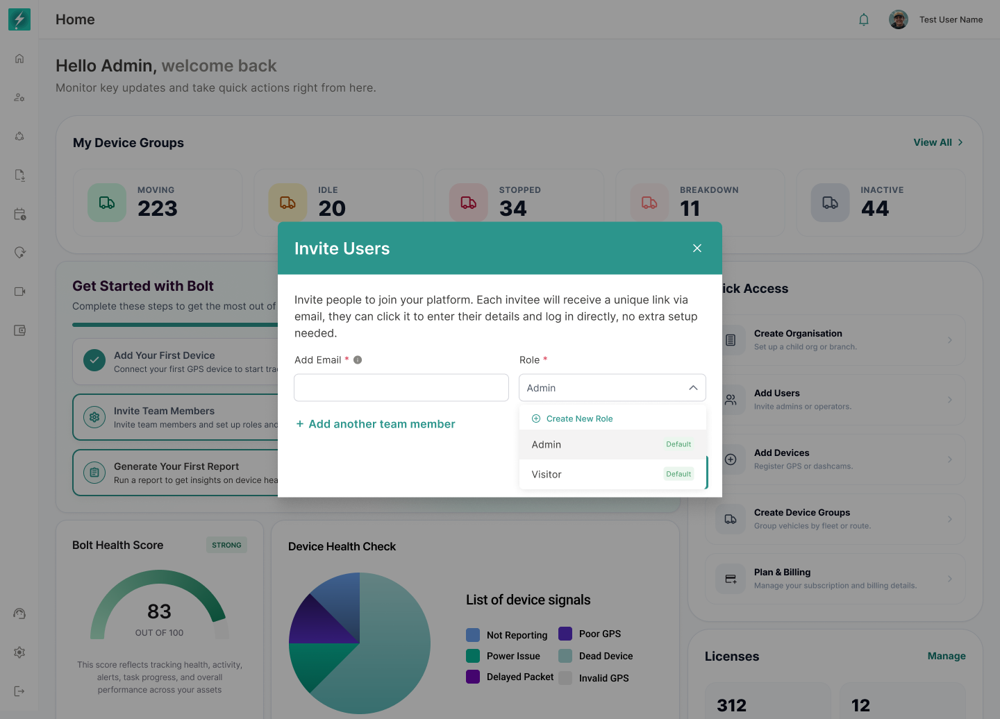

## 15. Role Selection

*The Role dropdown exposes existing roles and a Create New Role entry without leaving the invitation context.*

### 15.1 Approved options

- Create New Role.
- Admin.
- Visitor.

The production list must come from the current organisation's active roles rather than a hard-coded client list.

### 15.2 Role rules

- Only roles the current user can assign are returned.
- Inactive or deleted roles must not be selectable.
- The default role indicator may be shown where applicable.
- Role names must remain unique within the relevant organisation scope.
- A role selected for one invitee must not automatically apply to every row unless the user explicitly chooses a bulk behavior.

### 15.3 Create New Role

- Selecting Create New Role opens the approved role-management entry flow.
- Returning from role creation should preserve unsent invitation data when technically supported.
- The newly created role should appear in the dropdown after a successful return or refresh.
- The user must have `role:manage` permission to see this option.

### 15.4 Dropdown accessibility

- Arrow keys move between options.
- Enter selects the focused option.
- Escape closes the list.
- The selected role is announced to assistive technology.
- Focus must not move behind the modal.

---
