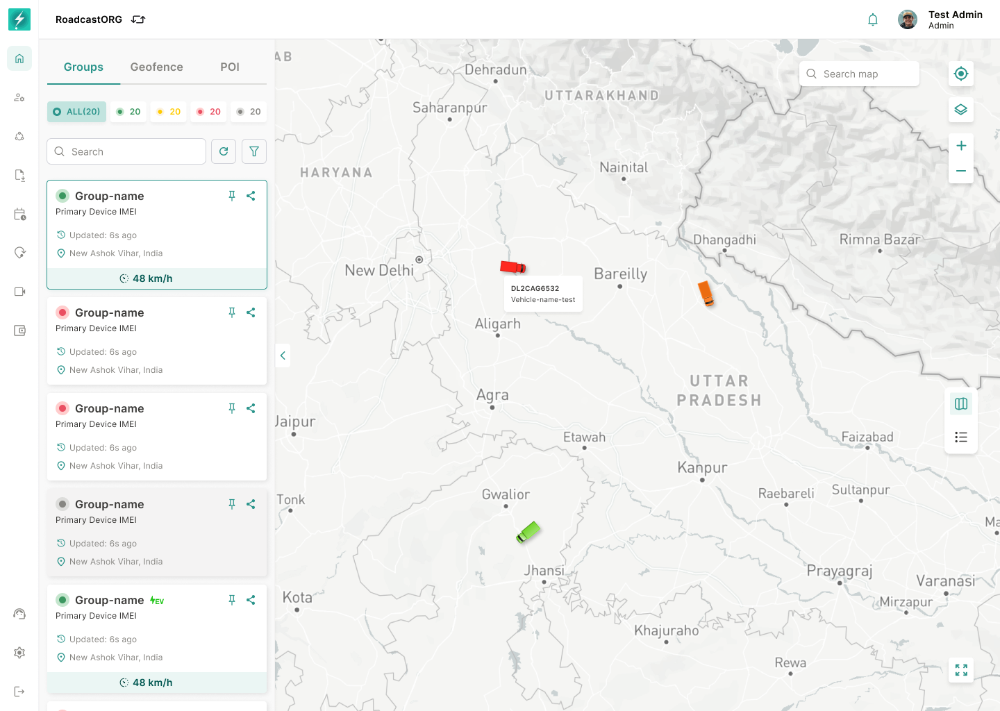

## 9. Base Map Workspace

### 9.1 Layout Requirements

The Map page should load with:

- Collapsed global navigation on the far left.
- Organisation/user header at top.
- Left panel with tabs for Groups, Geofence and POI.
- Central map canvas occupying the main width.
- Right panel only when an entity is selected.
- Floating chatbot/help button.
- Map controls for search, locate/target, zoom, layer control and view toggle.

*The default Map workspace combines the Groups list, status filters, vehicle markers and map controls in one operational view.*

### 9.2 Default State

On first load:

- Default selected tab should be **Groups**, unless URL parameters specify another tab.
- The system should load the user’s accessible organisation hierarchy.
- Visible entities should respect the selected hierarchy and user permissions.
- Map should auto-fit to the loaded entities where feasible.
- If no entities exist, show an empty state with relevant next action based on permissions.

### 9.3 Map Canvas Behavior

The map should support:

- Marker clustering at lower zoom levels.
- Individual vehicle/device markers at higher zoom levels.
- Vehicle icons rotated according to heading where heading data exists.
- Geofence overlays, KML overlays and POI markers.
- Tooltip on marker hover/click.
- Fit-to-entity when a list item is clicked.
- Persisted map type/layer preference where technically feasible.
- Zoom in/out, map search and layer selection controls.
- Map/list synchronization: selecting a marker should select the corresponding card/table row, and selecting a card/table row should focus the marker.
- Preserve map viewport while filters load; only auto-fit after explicit user action or first-load behavior.
- Keep selected entity pinned in context while live updates arrive unless the entity is filtered out or access changes.
- Support direct navigation to a selected entity from URL/share parameters where technically feasible.

Real-time navigation requirements:

- The map must show the latest known location for each visible entity in the active hierarchy/filter scope.
- Live movement should update without requiring a full page reload.
- Marker direction should update only when heading data is valid and recent.
- If a device goes inactive, the marker should remain at last known location with inactive/stale indication instead of disappearing abruptly.
- Users should be able to reset the viewport to all visible entities or focus only the selected entity.

---
