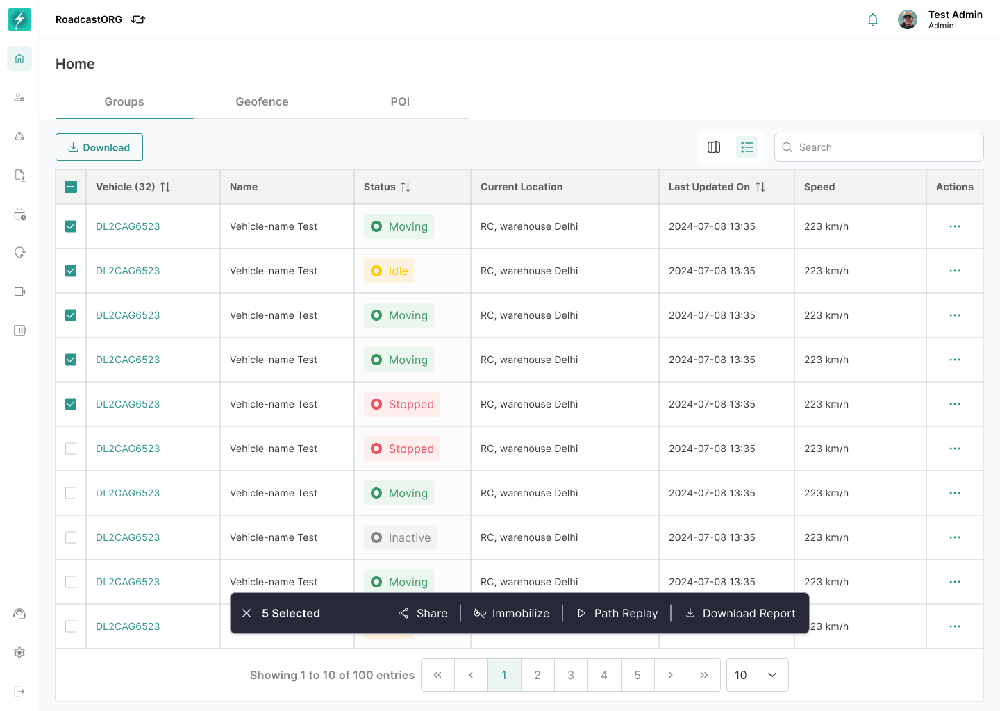

## 27. Bulk Actions

### 27.1 Purpose

Bulk actions support efficient operation on multiple entities from table view.

*Selecting multiple rows opens a contextual action bar with the permitted operations for that entity set.*

### 27.2 Requirements

- Multi-select rows.
- Selected count indicator.
- Bulk action bar.
- Vehicle, geofence and POI bulk contexts.
- Permission-based action availability.
- Clear selection.
- Bulk share where supported.
- Confirmation for destructive or command-based actions.

---
