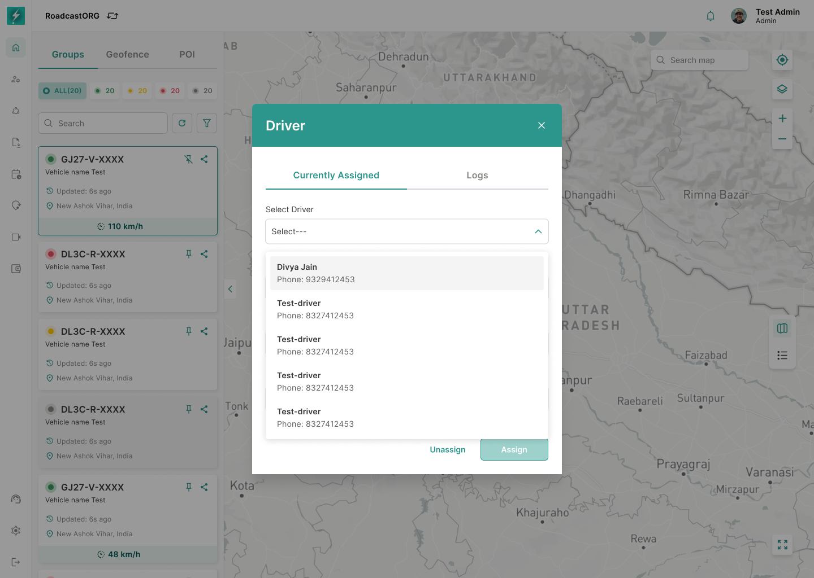

## 20. Driver Assignment

### 20.1 Purpose

Driver assignment allows admins to associate or update driver assignment from the live map context.

*The Driver workflow shows the current assignment, available drivers, contact details and assignment logs.*

### 20.2 Requirements

- Open Driver action from selected entity.
- Show currently assigned driver if one exists.
- Show no-driver state if no driver is assigned.
- Allow user to select a driver.
- Show driver details such as phone number, alternate phone number and address where available.
- Support assigning driver.
- Support unassigning driver.
- Show assignment logs.
- Record assignment changes in audit/command log.

---
