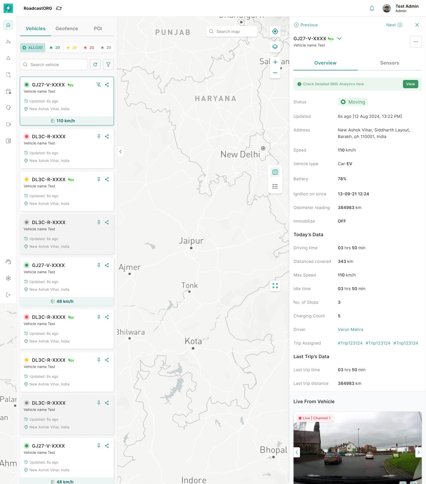

## 24. EV View and BMS Entry

### 24.1 Purpose

Map should expose EV-specific telemetry when the selected group is an EV or has EV/BMS-supported hardware.

*EV details extend the standard vehicle panel with battery, charging and BMS-related information.*

### 24.2 Requirements

EV info card should show:

- Vehicle type: EV.
- Battery percentage.
- Charging state.
- Charging count where available.
- BMS analytics entry point.
- Current status and speed.
- Odometer.
- Trip assigned where available.
- EV battery column in table view.

---
