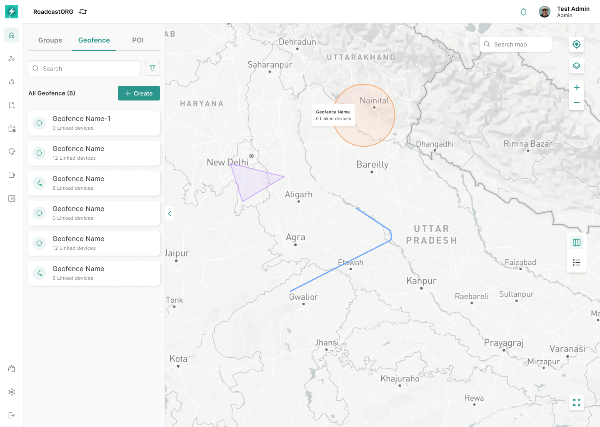

## 11. Geofence List

*The Geofence tab keeps saved areas visible in the list while rendering their active boundaries on the map.*

### 11.1 List Content

The Geofence tab should show all accessible geofences with:

- Geofence name.
- Shape/icon indicator.
- Linked device/group count where available.
- Visibility status.
- Edit action.
- Selected state.
- Pagination when the list exceeds the page size.

### 11.2 Geofence Details

Selecting a geofence should:

- Focus the map on the geofence boundary.
- Display the boundary on the map.
- Open or update the right panel with geofence metadata.
- Show radius/area, created date, color, state, organisation and global properties where available.

### 11.3 Geofence Visibility and Legend Behavior

Geofence overlays should be clear but non-obstructive on the map canvas.

Rules:

- Hidden geofences should be removed from the current user's map overlay but should remain available in the Geofence list.
- Disabled geofences should remain identifiable as saved boundaries but should not be treated as active alert/monitoring zones.
- Show/hide is a display preference; enable/disable is an operational state.
- Geofence labels should be toggleable when label density impacts map readability.
- Linked device/group count should remain visible in the list/table so users understand the operational impact of each geofence.

---
