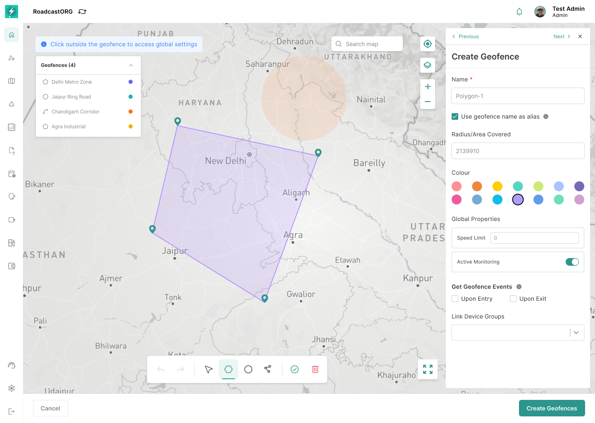
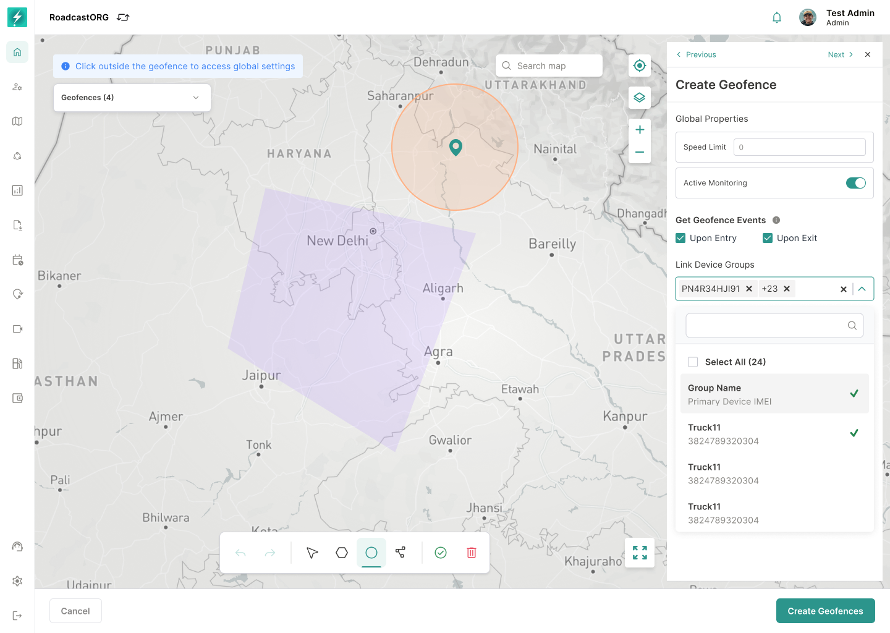

## 22. Geofence Management

*Geofence creation combines boundary drawing with name, colour, monitoring rules and global properties.*

### 22.1 Geofence Creation

Geofence creation should support:

- Create from Geofence tab.
- Add geofence name.
- Add global settings/properties.
- Configure geofence color.
- Configure speed limit properties where applicable.
- Draw geofence on map.
- Support supported shapes, including circle and polygon where available.
- Link device groups/vehicles.
- Review before save.
- Create geofence and show success state.

*Device Groups can be searched and linked during creation so monitoring applies to the intended operational scope.*

### 22.2 Geofence Editing

Geofence editing should support:

- Single geofence edit.
- Global settings edit.
- Geofence information edit.
- Shape/boundary edit.
- Linked device updates.
- Multi-geofence edit where supported.
- Clear difference between editing metadata and editing the actual boundary.

### 22.3 Visibility and State

Geofence should support:

- Show/hide from map.
- Enable/disable state.
- Disabled geofences should not trigger events unless backend rules define otherwise.
- Hidden geofences should only affect visibility, not the geofence rule state.
- State changes must be explicit and auditable.

---
