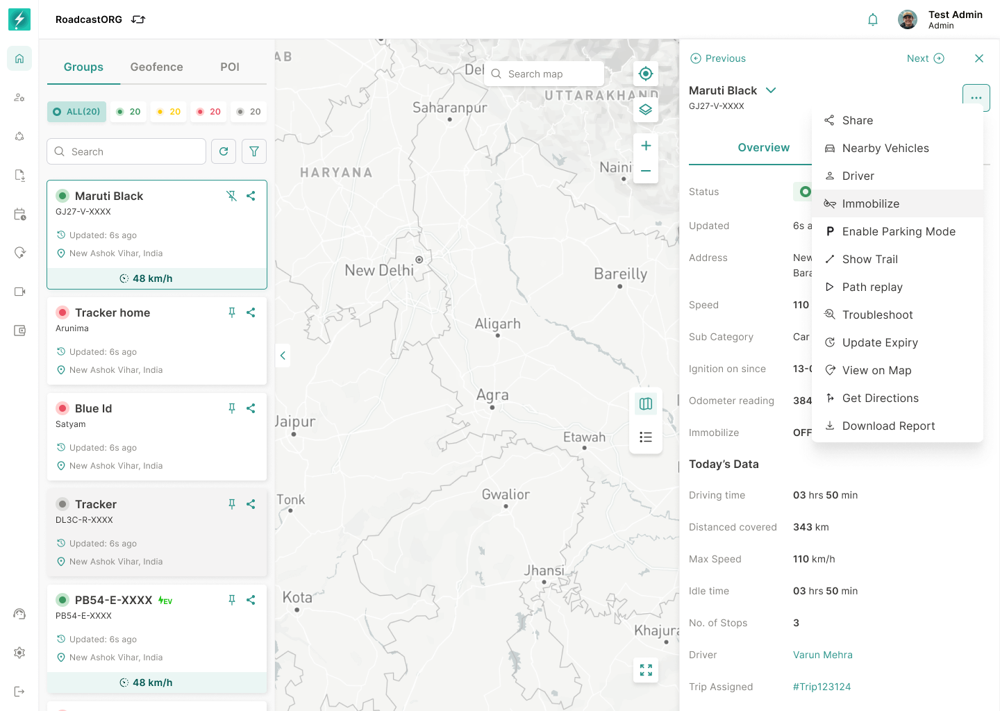
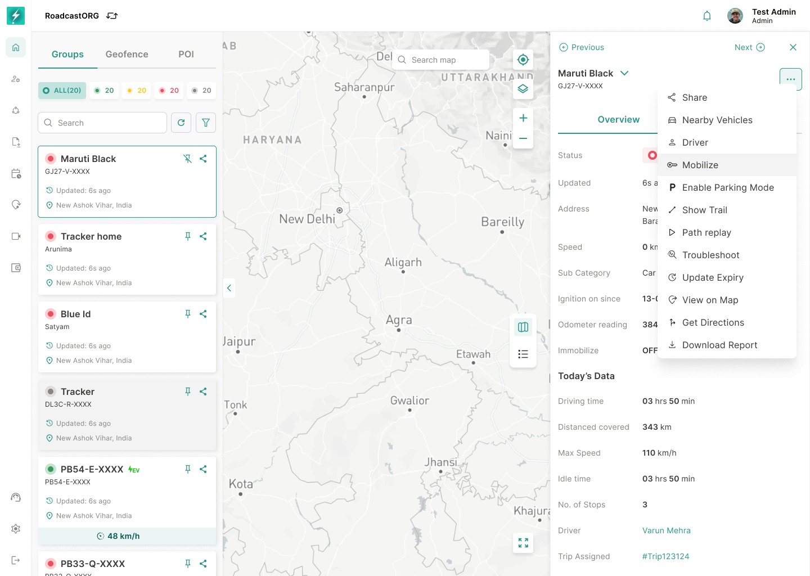

## 26. Immobilize and Mobilize

### 26.1 Immobilize

Immobilize allows authorized users to remotely prevent vehicle movement where the device and vehicle installation support it.

*The action is exposed only when capability, license and permission checks allow the remote command.*

Requirements:

- Available only for supported device/vehicle combinations.
- Requires explicit confirmation.
- Must validate current speed.
- If vehicle is moving above the configured speed threshold, command should enter queue rather than execute immediately.
- If vehicle is moving below threshold or stationary, command can execute according to backend safety rules.
- Show queued state.
- Show immobilized success state.
- Record command in command log.

The current flow includes speed-sensitive immobilize states for vehicles above and below the configured 20 km/h threshold.

### 26.2 Mobilize

Mobilize allows authorized users to restore vehicle movement capability after immobilization.

*Mobilize is available only when the current immobilizer state permits restoration of vehicle movement.*

Requirements:

- Available only when immobilizer state allows mobilize.
- Requires explicit confirmation.
- Show command in progress.
- Show mobilized success state.
- Record command in command log.
- Handle failed/timeout states.

---
