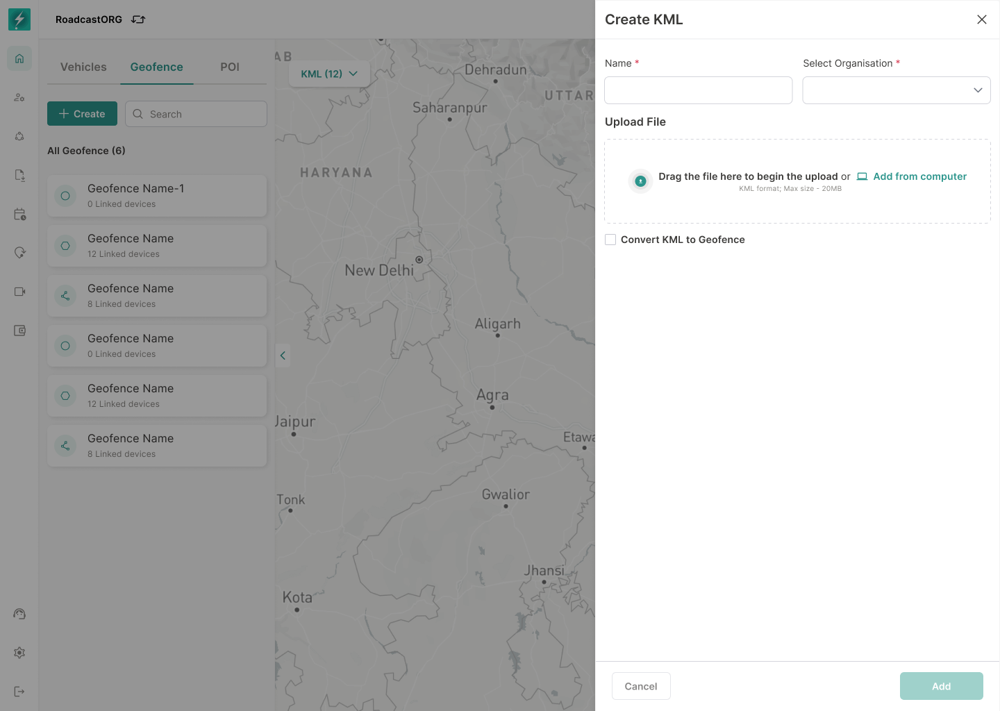

## 23. KML Management

### 23.1 Purpose

KML support allows users to upload or manage external geographic boundaries and optionally convert them into usable Bolt geofences.

*The KML workflow accepts an external boundary file and can convert the uploaded geometry into a Bolt geofence.*

### 23.2 Requirements

- KML list under map/geofence context.
- Create/Add KML.
- Upload or define KML data.
- Add KML to map.
- Convert KML to geofence where supported.
- Link vehicles/device groups where supported.
- Show KML added success state.
- Allow viewing KML overlay on map.
- Validate supported file size and geometry type.

---
