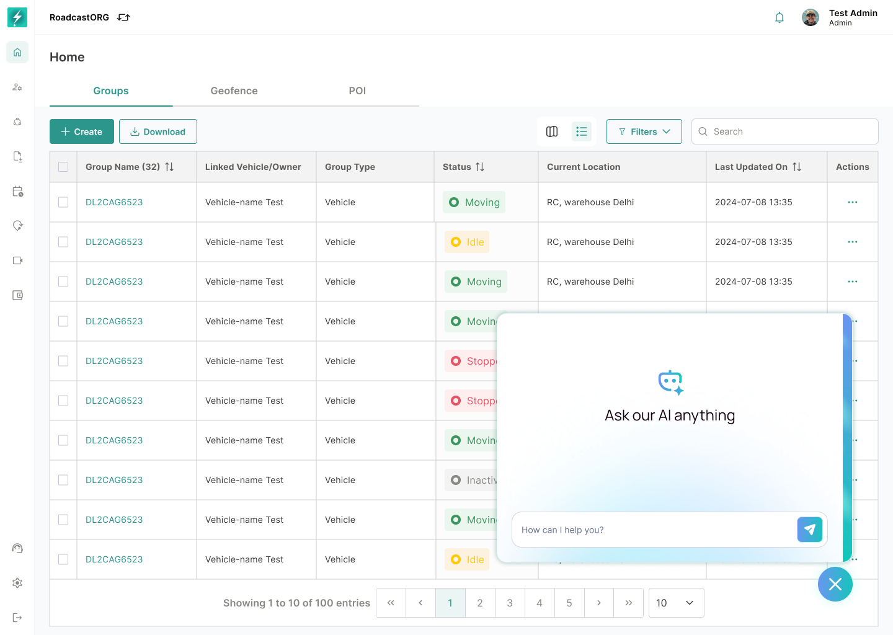

## 28. Map Assistant / Feedback Widget

### 28.1 Purpose

The floating assistant/help widget gives users a fast support entry point from the Map page.

*The assistant opens above the Map without removing the operator from the current page context.*

### 28.2 Requirements

- Floating assistant button should remain accessible without blocking core map actions.
- Hover state should indicate interactivity.
- Chat/feedback panel should open in context.
- Feedback should capture page context where possible.
- The widget should not obscure critical map controls, action modals or command confirmations.

---
