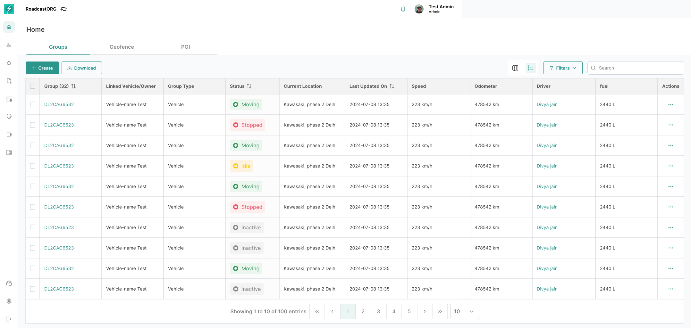

## 14. Map Table View

### 14.1 Purpose

The table view gives users a structured data view of map entities when scanning or bulk action is more efficient than map interaction.

*The table view supports expandable vehicle rows, operational columns, filters, pagination and row actions.*

### 14.2 Vehicle / Device Group Table

The vehicle table should include:

- Group name.
- Linked vehicle/owner.
- Group type.
- Status.
- Current location.
- Last updated on.
- Speed.
- Odometer.
- Driver.
- Fuel, where available.
- Actions.

The vehicle table should support expandable rows, horizontal scrolling, filtering, download and action menu.

### 14.3 Geofence Table

The geofence table should include:

- Name.
- Shape.
- Radius/area covered.
- Colour.
- Linked groups.
- Created on.
- Actions.

### 14.4 POI Table

The POI table should include:

- Name.
- Address.
- Icon.
- Description.
- Created on.
- Actions.

### 14.5 Bulk Selection

Table rows should support multi-selection wherever bulk actions are allowed. Bulk actions should show a selected-count bar and must respect permissions.

---
