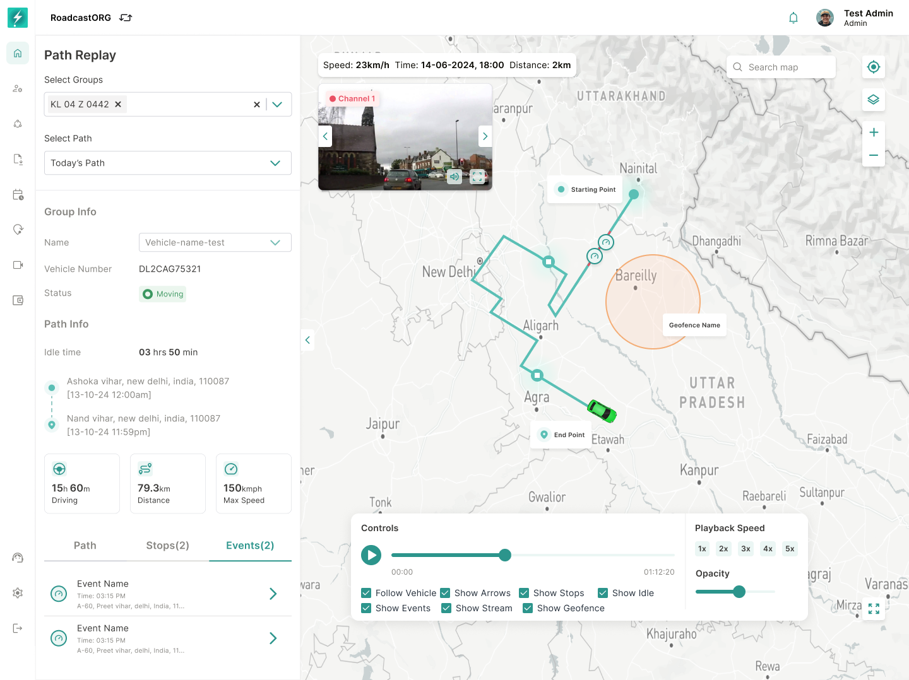

# Bolt Map — Product and Functional Guide

**Version:** 1.1 — Detailed product and functional specification  
**Prepared for:** Roadcast / Bolt  
**Module:** Map  
**Platforms:** Bolt Web  
**Status:** Product, design and engineering review  
**Last updated:** 24 July 2026

---

## 1. Overview

Map is the core operational workspace of Bolt Fleet Management. It is the page where users monitor live fleet location, inspect vehicle/device-group state, view geofences and POIs, replay historical movement, execute selected operational commands, and navigate to deeper entity actions.

The Map page should answer four operating questions:

- **Where are my vehicles, assets, drivers or device groups right now?**
- **Which entities need attention based on status, location, sensors, geofence state or command state?**
- **What happened historically for a selected entity or set of entities?**
- **What action can I take immediately from the map without leaving the operational context?**

This guide documents the current Map experience together with the system rules, permissions, data requirements, command safety, performance expectations and acceptance criteria required for implementation.

---

## 2. How to Use This Guide

The guide is structured so product, design, engineering, QA, support and operations teams can use the same source:

- **Sections 3–8:** product problem, goals, scope, users, permissions and information architecture.
- **Sections 9–16:** core Map workspace, entity views, filters, tables, details and contextual actions.
- **Sections 17–28:** operational workflows including replay, trail, driver assignment, sharing, geofence/KML, EV, parking and remote commands.
- **Sections 29–37:** data, system behavior, states, security, reliability, accessibility, analytics, dependencies and edge cases.
- **Sections 38–42:** acceptance criteria, delivery phases, confirmed decisions, open decisions and final summary.

Screenshots are embedded beside the workflow they explain. Every image uses a relative `assets/...` path so the Markdown can be imported with this package without external design links.

> **Important:** If device capability, organisation configuration, licensing or permissions prevent an action from working, the interface must show a specific unavailable or restricted state. It must not silently fail or imply that a command completed.

---

## 3. Problem Statement

Fleet operators spend most of their working time on the Map page because live location is the starting point for most operational decisions. The current system must support high-frequency tasks without forcing users to jump between separate modules for basic monitoring, diagnostics, history or commands.

The Map page must solve these problems:

- Users need a single real-time workspace to monitor vehicles, assets, personal trackers and device groups.
- Users need quick switching between **Groups**, **Geofence** and **POI** contexts.
- Users need reliable filtering, search and table views to handle large fleets.
- Users need right-side contextual details without losing the map view.
- Users need immediate access to actions such as share, path replay, show trail, nearby vehicles, assign driver, parking mode, immobilize and mobilize.
- Users need clear states for no data, stale data, failed commands and inactive devices.
- Admins need geofence/KML creation and editing flows that are connected to the map itself.

---

## 4. Product Goals

### 4.1 User Goals

- View live location and status of all assigned device groups on a map.
- Quickly filter the visible fleet by status, category, device group type, vehicle type, geofence, POI or advanced criteria.
- Search for a vehicle, group, geofence or POI by keyword.
- Inspect an entity without leaving the map.
- Switch between map and table representations of the same data.
- Replay paths and stops for a selected entity or multiple entities.
- Share live tracking links with expiry and link-type control.
- Execute permitted map actions with clear confirmation and command status.
- Create and manage geofences, POIs and KML overlays from the map context.

### 4.2 Business Goals

- Make Map the default operational command surface for Bolt.
- Reduce support dependency by exposing live status, diagnostics and history clearly.
- Improve command reliability and user trust through status feedback, command logs and explicit safety rules.
- Support larger enterprise fleets through performant filters, pagination, clustering and table views.
- Standardize map-related workflows for future modules such as TripHub, Video Monitoring, EV/BMS and Driver-based Tracking.

---

## 5. Scope

### 5.1 In Scope

- Map workspace layout and navigation.
- Groups, Geofence and POI tabs.
- Left entity list, map canvas and right contextual details panel.
- Status filters, search, refresh, sorting and advanced filters.
- Map table view for vehicles/device groups, geofences and POIs.
- Vehicle/device group info cards.
- Sensor and video streaming sub-tabs where supported by license/device capability.
- EV-specific map info and BMS entry point.
- Asset/personal group info cards.
- Path replay.
- Show trail.
- Nearby vehicle search.
- Assign/unassign driver from map context.
- Share live tracking links and token logs.
- Bulk actions and bulk share from table view.
- KML list, upload and KML-to-geofence conversion.
- Geofence create, edit, show/hide, enable/disable and linked-device flows.
- Parking mode.
- Immobilize and mobilize command flows.
- Floating map assistant / help widget.
- Core permissions, states, acceptance criteria and open decisions.

### 5.2 Out of Scope

- Redesign of global navigation outside the Map module.
- Mobile Map PRD.
- Full geofence alert-rule engine beyond properties shown in Map flows.
- Route optimization or dispatch planning.
- Driver mobile app behavior.
- Command retry infrastructure beyond UI states and command status requirements.
- Full Video Monitoring PRD; Map only links to video streams when a device supports video.
- Full BMS PRD; Map only surfaces EV/BMS entry and key EV telemetry.
- AI-based map recommendations unless explicitly added in a later sprint.

---

## 6. Users and Permissions

### 6.1 Primary Users

- **Fleet Operator:** monitors live locations, filters map, reviews status and opens path replay.
- **Fleet Admin:** manages geofences, POIs, KML, drivers, sharing and commands.
- **Support/Admin User:** impersonates or supports organisations, reviews data, validates device state and troubleshoots issues.
- **Organisation Owner:** views fleet status and uses high-level tracking features.

### 6.2 Permission Requirements

Permission checks must be enforced at API and UI level.

| Capability | Suggested permission |
|---|---|
| View Map | `map:view` |
| View device groups / vehicles | `device_group:view` |
| View geofences | `geofence:view` |
| Create/edit/delete geofences | `geofence:manage` |
| View POIs | `poi:view` |
| Create/edit/delete POIs | `poi:manage` |
| View path replay | `path_replay:view` |
| Share tracking links | `tracking_share:manage` |
| View share tokens/logs | `tracking_share:view_tokens` |
| Assign driver | `driver_assignment:manage` |
| Parking mode | `parking_mode:manage` |
| Immobilize/mobilize | `remote_command:immobilize` / `remote_command:mobilize` |
| Bulk actions | Relevant entity-level bulk permission |
| Download table data | `map:download` |
| KML upload/manage | `kml:manage` |
| View video stream in map card | `video_monitoring:view` |
| View EV/BMS details | `bms:view` |

Restricted users should either not see unauthorized actions or should see them disabled with an explanatory tooltip. Critical commands such as immobilize and mobilize must never rely on UI-only permission checks.

---

## 7. Core Concepts

### 7.1 Device Group

A Device Group is the primary trackable entity in Map. It may represent a vehicle, asset, personal tracker or another linked entity. Map cards and details should show the linked vehicle/owner where available.

### 7.2 Map Entity Tabs

Map uses three primary tabs:

- **Groups:** the visible UI label for operational Device Group entities.
- **Geofence:** saved areas, boundaries and alert zones.
- **POI:** saved points of interest.

`Device Group` remains the domain/entity name in APIs, permissions, data models and this PRD. `Groups` is the shorter navigation label shown in the current product interface.

**Linked Data** and **Command Log** are related contexts and should be available where implementation supports them.

### 7.3 Entity Status and Marker Legend

Device-group status should support the core fleet states used across Bolt:

- **Moving:** valid recent packet, ignition/motion state indicates movement, and speed is above the configured movement threshold.
- **Idle:** valid recent packet, ignition is on, and the entity is not moving beyond the configured idle/movement threshold.
- **Stopped:** valid recent packet, ignition is off or the entity is stationary beyond the configured stopped threshold.
- **Inactive:** no valid recent packet within the configured inactive threshold, or device is offline/not reporting.
- **Breakdown:** vehicle is marked as breakdown through operational state, alert state or supported device/workflow logic.
- **No data / unknown:** the entity exists but the system does not have enough telemetry to determine live status.

Status counts in the list header should act as quick filters. Hover or tooltip copy should clarify the status meaning where the state is not obvious.

Marker legend requirements:

- Each status must have a distinct visual marker state that is consistently used across map markers, list chips and table status values.
- Moving markers should support direction/heading where valid heading data exists.
- Idle, stopped, inactive and breakdown markers should not imply movement unless heading/motion data is current.
- Marker labels should show the primary vehicle number/device-group name when labels are enabled.
- Cluster markers should show the number of grouped entities and should expand or zoom into the clustered area on click.
- The legend should be accessible from the map layer/control area so users can interpret marker color, marker shape and status labels without leaving the map.
- If telemetry is stale, the marker should prioritize freshness communication over last known movement state.

### 7.4 Last Updated

Last Updated represents the most recent valid packet/event timestamp received for the entity. It is central to sorting, freshness indicators and inactive-state logic.

### 7.5 Map Commands

Map commands are actions issued from the map context, such as parking mode, immobilize, mobilize, share link generation and driver assignment. Commands must have clear initiated, queued, success, failed and expired states where applicable.

---

## 8. Information Architecture

The Map workspace follows a three-region structure:

- **Left panel:** entity tabs, counts, filters, search, list/table entry points and entity cards.
- **Map canvas:** live map, markers, clusters, geofence overlays, POI markers, KML overlays, map controls and trail/path layers.
- **Right panel:** selected entity details, sensors, video stream, action menu and contextual workflows.

---

## 9. Base Map Workspace

### 9.1 Layout Requirements

The Map page should load with:

- Collapsed global navigation on the far left.
- Organisation/user header at top.
- Left panel with tabs for Groups, Geofence and POI.
- Central map canvas occupying the main width.
- Right panel only when an entity is selected.
- Floating chatbot/help button.
- Map controls for search, locate/target, zoom, layer control and view toggle.

*The default Map workspace combines the Groups list, status filters, vehicle markers and map controls in one operational view.*

### 9.2 Default State

On first load:

- Default selected tab should be **Groups**, unless URL parameters specify another tab.
- The system should load the user’s accessible organisation hierarchy.
- Visible entities should respect the selected hierarchy and user permissions.
- Map should auto-fit to the loaded entities where feasible.
- If no entities exist, show an empty state with relevant next action based on permissions.

### 9.3 Map Canvas Behavior

The map should support:

- Marker clustering at lower zoom levels.
- Individual vehicle/device markers at higher zoom levels.
- Vehicle icons rotated according to heading where heading data exists.
- Geofence overlays, KML overlays and POI markers.
- Tooltip on marker hover/click.
- Fit-to-entity when a list item is clicked.
- Persisted map type/layer preference where technically feasible.
- Zoom in/out, map search and layer selection controls.
- Map/list synchronization: selecting a marker should select the corresponding card/table row, and selecting a card/table row should focus the marker.
- Preserve map viewport while filters load; only auto-fit after explicit user action or first-load behavior.
- Keep selected entity pinned in context while live updates arrive unless the entity is filtered out or access changes.
- Support direct navigation to a selected entity from URL/share parameters where technically feasible.

Real-time navigation requirements:

- The map must show the latest known location for each visible entity in the active hierarchy/filter scope.
- Live movement should update without requiring a full page reload.
- Marker direction should update only when heading data is valid and recent.
- If a device goes inactive, the marker should remain at last known location with inactive/stale indication instead of disappearing abruptly.
- Users should be able to reset the viewport to all visible entities or focus only the selected entity.

---

## 10. Device Groups List

### 10.1 List Content

Each Device Group card should show:

- Status indicator.
- Device group name.
- Linked vehicle number or owner name, where available.
- Last updated time.
- Last known address.
- Pin/unpin or focus action where supported.
- Share shortcut where supported.
- Selected state when the card is active.

### 10.2 Status Filters

Status chips should show counts and filter the list and map. Filters should include all configured statuses available to the user, such as all, moving, idle, stopped, inactive and breakdown.

Rules:

- Selecting a status chip filters both the list and visible map markers.
- Count chips should be based on the currently selected hierarchy and applied high-level filters.
- Search should work within the selected tab and should not remove the active tab context.
- Refresh should reload list and map data without resetting the active tab unless a hard refresh is required.

### 10.3 Default Sorting

Device Groups should be sorted by **Last Updated**, most recent first, unless the user applies another sort. Stale/no-data entities should move lower unless filtered explicitly.

### 10.4 Marker and List Status Parity

The status shown in the left list, map marker, table row and right-side info card must use the same status source and freshness rules.

Rules:

- A marker and its corresponding list card must never show conflicting statuses for the same timestamp.
- If the list says Inactive, the marker should use the inactive marker state even if the last known speed was moving.
- If a user applies a status filter, both list cards and map markers should reduce to the same filtered entity set.
- Marker tooltips should show the entity name, status, speed where applicable, last updated time and last known address.
- For large fleets, status counts should be computed against the active organisation/hierarchy scope, not only the current visible viewport.

---

## 11. Geofence List

*The Geofence tab keeps saved areas visible in the list while rendering their active boundaries on the map.*

### 11.1 List Content

The Geofence tab should show all accessible geofences with:

- Geofence name.
- Shape/icon indicator.
- Linked device/group count where available.
- Visibility status.
- Edit action.
- Selected state.
- Pagination when the list exceeds the page size.

### 11.2 Geofence Details

Selecting a geofence should:

- Focus the map on the geofence boundary.
- Display the boundary on the map.
- Open or update the right panel with geofence metadata.
- Show radius/area, created date, color, state, organisation and global properties where available.

### 11.3 Geofence Visibility and Legend Behavior

Geofence overlays should be clear but non-obstructive on the map canvas.

Rules:

- Hidden geofences should be removed from the current user's map overlay but should remain available in the Geofence list.
- Disabled geofences should remain identifiable as saved boundaries but should not be treated as active alert/monitoring zones.
- Show/hide is a display preference; enable/disable is an operational state.
- Geofence labels should be toggleable when label density impacts map readability.
- Linked device/group count should remain visible in the list/table so users understand the operational impact of each geofence.

---

## 12. POI List

*The POI view synchronizes saved locations in the left panel with their markers on the map.*

### 12.1 POI Requirements

The POI tab should show saved points of interest with:

- POI name.
- Address.
- Icon.
- Description, where available.
- Created date.
- Actions menu.
- Map marker focus on selection.

### 12.2 POI Table

The POI table should support search, filters, download and row-level actions.

---

## 13. Search, Filters and Advanced Filters

*Advanced filters narrow the list, table and map markers together while preserving the current Map context.*

### 13.1 Search

Search should support keyword lookup across the active tab:

- Device Group: group name, linked vehicle number, driver name, owner name, IMEI where available.
- Geofence: geofence name, organisation, linked group.
- POI: POI name, address, description.

Search should update list results and visible markers while preserving map state where possible.

### 13.2 Basic Filters

The Map filter panel should support:

- Card type.
- Device group type.
- Device group category.
- Vehicle type.
- Status.
- Organisation/sub-organisation scope where applicable.
- Nearby vehicle filter when initiated from nearby-vehicle flow.

### 13.3 Advanced Filters

Advanced filters should allow users to narrow large fleets using additional attributes. The exact available fields may depend on entity type, organisation configuration and licensed modules.

Rules:

- Filters apply to list, table and map markers together.
- Filter state should be visible after application.
- Users can clear all filters.
- If a filter combination returns no result, show a no-result state with “Clear filters”.
- Backend filtering is preferred for large datasets.

---

## 14. Map Table View

### 14.1 Purpose

The table view gives users a structured data view of map entities when scanning or bulk action is more efficient than map interaction.

*The table view supports expandable vehicle rows, operational columns, filters, pagination and row actions.*

### 14.2 Vehicle / Device Group Table

The vehicle table should include:

- Group name.
- Linked vehicle/owner.
- Group type.
- Status.
- Current location.
- Last updated on.
- Speed.
- Odometer.
- Driver.
- Fuel, where available.
- Actions.

The vehicle table should support expandable rows, horizontal scrolling, filtering, download and action menu.

### 14.3 Geofence Table

The geofence table should include:

- Name.
- Shape.
- Radius/area covered.
- Colour.
- Linked groups.
- Created on.
- Actions.

### 14.4 POI Table

The POI table should include:

- Name.
- Address.
- Icon.
- Description.
- Created on.
- Actions.

### 14.5 Bulk Selection

Table rows should support multi-selection wherever bulk actions are allowed. Bulk actions should show a selected-count bar and must respect permissions.

---

## 15. Vehicle / Device Group Info Card

### 15.1 Overview Tab

Selecting a vehicle/device group should open a right-side details panel with:

*The Overview tab preserves the live map while showing status, location, telemetry, assigned driver and daily operational data.*

- Previous / Next controls.
- Entity name and secondary label.
- Overview tab.
- Sensors tab.
- Video Streaming tab where supported.
- Status.
- Last updated timestamp.
- Address.
- Sub-category.
- Speed.
- Vehicle type.
- Ignition on/off duration.
- Odometer reading.
- Immobilizer state.
- Today’s data / operational metrics.
- Document expiry alerts, where applicable.

### 15.2 Sensors Tab

The Sensors tab should show all supported sensor values for the selected device/group. Examples include:

*The Sensors tab presents supported device states such as ignition, network, geofence, immobilizer, parking, battery and temperature.*

- Ignition.
- Network.
- Geofence state.
- Immobilizer.
- Parking.
- Door.
- AC.
- GPS.
- Battery or EV battery where applicable.

Unsupported sensor values should show `N/A`, not blank.

### 15.3 Video Streaming Tab

If the selected group has video capability and the user has permission, show the Video Streaming tab with available channels and last updated stream timestamp.

*Video-enabled vehicles expose available camera channels without taking the operator away from the Map.*

### 15.4 Entity-Specific Variants

The info card should adapt to entity type:

- Vehicle: speed, ignition, odometer, vehicle type, driver and immobilizer.
- Asset/personal: linked devices, movement state and today’s data.
- EV: battery percentage, charging state and BMS entry point.
- Video-enabled vehicle: stream channels.
- Inactive/no-data entity: stale timestamp and unavailable values.

---

## 16. Action Menu

The selected entity action menu should expose only supported and permitted actions.

Actions supported by the current product flows include:

- Share.
- Show Trail.
- Path Replay.
- Nearby Vehicles.
- Driver.
- Immobilize.
- Parking Mode.
- Troubleshoot.
- Video Streaming where applicable.
- Sensor view where applicable.

Rules:

- Actions must be hidden or disabled when unsupported by device capability, license or permissions.
- Critical actions must use confirmation modals.
- Actions that issue commands must write to command log.
- Opening an action should preserve current selected entity context.

---

## 17. Path Replay

### 17.1 Purpose

Path Replay allows users to review historical movement for one or more selected groups over a selected date/path window.

*Path Replay combines route history, stop and event lists, playback speed and map-layer controls.*

### 17.2 Entry Points

Users can access Path Replay from:

- Selected vehicle/device group action menu.
- Direct Path Replay route.
- Table action where available.

### 17.3 Functional Requirements

Path Replay should support:

- Selecting one or more groups.
- Selecting path type/date option.
- Viewing name, vehicle number and status.
- Viewing path info metrics.
- Map path visualization.
- Stops tab.
- Events tab.
- Playback controls.
- Playback speed options: 1x, 2x, 3x, 4x and 5x, matching the current design.
- Opacity control.
- Follow vehicle.
- Show arrows.
- Show stops.
- Show idle.
- Show events.
- Show stream where the selected vehicle and historical interval have video data.
- Show geofence.
- Filter ignition off.
- Show start and end.
- No data state when no path is available.
- Warning toast when no position data is found.

### 17.4 No Data Behavior

If path data is unavailable:

- Show a clear no-data state.
- Disable playback controls where playback cannot run.
- Preserve selected groups and path filters so the user can adjust criteria.
- Do not show misleading zero-distance playback as successful data.

---

## 18. Show Trail

### 18.1 Purpose

Show Trail gives users a quick recent-trail visualization on the main map without entering the full Path Replay workflow.

*Show Trail adds a recent movement line to the current Map while keeping the selected vehicle and live operational context visible.*

### 18.2 Requirements

- Available from selected entity action menu.
- Show recent movement trail on the active map.
- Support single-vehicle and multi-vehicle trail visualization.
- Show trail styling clearly against map background.
- Allow trail to be cleared or replaced when user selects another entity.
- Must not permanently alter map filters.

---

## 19. Nearby Vehicles

### 19.1 Purpose

Nearby Vehicles helps users find other fleet entities near a selected vehicle or location.

*Nearby Vehicles searches around a coordinate and returns the nearest fleet entities with distance and driver details.*

### 19.2 Requirements

- User initiates Nearby Vehicles from the selected entity action menu.
- System opens a search/filter state.
- User can search nearby vehicles.
- Result table/list should show vehicle, distance, driver name, driver phone number and actions where available.
- Selecting a nearby vehicle should focus it on map or open its info card.
- Empty results should show a clear no-nearby-vehicles state.

---

## 20. Driver Assignment

### 20.1 Purpose

Driver assignment allows admins to associate or update driver assignment from the live map context.

*The Driver workflow shows the current assignment, available drivers, contact details and assignment logs.*

### 20.2 Requirements

- Open Driver action from selected entity.
- Show currently assigned driver if one exists.
- Show no-driver state if no driver is assigned.
- Allow user to select a driver.
- Show driver details such as phone number, alternate phone number and address where available.
- Support assigning driver.
- Support unassigning driver.
- Show assignment logs.
- Record assignment changes in audit/command log.

---

## 21. Share Tracking Links

### 21.1 Purpose

Share allows users to generate temporary tracking links for a selected entity or selected set of entities.

*The Share workflow generates a scoped tracking link that can be copied, regenerated, expired or revoked.*

### 21.2 Single Entity Share

Single-entity sharing should support:

- Generate Link tab.
- Tokens tab.
- Link type selection.
- Detailed view link.
- Location view link where applicable.
- Expiry date/time.
- Copy generated link.
- Regenerate link.
- Delete/revoke token.
- View generated token logs.

### 21.3 Bulk Share

Bulk share should support:

- Selecting multiple vehicles/entities in table view.
- Generating one shared view for selected entities.
- Viewing shared map state.
- Opening vehicle info from shared view where allowed.
- Token expiry and revocation.

### 21.4 Security Rules

- Shared links must use tokenized access.
- Expiry must be enforced server-side.
- Expired/revoked tokens must not expose entity data.
- Shared view should show only the entities and fields included in the link type.
- Token logs must show generated date, link type and expiry.

---

## 22. Geofence Management

*Geofence creation combines boundary drawing with name, colour, monitoring rules and global properties.*

### 22.1 Geofence Creation

Geofence creation should support:

- Create from Geofence tab.
- Add geofence name.
- Add global settings/properties.
- Configure geofence color.
- Configure speed limit properties where applicable.
- Draw geofence on map.
- Support supported shapes, including circle and polygon where available.
- Link device groups/vehicles.
- Review before save.
- Create geofence and show success state.

*Device Groups can be searched and linked during creation so monitoring applies to the intended operational scope.*

### 22.2 Geofence Editing

Geofence editing should support:

- Single geofence edit.
- Global settings edit.
- Geofence information edit.
- Shape/boundary edit.
- Linked device updates.
- Multi-geofence edit where supported.
- Clear difference between editing metadata and editing the actual boundary.

### 22.3 Visibility and State

Geofence should support:

- Show/hide from map.
- Enable/disable state.
- Disabled geofences should not trigger events unless backend rules define otherwise.
- Hidden geofences should only affect visibility, not the geofence rule state.
- State changes must be explicit and auditable.

---

## 23. KML Management

### 23.1 Purpose

KML support allows users to upload or manage external geographic boundaries and optionally convert them into usable Bolt geofences.

*The KML workflow accepts an external boundary file and can convert the uploaded geometry into a Bolt geofence.*

### 23.2 Requirements

- KML list under map/geofence context.
- Create/Add KML.
- Upload or define KML data.
- Add KML to map.
- Convert KML to geofence where supported.
- Link vehicles/device groups where supported.
- Show KML added success state.
- Allow viewing KML overlay on map.
- Validate supported file size and geometry type.

---

## 24. EV View and BMS Entry

### 24.1 Purpose

Map should expose EV-specific telemetry when the selected group is an EV or has EV/BMS-supported hardware.

*EV details extend the standard vehicle panel with battery, charging and BMS-related information.*

### 24.2 Requirements

EV info card should show:

- Vehicle type: EV.
- Battery percentage.
- Charging state.
- Charging count where available.
- BMS analytics entry point.
- Current status and speed.
- Odometer.
- Trip assigned where available.
- EV battery column in table view.

---

## 25. Parking Mode

### 25.1 Purpose

Parking Mode allows users to enable or schedule parking protection behavior for supported vehicles/devices.

*Parking Mode can be enabled immediately or scheduled for selected days and times on supported devices.*

### 25.2 Requirements

Parking Mode modal should support:

- Current parking mode status.
- Vehicle name.
- Parking mode toggle.
- Schedule Parking Mode option.
- Day selector.
- Start time.
- End time.
- Update action.
- Cancel action.
- Disabled field state when scheduling is not enabled.
- Success/error message after update.

### 25.3 Rules

- Parking Mode should only appear for compatible devices/licenses.
- Scheduled parking mode requires at least one day, start time and end time.
- Start and end time should be validated.
- Update should be recorded as a command/configuration change.
- Existing state must be pre-filled when opening the modal.

---

## 26. Immobilize and Mobilize

### 26.1 Immobilize

Immobilize allows authorized users to remotely prevent vehicle movement where the device and vehicle installation support it.

*The action is exposed only when capability, license and permission checks allow the remote command.*

Requirements:

- Available only for supported device/vehicle combinations.
- Requires explicit confirmation.
- Must validate current speed.
- If vehicle is moving above the configured speed threshold, command should enter queue rather than execute immediately.
- If vehicle is moving below threshold or stationary, command can execute according to backend safety rules.
- Show queued state.
- Show immobilized success state.
- Record command in command log.

The current flow includes speed-sensitive immobilize states for vehicles above and below the configured 20 km/h threshold.

### 26.2 Mobilize

Mobilize allows authorized users to restore vehicle movement capability after immobilization.

*Mobilize is available only when the current immobilizer state permits restoration of vehicle movement.*

Requirements:

- Available only when immobilizer state allows mobilize.
- Requires explicit confirmation.
- Show command in progress.
- Show mobilized success state.
- Record command in command log.
- Handle failed/timeout states.

---

## 27. Bulk Actions

### 27.1 Purpose

Bulk actions support efficient operation on multiple entities from table view.

*Selecting multiple rows opens a contextual action bar with the permitted operations for that entity set.*

### 27.2 Requirements

- Multi-select rows.
- Selected count indicator.
- Bulk action bar.
- Vehicle, geofence and POI bulk contexts.
- Permission-based action availability.
- Clear selection.
- Bulk share where supported.
- Confirmation for destructive or command-based actions.

---

## 28. Map Assistant / Feedback Widget

### 28.1 Purpose

The floating assistant/help widget gives users a fast support entry point from the Map page.

*The assistant opens above the Map without removing the operator from the current page context.*

### 28.2 Requirements

- Floating assistant button should remain accessible without blocking core map actions.
- Hover state should indicate interactivity.
- Chat/feedback panel should open in context.
- Feedback should capture page context where possible.
- The widget should not obscure critical map controls, action modals or command confirmations.

---

## 29. Data Requirements

### 29.1 Device Group Data

Required fields:

- Entity ID.
- Entity name.
- Entity type.
- Linked vehicle ID/number.
- Linked owner name where applicable.
- Status.
- Latitude/longitude.
- Heading.
- Speed.
- Last updated timestamp.
- Last known address.
- Organisation and hierarchy path.
- Device capability flags.
- License/module capability flags.

### 29.2 Sensor Data

Sensor values should be returned as typed fields with freshness metadata. Unsupported values should return unsupported/unavailable state rather than null-only fields.

### 29.3 Geofence Data

Required fields:

- Geofence ID.
- Name.
- Shape type.
- Geometry.
- Radius/area.
- Color.
- Enabled/disabled state.
- Visible/hidden state per user/session where applicable.
- Linked device groups.
- Created/updated metadata.
- Property schema and configured values.

### 29.4 POI Data

Required fields:

- POI ID.
- Name.
- Coordinates.
- Address.
- Icon.
- Description.
- Created/updated metadata.

### 29.5 Command Data

Required fields:

- Command ID.
- Command type.
- Target entity.
- Requested by.
- Requested at.
- Current status.
- Status reason.
- Device acknowledgement timestamp.
- Final result.
- Audit metadata.

### 29.6 Marker Legend and Navigation Data

Required fields:

- Resolved status.
- Raw motion state.
- Ignition state.
- Speed.
- Heading.
- Heading timestamp.
- Last valid packet timestamp.
- Data freshness state.
- Marker icon type.
- Marker label value.
- Cluster eligibility.
- Active overlay state for geofence, POI and KML layers.

---

## 30. System Behavior and Logic

### 30.1 Data Refresh

- Map should refresh live positions on the configured polling/socket interval.
- List cards should update when new location/status packets arrive.
- Right panel should update selected entity details without closing.
- If selected entity becomes unavailable, show stale/unavailable state rather than clearing the panel abruptly.

### 30.2 Sorting

Default sort for Device Groups should be **Last Updated, most recent first**. Additional sort options may include status, name, speed, distance and health/risk where supported.

### 30.3 Filtering and Pagination

- Backend filtering is preferred for large fleets.
- Frontend-only filtering may be used only where data volume is already bounded.
- Pagination should preserve selected tab, search, filters and sort.
- Map markers should represent the active filter scope. If the implementation only plots current page entities, the UI must make that explicit.

### 30.4 Clustering

- Markers should cluster at lower zoom levels.
- Cluster count should represent visible entities in the current filter scope.
- Clicking a cluster should zoom into the cluster area.
- Cluster color may reflect severity/status mix if implemented.

### 30.5 Selected Entity State

- Clicking a card or marker selects the entity.
- Selected entity should be visually highlighted in list and map.
- Right panel should open with selected entity details.
- Previous/Next controls should move through the current filtered list.

### 30.6 Legend and Data Freshness Logic

- Status should be calculated using the most recent valid telemetry packet and configured status thresholds.
- If telemetry timestamp exceeds the inactive/stale threshold, status should resolve to Inactive or stale/no-data even if the last known motion state was Moving.
- Marker legend, list chip, table badge and info-card status should use the same resolved status.
- If heading is missing, invalid or stale, the marker must not rotate based on old heading.
- When a selected entity receives a fresher packet, update marker position, list row/card, tooltip and right-panel values together to avoid mismatched information.

### 30.7 Remote Command Feedback Logic

- Remote commands should move through clear states: initiated, queued, sent, acknowledged, completed, failed and expired where backend supports these stages.
- The UI should not mark a command successful until backend/device acknowledgement confirms the final state.
- Command Log should record requested action, target entity, requested by, requested at, status, response reason and final timestamp.
- If a command is queued because the device is offline or unsafe to execute immediately, the UI must clearly say that the command is queued and not yet completed.
- Critical commands such as immobilize/mobilize should require confirmation and should respect speed/safety rules defined for that command.

---

## 31. Empty, Error and Loading States

### 31.1 Empty States

Provide empty states for:

- No device groups.
- No geofences.
- No POIs.
- No search results.
- No filter results.
- No path data.
- No nearby vehicles.
- No driver assigned.
- No KML files.
- No eligible devices for a command.

### 31.2 Loading States

Use skeleton or spinner states for:

- Initial map load.
- List load.
- Table load.
- Right panel details.
- Sensor values.
- Path replay data.
- Share link generation.
- Command submission.

### 31.3 Error States

Use explicit errors for:

- Map provider failure.
- No position data found.
- Invalid geofence geometry.
- KML upload failure.
- Command failed.
- Command timed out.
- Share token generation failed.
- Permission denied.
- Data stale or unavailable.

---

## 32. Security, Privacy and Audit

- Users must only see entities permitted by organisation hierarchy and role.
- Shared links must be tokenized, scoped and expirable.
- Critical commands require backend-side permission validation.
- Immobilize/mobilize must be audited.
- Driver assignment changes must be audited.
- Geofence edits and state changes must be audited.
- Bulk actions must record selected entity IDs and acting user.
- Sensitive identifiers such as IMEI/SIM should follow existing masking/visibility rules.
- Shared view should not expose admin-only metadata.

---

## 33. Performance and Reliability

Map must remain usable for large fleets.

Requirements:

- Use marker clustering for high entity counts.
- Avoid rendering full tables without pagination/virtualization.
- Debounce search/filter input.
- Avoid unnecessary full-map re-renders.
- Use backend filtering for large organisations.
- Keep selected entity context stable during refresh.
- Degrade gracefully when map tiles, geocoder or telemetry APIs are slow.
- Use lazy loading for details tabs such as sensors/video where possible.
- Load map tiles, list data and live telemetry independently so one slow dependency does not block the entire workspace.
- Preserve the last valid marker position and freshness state during short telemetry interruptions.
- Retry transient read failures with bounded backoff; do not automatically retry safety-critical write commands unless the command service confirms that retry is idempotent.
- Cancel or ignore stale requests when the user changes organisation, tab, search or filter state before an earlier request completes.
- Avoid duplicating markers, paths or command feedback when sockets reconnect or requests are replayed.
- Instrument map load, marker render, filter response, right-panel load, path replay generation and command completion times.
- Define measurable production targets for initial map readiness, live-update latency, filter response, path replay generation and command acknowledgement before release.

---

## 34. Accessibility and Usability

- All map actions must be reachable by keyboard, including tab switching, search, filters, table view, marker-result navigation, details-panel actions and modal controls.
- Do not use marker colour as the only status signal. Pair colour with icon, label, shape or accessible text.
- Status chips, selected cards, table rows and command states must meet the Bolt contrast standard in default, hover, selected, disabled and focus states.
- Provide descriptive accessible names for vehicle markers, clusters, geofences, POIs, map controls and icon-only actions.
- Keyboard focus must remain visible and move predictably when the right panel, filter drawer, action menu or confirmation modal opens.
- Closing a drawer or modal must return focus to the control that opened it.
- Map zoom and pan must not trap keyboard or screen-reader users; an equivalent list or table path must remain available for every operational entity.
- Dynamic live updates should not repeatedly interrupt assistive technology. Announce only meaningful state changes such as a selected vehicle becoming inactive or a command changing status.
- Date, time, distance, speed and number formats should follow the user's locale and organisation settings.
- All timestamps must identify the effective timezone when ambiguity is possible.
- Long names, addresses and translated labels must truncate safely with a tooltip or expandable view; controls must not overlap.

---

## 35. Analytics Events

Analytics should measure whether users can find an entity, understand its state and complete an operational action without leaving the Map module.

| Event | Trigger | Key properties |
|---|---|---|
| `map_opened` | Map workspace becomes usable | organisation, user role, accessible entity count, initial tab, load duration |
| `map_tab_changed` | User changes Groups, Geofence or POI tab | previous tab, new tab |
| `map_entity_searched` | Search is submitted or results update | active tab, query length, result count |
| `map_filter_applied` | Basic or advanced filters are applied | filter types, active-filter count, result count |
| `map_view_changed` | User switches between map/list and table representation | previous view, new view |
| `map_entity_selected` | Card, row or marker is selected | entity type, selection source, resolved status |
| `map_details_tab_opened` | Overview, Sensors or Video tab is opened | entity type, tab, device capability |
| `map_path_replay_requested` | User submits path criteria | entity count, path type, date range |
| `map_path_replay_result` | Path replay succeeds or fails | result, position count, generation duration, failure reason |
| `map_trail_shown` | Show Trail is activated | entity count, trail window |
| `map_share_link_generated` | Tracking link is successfully created | link type, entity count, expiry duration |
| `map_driver_assignment_changed` | Driver is assigned or unassigned | action, entity type, result |
| `map_geofence_saved` | Geofence create/edit completes | action, shape type, linked-entity count, result |
| `map_kml_processed` | KML upload or conversion completes | action, file size band, geometry type, result |
| `map_parking_mode_updated` | Parking Mode settings are submitted | enabled, scheduled, result |
| `map_remote_command_requested` | Immobilise or mobilise is confirmed | command type, speed band, device state |
| `map_remote_command_result` | Remote command reaches a terminal state | command type, final status, duration, reason |
| `map_error_shown` | A user-visible error is displayed | error type, active flow, recoverable |

Analytics payloads must not include unmasked IMEI, SIM, driver phone number, public share token or precise coordinates unless explicitly approved under the organisation's analytics and privacy policy.

---

## 36. Integration Dependencies

| Dependency | Map usage | Required behavior |
|---|---|---|
| Telemetry/location service | Live position, speed, heading, ignition and freshness | Return timestamped data and a resolved freshness state; support incremental updates. |
| Device-group and vehicle service | Entity identity, hierarchy, capability and linked metadata | Enforce organisation scope and return capability flags used to gate actions. |
| Geocoding service | Address search and reverse-geocoded last location | Fail independently from raw coordinates and expose unavailable/loading states. |
| Map provider | Tiles, zoom, pan, search and overlays | Support provider-failure fallback messaging and preserve non-map list/table access. |
| Geofence/POI service | Geometry, visibility, state and linked entities | Validate geometry server-side and return auditable create/update results. |
| Path/history service | Historical positions, stops, idle, events and playback | Return ordered points with timestamps and explicit no-data/error outcomes. |
| Command service | Parking Mode, immobilise and mobilise | Provide idempotency, status progression, acknowledgement and failure reasons. |
| Share-token service | Temporary tracking links and token logs | Enforce entity scope, link type, expiry and revocation server-side. |
| Driver service | Driver search, assignment and logs | Prevent invalid concurrent assignment and return auditable change history. |
| Video Monitoring | Map-level stream access | Expose only licensed channels for users with video permission. |
| EV/BMS service | Battery, charging and BMS entry | Return value freshness and unsupported/unavailable states. |
| Audit and analytics services | Sensitive action traceability and usage events | Receive actor, target, action, result and timestamps without leaking restricted data. |

Every integration failure must map to a defined user-facing state. A successful HTTP response alone must not be treated as a successful command unless the domain service confirms the intended final state.

---

## 37. Key Edge Cases

- Device has no coordinates.
- Device has stale last update.
- Device has location but no address reverse geocode.
- Device marker and list card disagree because of delayed refresh.
- Device is selected, then filtered out.
- User changes hierarchy while right panel is open.
- User lacks permission for an action shown in older cached UI state.
- Geofence geometry is invalid or too large.
- KML contains unsupported geometry.
- Shared link expires while recipient is viewing it.
- Immobilize command is queued because vehicle is moving above threshold.
- Mobilize command fails after confirmation.
- Path replay has events but no valid GPS points.
- Nearby vehicle search returns no results.
- User tries to assign a driver already assigned elsewhere.
- Map provider fails to load tiles.
- User refreshes page with active tab/filter URL state.

---

## 38. Acceptance Criteria

### 38.1 Base Map

- User can open Map and see accessible device groups on the map.
- User can switch between Groups, Geofence and POI tabs.
- User can search and filter within each tab.
- Selecting a list item focuses the map and opens the right panel.
- Selecting a marker opens the correct entity details.
- Default Device Group sorting is Last Updated, most recent first.

### 38.2 Details and Actions

- Right panel shows correct overview and sensor data for selected entity.
- Unsupported sensor fields show N/A or equivalent unavailable state.
- Action menu shows only permitted and supported actions.
- Share link generation supports expiry and token log.
- Driver assignment supports assigned, unassigned and logs states.
- Parking mode supports enabled/disabled and schedule states.
- Immobilize/mobilize flows show confirmation, queued/success/failure states.

### 38.3 Path and Trail

- User can open Path Replay and select groups/path criteria.
- Path Replay shows path, stops and events where data exists.
- No-data path replay shows clear no-data state.
- Show Trail displays recent movement without requiring full Path Replay.

### 38.4 Geofence, POI and KML

- User can view geofence list and focus boundaries on map.
- User can create/edit geofence where permitted.
- User can show/hide and enable/disable geofences where permitted.
- User can view POIs and POI table.
- User can add KML and convert/link as supported by design.

### 38.5 Table and Bulk

- Vehicle, geofence and POI table views load with correct columns.
- Filters and downloads work from table view.
- Bulk selection shows selected count and permitted actions.
- Bulk share generates scoped link for selected entities.

### 38.6 Reliability, Accessibility and Audit

- List, marker, table and right-panel status remain consistent for the same telemetry timestamp.
- A stale heading never rotates a marker as if it were current.
- Map-provider or geocoder failure does not remove the equivalent entity list/table workflow.
- Keyboard users can open and close filters, details panels, action menus and confirmation dialogs without losing focus.
- Critical commands are not shown as successful before backend/device confirmation.
- Share, driver, geofence, KML, Parking Mode and immobilise/mobilise actions create the required audit entries.

---

## 39. Delivery Phases

### Phase 1 — Core Map Workspace

- Groups / Geofence / POI tabs.
- Map canvas and marker rendering.
- Search, basic filters and refresh.
- Selected entity details panel.
- Basic table views.

### Phase 2 — Operational Actions

- Action menu.
- Share link generation and token logs.
- Path Replay.
- Show Trail.
- Nearby Vehicles.
- Driver assignment.

### Phase 3 — Entity Management

- Geofence V2 create/edit/link flows.
- POI management improvements.
- KML upload and KML-to-geofence conversion.
- Bulk actions and bulk share.

### Phase 4 — Advanced Commands and Capability-Based Views

- Parking Mode.
- Immobilize/mobilize.
- EV/BMS map details.
- Video stream tab in map card.
- Map assistant/feedback improvements.

---

## 40. Resolved Product Decisions

- The documented product interface is the source of truth for current layout, labels and visible interaction states.
- Map is the core Bolt operational workspace and should not be treated as a simple visual tracking page.
- The primary page structure is left panel + map canvas + right details panel.
- Groups, Geofence and POI are the primary Map tabs.
- Device Groups default sorting should be Last Updated, most recent first.
- Path Replay and Show Trail are separate flows: Path Replay is full historical playback, Show Trail is quick map-level recent movement visibility.
- Immobilize must be speed-sensitive and can enter queued state when vehicle speed is above threshold.
- Shared tracking links must be tokenized and expiry-aware.
- Geofence visibility and geofence enablement are separate concepts.
- Explicit product and safety rules in this PRD supersede a purely visual interpretation of the interface.

---

## 41. Open Decisions

- Exact live refresh interval and socket/polling fallback behavior.
- Whether map URL should persist all filters, selected entity and tab state.
- Exact clustering threshold and cluster color logic.
- Backend vs frontend filtering boundary for large fleets.
- Maximum table page size and export size.
- Default share-link expiry and whether expiry is mandatory.
- Bulk action maximum selection count.
- KML file size limit and supported geometry types.
- Whether POI creation/edit is in the same release as POI list/table.
- Exact geofence speed-limit property schema and validation rules.
- Immobilize queue expiry behavior.
- Command retry policy and timeout duration.
- Whether Command Log is a full Map tab in this release or linked from selected entity.
- Whether Chatbot/Feedback is included in MVP or only design-ready.
- Mobile Map scope and parity expectations.

---

## 42. PRD Summary

The Map PRD defines Bolt’s primary real-time fleet operations workspace. The implementation should prioritize reliable live visibility, scalable entity handling, clear contextual details, safe command execution and high-trust historical review.

The Map page should become the central place where users can monitor, investigate and act on their fleet without losing spatial context.
