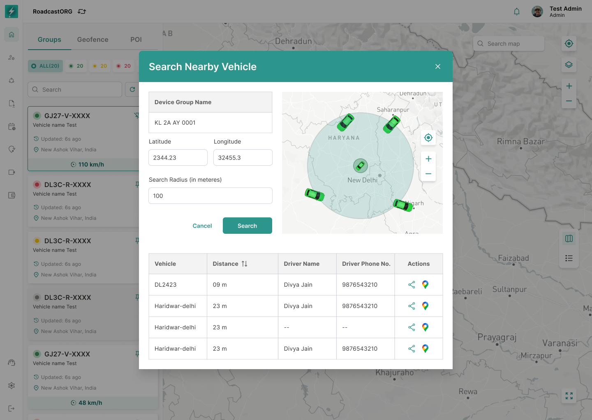

## 19. Nearby Vehicles

### 19.1 Purpose

Nearby Vehicles helps users find other fleet entities near a selected vehicle or location.

*Nearby Vehicles searches around a coordinate and returns the nearest fleet entities with distance and driver details.*

### 19.2 Requirements

- User initiates Nearby Vehicles from the selected entity action menu.
- System opens a search/filter state.
- User can search nearby vehicles.
- Result table/list should show vehicle, distance, driver name, driver phone number and actions where available.
- Selecting a nearby vehicle should focus it on map or open its info card.
- Empty results should show a clear no-nearby-vehicles state.

---
