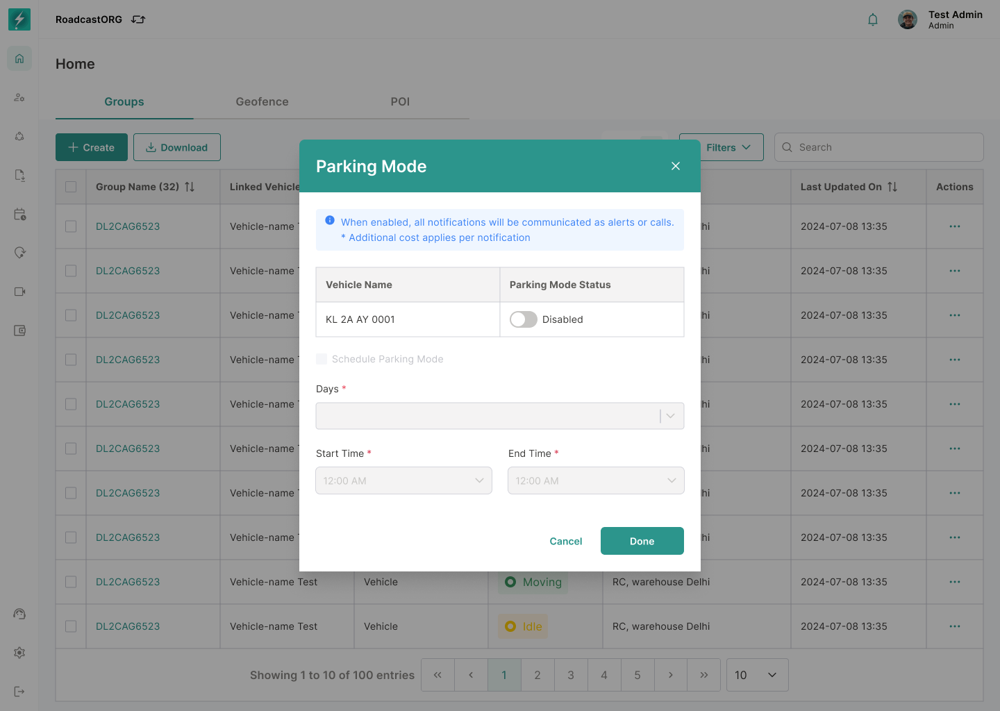

## 25. Parking Mode

### 25.1 Purpose

Parking Mode allows users to enable or schedule parking protection behavior for supported vehicles/devices.

*Parking Mode can be enabled immediately or scheduled for selected days and times on supported devices.*

### 25.2 Requirements

Parking Mode modal should support:

- Current parking mode status.
- Vehicle name.
- Parking mode toggle.
- Schedule Parking Mode option.
- Day selector.
- Start time.
- End time.
- Update action.
- Cancel action.
- Disabled field state when scheduling is not enabled.
- Success/error message after update.

### 25.3 Rules

- Parking Mode should only appear for compatible devices/licenses.
- Scheduled parking mode requires at least one day, start time and end time.
- Start and end time should be validated.
- Update should be recorded as a command/configuration change.
- Existing state must be pre-filled when opening the modal.

---
