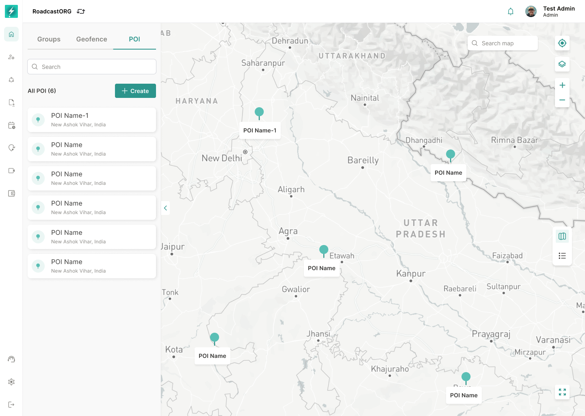

## 12. POI List

*The POI view synchronizes saved locations in the left panel with their markers on the map.*

### 12.1 POI Requirements

The POI tab should show saved points of interest with:

- POI name.
- Address.
- Icon.
- Description, where available.
- Created date.
- Actions menu.
- Map marker focus on selection.

### 12.2 POI Table

The POI table should support search, filters, download and row-level actions.

---
