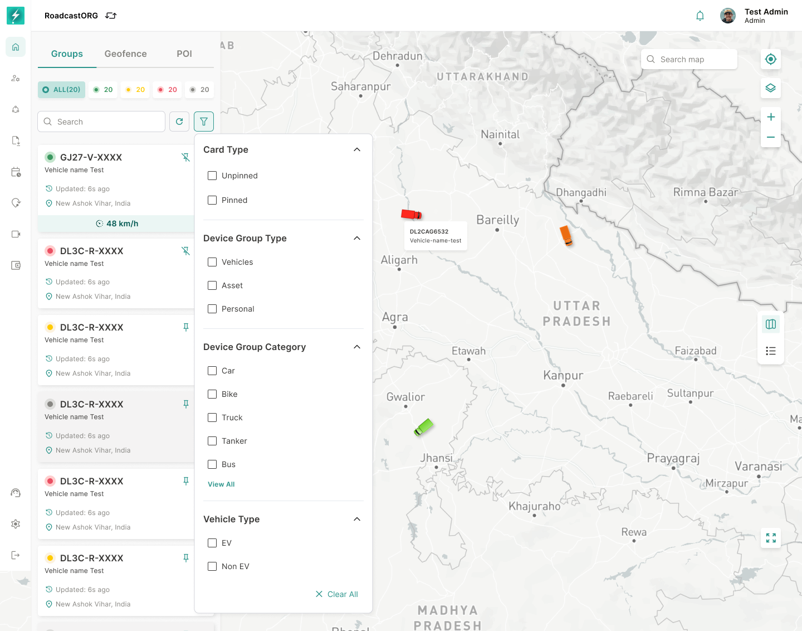

## 13. Search, Filters and Advanced Filters

*Advanced filters narrow the list, table and map markers together while preserving the current Map context.*

### 13.1 Search

Search should support keyword lookup across the active tab:

- Device Group: group name, linked vehicle number, driver name, owner name, IMEI where available.
- Geofence: geofence name, organisation, linked group.
- POI: POI name, address, description.

Search should update list results and visible markers while preserving map state where possible.

### 13.2 Basic Filters

The Map filter panel should support:

- Card type.
- Device group type.
- Device group category.
- Vehicle type.
- Status.
- Organisation/sub-organisation scope where applicable.
- Nearby vehicle filter when initiated from nearby-vehicle flow.

### 13.3 Advanced Filters

Advanced filters should allow users to narrow large fleets using additional attributes. The exact available fields may depend on entity type, organisation configuration and licensed modules.

Rules:

- Filters apply to list, table and map markers together.
- Filter state should be visible after application.
- Users can clear all filters.
- If a filter combination returns no result, show a no-result state with “Clear filters”.
- Backend filtering is preferred for large datasets.

---
