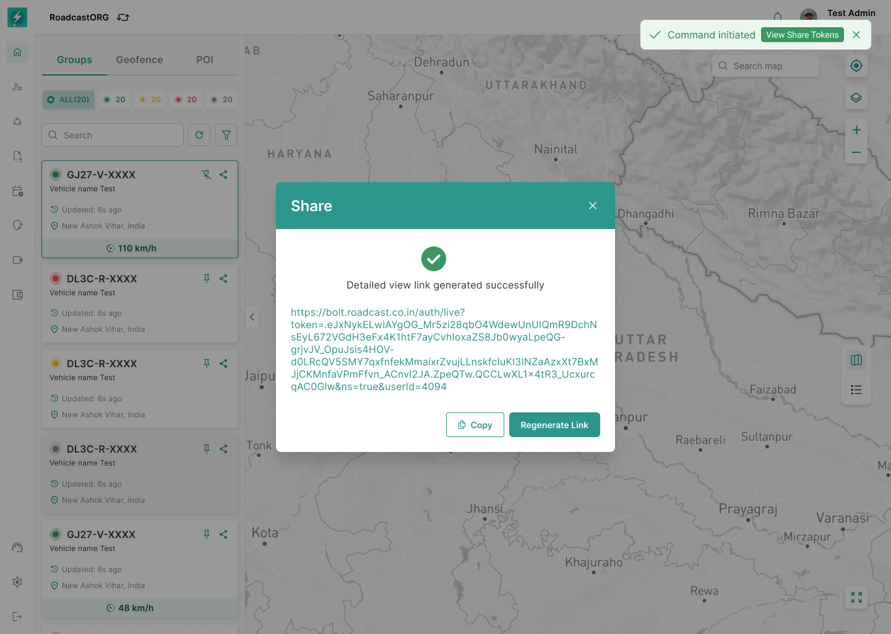

## 21. Share Tracking Links

### 21.1 Purpose

Share allows users to generate temporary tracking links for a selected entity or selected set of entities.

*The Share workflow generates a scoped tracking link that can be copied, regenerated, expired or revoked.*

### 21.2 Single Entity Share

Single-entity sharing should support:

- Generate Link tab.
- Tokens tab.
- Link type selection.
- Detailed view link.
- Location view link where applicable.
- Expiry date/time.
- Copy generated link.
- Regenerate link.
- Delete/revoke token.
- View generated token logs.

### 21.3 Bulk Share

Bulk share should support:

- Selecting multiple vehicles/entities in table view.
- Generating one shared view for selected entities.
- Viewing shared map state.
- Opening vehicle info from shared view where allowed.
- Token expiry and revocation.

### 21.4 Security Rules

- Shared links must use tokenized access.
- Expiry must be enforced server-side.
- Expired/revoked tokens must not expose entity data.
- Shared view should show only the entities and fields included in the link type.
- Token logs must show generated date, link type and expiry.

---
