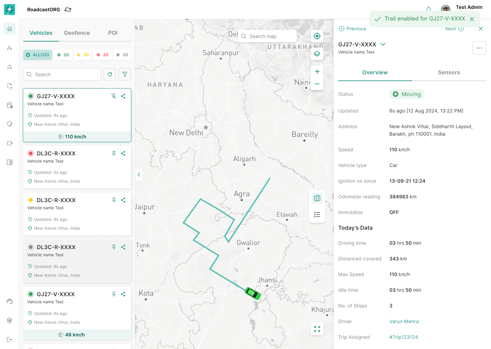

## 18. Show Trail

### 18.1 Purpose

Show Trail gives users a quick recent-trail visualization on the main map without entering the full Path Replay workflow.

*Show Trail adds a recent movement line to the current Map while keeping the selected vehicle and live operational context visible.*

### 18.2 Requirements

- Available from selected entity action menu.
- Show recent movement trail on the active map.
- Support single-vehicle and multi-vehicle trail visualization.
- Show trail styling clearly against map background.
- Allow trail to be cleared or replaced when user selects another entity.
- Must not permanently alter map filters.

---
