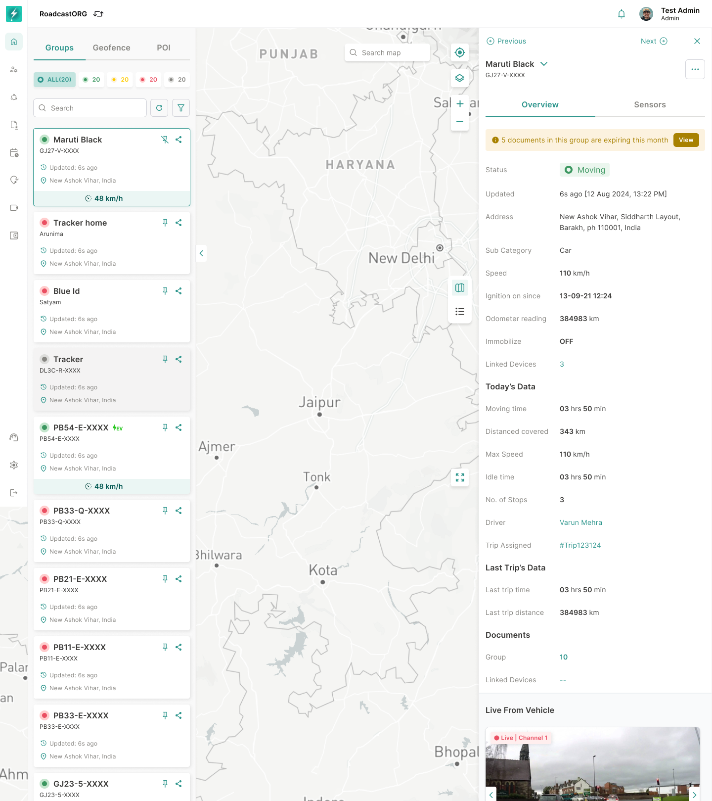
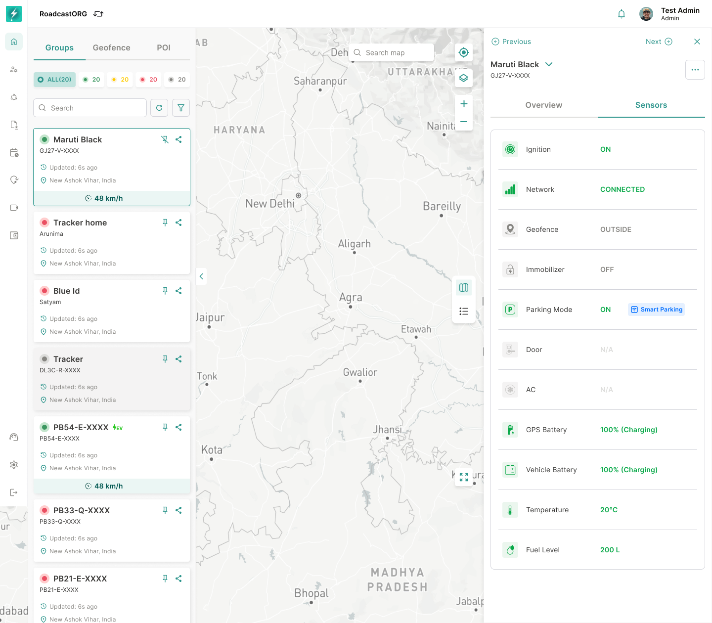
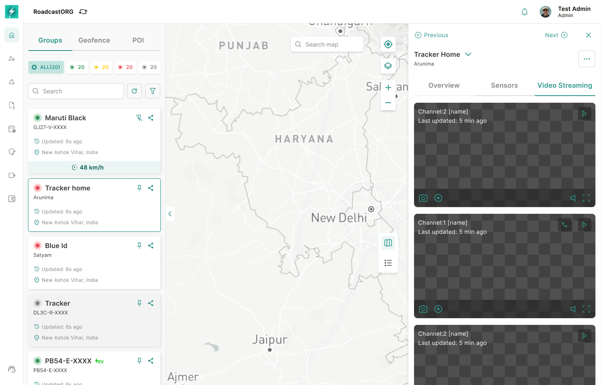

## 15. Vehicle / Device Group Info Card

### 15.1 Overview Tab

Selecting a vehicle/device group should open a right-side details panel with:

*The Overview tab preserves the live map while showing status, location, telemetry, assigned driver and daily operational data.*

- Previous / Next controls.
- Entity name and secondary label.
- Overview tab.
- Sensors tab.
- Video Streaming tab where supported.
- Status.
- Last updated timestamp.
- Address.
- Sub-category.
- Speed.
- Vehicle type.
- Ignition on/off duration.
- Odometer reading.
- Immobilizer state.
- Today’s data / operational metrics.
- Document expiry alerts, where applicable.

### 15.2 Sensors Tab

The Sensors tab should show all supported sensor values for the selected device/group. Examples include:

*The Sensors tab presents supported device states such as ignition, network, geofence, immobilizer, parking, battery and temperature.*

- Ignition.
- Network.
- Geofence state.
- Immobilizer.
- Parking.
- Door.
- AC.
- GPS.
- Battery or EV battery where applicable.

Unsupported sensor values should show `N/A`, not blank.

### 15.3 Video Streaming Tab

If the selected group has video capability and the user has permission, show the Video Streaming tab with available channels and last updated stream timestamp.

*Video-enabled vehicles expose available camera channels without taking the operator away from the Map.*

### 15.4 Entity-Specific Variants

The info card should adapt to entity type:

- Vehicle: speed, ignition, odometer, vehicle type, driver and immobilizer.
- Asset/personal: linked devices, movement state and today’s data.
- EV: battery percentage, charging state and BMS entry point.
- Video-enabled vehicle: stream channels.
- Inactive/no-data entity: stale timestamp and unavailable values.

---
