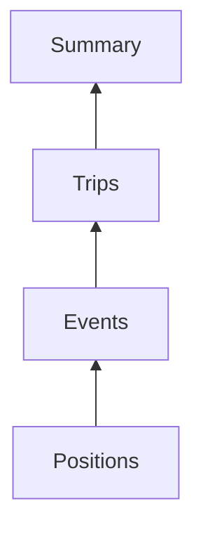
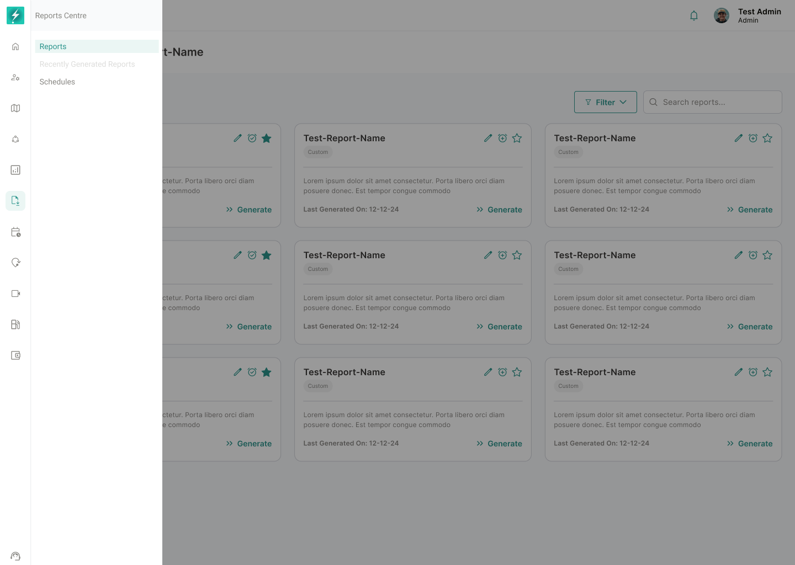
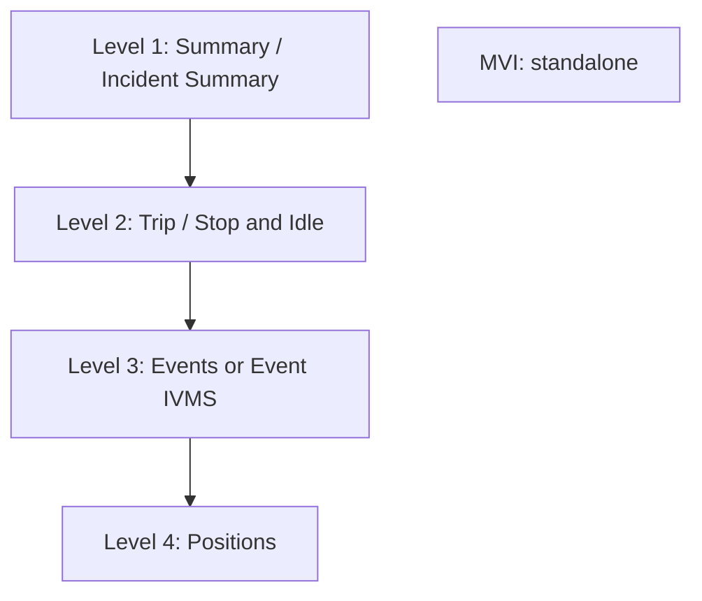
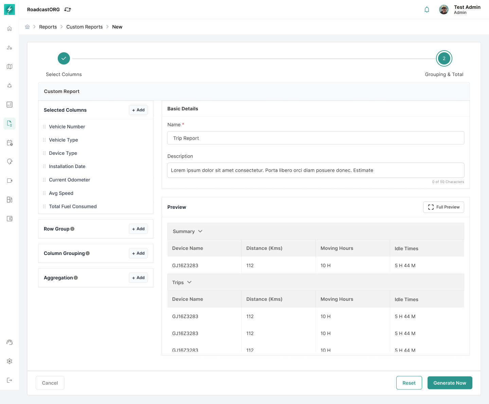
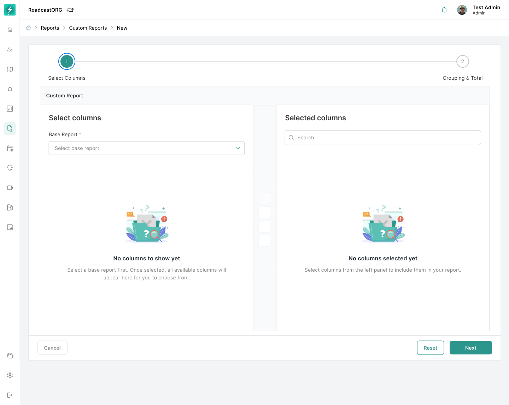
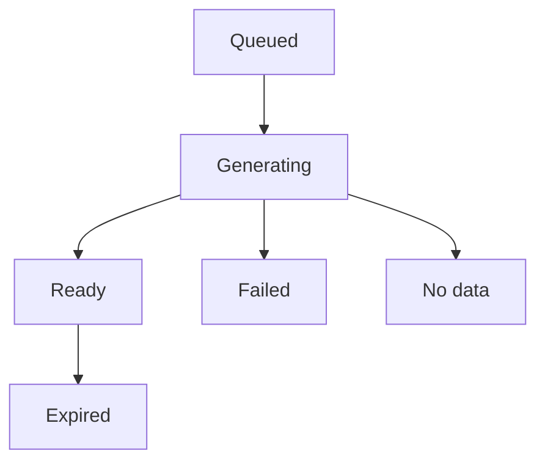
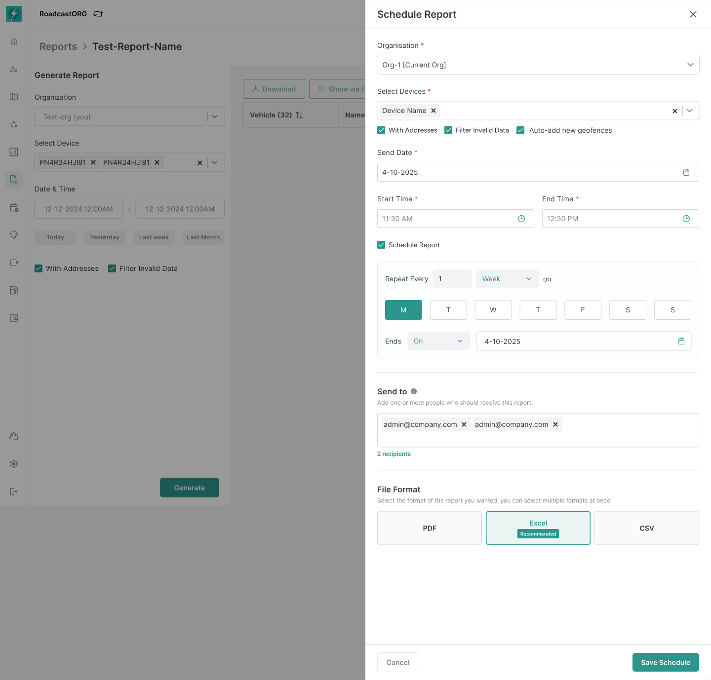
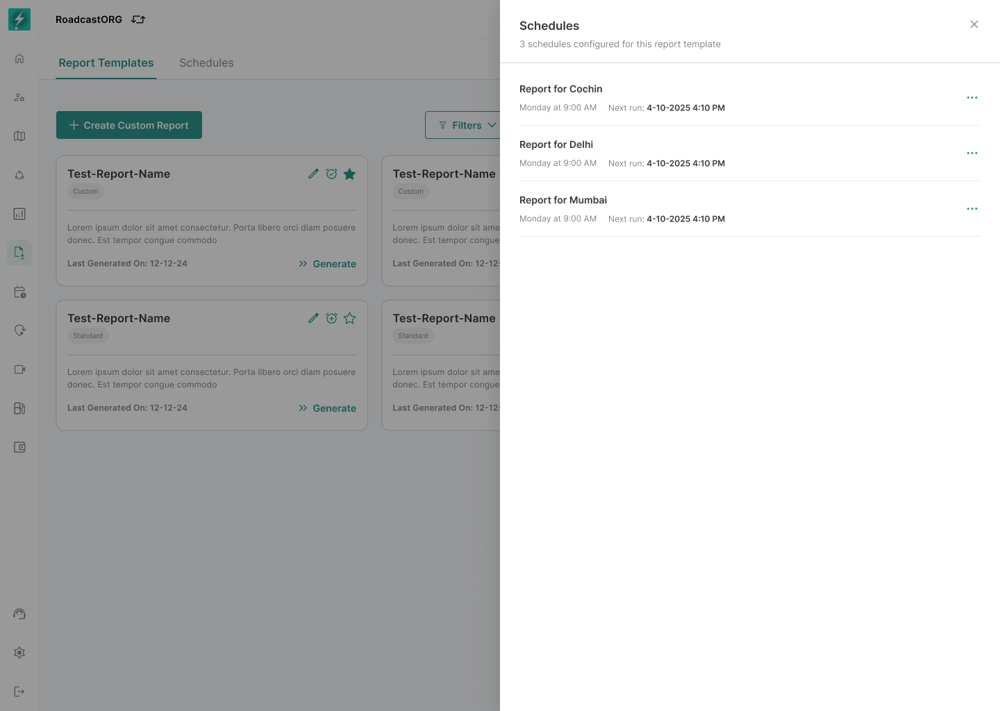
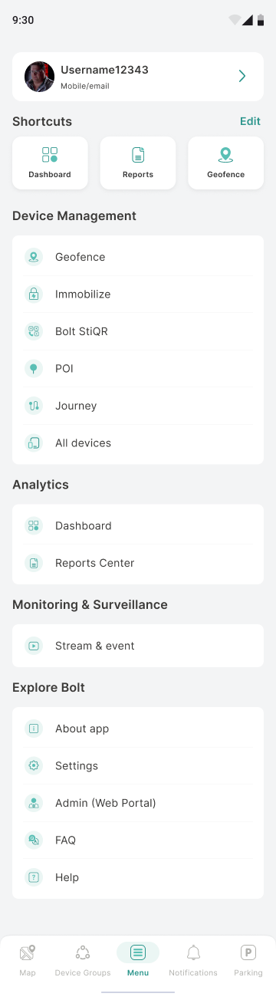

# Reports

Use BOLT Reports to turn vehicle activity into information you can review, download, share, and schedule.

This guide covers report selection, custom report creation, generation, scheduling, and mobile access.

## Reports Overview

The Reports module helps you convert fleet activity into structured information that can be reviewed, downloaded, shared, and scheduled.

You can use ready-made reports for common operational requirements, or build a custom report using selected data, columns, filters, grouping, and totals.

### Why teams use reports

Live tracking answers *where is the vehicle right now*. Reports answer the harder questions - the ones that come up in a Monday review, a customer dispute, or a fuel-cost conversation.

| The question                                | The report that answers it                                    |
|---------------------------------------------|---------------------------------------------------------------|
| How much did we actually run last month?    | [Summary](#summary-report)                                    |
| Why is this route always late?              | [Trip](#trip-report) + [Stop and Idle](#stop-and-idle-report) |
| Which drivers are braking hard, and where?  | [Events](#events-report)                                      |
| The customer says we never arrived. Did we? | [Positions](#positions-report)                                |
| How much time are we burning at idle?       | [Stop and Idle](#stop-and-idle-report)                        |
| How many incidents this quarter?            | [Incident Summary](#incident-summary-report)                  |

*Typical questions Reports is used to settle.*

### Standard vs custom reports

|                 | Standard report                                          | Custom report                                                   |
|-----------------|----------------------------------------------------------|-----------------------------------------------------------------|
| **What it is**  | A ready-made report with sensible columns already chosen | A report you assemble from one or more base reports             |
| **Best for**    | The common question, asked often                         | The specific question nobody built a report for                 |
| **You choose**  | Assets and date range                                    | Base reports, assets, dates, columns, filters, grouping, totals |
| **Time to run** | A minute                                                 | Five to fifteen, the first time                                 |
| **Where**       | Web and mobile                                           | Built on web. Saved templates can be *run* from mobile.         |

### Generated vs scheduled

A **generated report** is a file. You asked for it, it was produced, and it now sits in your reports list until it expires. A **scheduled report** is a standing instruction - run this configuration every Monday at 07:00 and email it to these three people. The schedule produces generated reports; it is not one itself.

> **Note:** Deleting a schedule does not delete the reports it already produced. Those files stay until their own retention window ends.

### The report journey

### Where Reports is available

| Capability                                       | Web | Mobile |
|--------------------------------------------------|-----|--------|
| Create or edit a custom report                   | Yes | No     |
| Configure columns, filters, grouping, and totals | Yes | No     |
| Run a saved report template                      | Yes | Yes    |
| Apply runtime filters                            | Yes | Yes    |
| Monitor generation status                        | Yes | Yes    |
| Download or share a generated report             | Yes | Yes    |
| Create or edit a schedule                        | Yes | No     |
| View schedule status                             | Yes | Yes    |

### Recommended reading path

1.  ##### Understand the module

    You are here.

2.  ##### Choose the correct report type

    [Report catalogue](#report-catalogue) and the [decision table](#choosing-the-correct-report).

3.  ##### Generate a basic report

    [Quick start](#reports-quick-start).

4.  ##### Create a custom report

    [Custom report builder](#build-a-custom-report), once you understand [hierarchy](#report-hierarchy-and-compatibility).

5.  ##### Configure columns, filters, grouping, totals

    [Columns](#selecting-and-managing-columns), [Filters](#filters-and-date-ranges), [Grouping](#grouping-and-aggregation).

6.  ##### Preview and generate

    [Generating a report](#generating-a-report).

7.  ##### Save or schedule

    [Templates](#saved-reports-and-templates), [Schedules](#scheduling-reports).

8.  ##### Download, share, or use on mobile

    [Reports on mobile](#reports-on-mobile).

9.  ##### Fix what went wrong

    [Troubleshooting](#troubleshooting).

------------------------------------------------------------------------

## How Reports Works

One idea underpins the entire Reports module. Understand it and every rule, restriction and error message stops feeling arbitrary.

### The one idea

Your vehicles are constantly sending one thing: **position pings**. A coordinate, a speed, a timestamp, every few seconds. That is all the hardware produces. Everything else in BOLT is built by interpreting those pings.

Read that diagram from the bottom:

- The device sends **positions**.
- BOLT notices a hard deceleration between two pings and calls it an **event**.
- BOLT notices the vehicle moved, then stopped for a long time, and calls that span a **trip**.
- BOLT adds all the trips for a day together and calls it a **summary**.

> **Important:** Every report is the same data, at a different zoom level. Summary is not a different dataset from Positions - it is the same dataset, viewed from further away. This single fact explains the hierarchy, the combination rules, the file sizes, and why some reports refuse to sit together.

### Why the hierarchy exists

Because a summary *contains* trips, and a trip *contains* events, and an event *sits at* a position, the four levels nest naturally:

When you combine reports, BOLT nests them in that order - the highest one you selected becomes the **primary** and organises everything else. You cannot nest a summary inside a trip, because that is not how the data is shaped. That is the whole rule.

### Why file size explodes as you go down

One vehicle. One day. The same day, seen at each level:

| Level     | Rows       | Why                                |
|-----------|------------|------------------------------------|
| Summary   | **1**      | The whole day, added up.           |
| Trip      | **6**      | One per journey.                   |
| Events    | **23**     | One per flagged behaviour.         |
| Positions | **~8,600** | A ping every few seconds, all day. |

> **Warning:** This is why a Positions report over a month, across thirty vehicles, fails. It is not a bug - you asked for roughly 7.7 million rows. Ask the question at the highest level that can answer it.

### The rule for choosing

> **Tip:** Start high. Go lower only when the higher level cannot answer you. Summary says vehicle 12 has four hours of idle. Then go to Stop and Idle to see where. Then go to Positions only if someone disputes it. Three reports, each one narrower than the last, each one prompted by a question the previous one raised.

Most people run reports that are far more detailed than the question requires, wait a long time, and then read the first summary row. Ask at the right zoom level and the answer arrives in seconds.

### Then what?

##### [See all 8 reports](#report-catalogue)

What each one shows and when to reach for it.

##### [Hierarchy & rules](#report-hierarchy-and-compatibility)

The combination rules, with an explorer you can click.

##### [Run one now](#reports-quick-start)

Five minutes, start to finish.

------------------------------------------------------------------------

## Reports Quick Start

Generate your first BOLT report in about five minutes, using a standard report and nothing else.

### Who this page is for

Anyone opening Reports for the first time. No prior configuration knowledge assumed. If you already know which report you want and just need the mechanics of a custom build, skip ahead to the [Custom report builder](#build-a-custom-report).

#### What you'll accomplish

- Open Reports and find the report you need
- Set a date range and pick vehicless
- Generate a report and download it as a file

#### Before you begin

- You need access to the Reports module. If the menu item isn't there, see [Permissions and access](#permissions-and-access).
- The vehicles you want to report on must have been sending data during your chosen dates.

> **Permission required:** Reports uses view and generate permissions. Without them, the module is hidden rather than shown greyed out.

### The five-minute path

*Open Report Center from the left navigation, then choose or generate a report.*

1.  ##### Open Reports

    From the left navigation in BOLT, select **Reports**. You land on the reports list - everything generated so far, newest first. First time in, it will be empty.

2.  ##### Pick a standard report

    Choose **Summary** if you want the big picture, or **Trip** if you want journey-by-journey detail. Not sure? The [decision table](#choosing-the-correct-report) settles it in a minute.

3.  ##### Choose your vehicles

    Select individual vehicles, or a vehicle group if you already have one set up. Start small - one or two vehicles is plenty for a first run.

4.  ##### Set the date range

    Yesterday is a good first choice. It is short, the data has settled, and the report will come back quickly.

5.  ##### Preview

    The preview shows a sample of what you are about to generate. If it looks empty here, it will be empty in the file. Fix it now rather than after.

6.  ##### Generate

    Select **Generate report**. The report is queued, then generated. You do not need to sit and watch - you can leave the page and come back.

7.  ##### Download

    When the status reads **Ready**, download the file. That is a report.

> **Tip:** Generate the same report twice with different date ranges and compare the two files. It is the fastest way to learn what each column is actually telling you.

### If nothing comes back

> **Empty state - no reports yet:** No reports have been generated yet. Choose a report or use a saved template to generate your first report.

> **No-data state:** No data matched this configuration. Widen the date range, check the selected vehicles, or remove a filter.

A report that comes back empty is almost never broken. It usually means the vehicle wasn't reporting on those dates, or a filter is narrower than you thought. [Troubleshooting](#troubleshooting) walks through each cause.

### Where to go next

##### [Choosing the right report](#choosing-the-correct-report)

Eight types, one table.

##### [Custom report builder](#build-a-custom-report)

When a standard report isn't enough.

##### [Scheduling](#scheduling-reports)

Stop generating it by hand every Monday.

------------------------------------------------------------------------

## Report Catalogue

Eight report types. Each one answers a different kind of question. Here is all of them, side by side.

### Every report type

##### [Summary](#summary-report)

Level 1

**How did the fleet perform overall?**

Rolled-up totals per vehicle or per day - distance, running time, idle time, event counts.

##### [Incident Summary](#incident-summary-report)

Companion to Summary

**How many incidents, and where?**

Incident totals sitting alongside summary figures.

##### [Trip](#trip-report)

Level 2

**What journeys did each vehicle complete?**

One row per journey - start, end, distance, duration, stops, idle.

##### [Stop and Idle](#stop-and-idle-report)

Companion to Trip

**Where is time being lost?**

Every stop and idle spell with location and duration.

##### [Events](#events-report)

Level 3

**What driving behaviour was flagged?**

Harsh braking, overspeed, harsh acceleration and other alerts.

##### [Event IVMS](#event-ivms-report)

Level 3

**What do the in-vehicle monitoring events show?**

IVMS-standard event records at the same level as Events.

##### [Positions](#positions-report)

Level 4

**Exactly where was the vehicle, second by second?**

Raw GPS position records - the most detailed level available.

##### [MVI](#mvi-report)

Standalone

**What does the vehicle inspection record say?**

Motor vehicle inspection data. Always generated on its own.

> **Note:** Only Trip has a full page written so far - it is the worked example for the report-page template. The remaining seven follow the identical structure and are queued for publication.

### Detail level at a glance

| Report           | Rows you'd get                             | Primary data level |
|------------------|--------------------------------------------|--------------------|
| Summary          | 1 row - the whole day                      | Vehicle / day      |
| Incident Summary | 1 row - incident totals                    | Vehicle / day      |
| Trip             | 6 rows - one per journey                   | Trip               |
| Stop and Idle    | 14 rows - every stop and idle spell        | Stop / idle record |
| Events           | 23 rows - one per flagged event            | Event              |
| Event IVMS       | 23 rows - IVMS-standard event records      | Event              |
| Positions        | ~8,600 rows - a GPS ping every few seconds | Position           |
| MVI              | 1 row - the inspection record              | Inspection         |

One day of one vehicle, seen through each report

> **Warning:** Positions is enormous. Ask for one vehicle and one day, not thirty vehicles and a month - you will hit the record limit and the report will fail.

### What combines with what

Reports sit at levels, and a custom report has to read top-down. The [hierarchy page](#report-hierarchy-and-compatibility) explains why, and includes an explorer you can click through.

| Report           | Level                | Combines with                                         |
|------------------|----------------------|-------------------------------------------------------|
| Summary          | 1                    | Trip, Events, Event IVMS, Positions, Incident Summary |
| Incident Summary | Companion to Summary | Summary                                               |
| Trip             | 2                    | Summary, Events, Event IVMS, Positions, Stop and Idle |
| Stop and Idle    | Companion to Trip    | Summary, Trip, Positions                              |
| Events           | 3                    | Summary, Trip, Positions                              |
| Event IVMS       | 3                    | Summary, Trip, Positions                              |
| Positions        | 4                    | Everything except MVI                                 |
| MVI              | Standalone           | Nothing - always runs alone                           |

------------------------------------------------------------------------

## Choosing the Correct Report

Start from the question you are trying to answer, not from the report names.

### Decision table

| If you need to know...                                 | Use                            | Why                                                                    |
|--------------------------------------------------------|--------------------------------|------------------------------------------------------------------------|
| Total distance, running time and idle across the fleet | **Summary**                    | Rolls everything up. One row per vehicle or per day.                   |
| How many incidents happened, and their totals          | **Summary + Incident Summary** | Incident Summary sits beside Summary at the same level.                |
| What individual journeys a vehicle made                | **Trip**                       | One row per journey - start, end, distance, duration.                  |
| Where time is being lost between journeys              | **Trip + Stop and Idle**       | Stop and Idle is Trip's companion. Gives you every stop with duration. |
| Which drivers are braking hard or overspeeding         | **Events**                     | One row per flagged event, with time, speed and place.                 |
| Behaviour events in IVMS format                        | **Event IVMS**                 | Same level as Events. Choose one or the other, not both.               |
| Exactly where a vehicle was at 14:32 last Tuesday      | **Positions**                  | Raw GPS. The most detailed level there is.                             |
| Which events happened inside which trip                | **Trip + Events**              | Events nest under the trip they belong to.                             |
| Vehicle inspection records                             | **MVI**                        | Runs on its own. Cannot be combined.                                   |

Find your question in the left column.

### Three rules that save you a rerun

1.  ##### Pick the narrowest report that answers the question

    If Trip answers it, do not run Positions. Detail you do not need costs you generation time and a harder file to read.

2.  ##### Start with a short date range

    One day. Confirm the report shape is right, then widen. A month-long Positions report that comes back wrong is a month of waiting for nothing.

3.  ##### Add the companion, not another level

    Want stops? Add Stop and Idle to Trip. Do not add Positions and try to reconstruct stops from GPS pings by hand.

> **Tip:** If two reports both seem right, the one that produces fewer rows is usually the correct answer.

### Common mistakes

| Mistake                                            | What happens                          | Do this instead                         |
|----------------------------------------------------|---------------------------------------|-----------------------------------------|
| Selecting Positions for a whole fleet, for a month | Report fails or hits the record limit | One vehicle, one day, then widen        |
| Trying to add Events to Stop and Idle              | The option is disabled                | Run them as two separate reports        |
| Adding MVI to an existing selection                | Everything else is cleared            | Run MVI on its own                      |
| Selecting both Events and Event IVMS               | They occupy the same level            | Choose whichever format your team reads |

------------------------------------------------------------------------

## Summary Report

The broadest view in BOLT. Everything a vehicle did in a period, rolled into a single line.

> **Note:** Summary sits at Level 1 - the top of the hierarchy. Whenever you include it in a custom report, it becomes the primary and everything else nests underneath it.

### What this report shows

Totals. Not journeys, not events, not GPS points - the aggregate of all of them. If a vehicle made six trips, stopped fourteen times and triggered twenty-three events, Summary gives you one row that adds all of that up.

#### One row means

**One vehicle, one period (typically one day).**

### Questions it answers

- How far did the fleet run last month?
- Which vehicle is doing the most kilometres?
- How much time are we losing to idle, across the whole fleet?
- How many events did each vehicle trigger?
- Is utilisation improving month on month?
- Which vehicles barely moved?

### Primary data level

**Vehicle / period.** Level 1 - the broadest level there is. Every other base report can nest beneath it.

> **Tip:** Summary is the right starting point for almost any question that begins "overall..." or "across the fleet...". If you find yourself scrolling through a Trip report adding up distances by hand, you wanted Summary.

### Commonly used columns

| Column         | What it tells you                | Identifying? |
|----------------|----------------------------------|--------------|
| **Vehicle ID** | Which vehicle the row is about   | Yes          |
| **Date**       | The period the totals cover      | Yes          |
| Total distance | Kilometres covered in the period | \-           |
| Running time   | Time spent actually moving       | \-           |
| Idle time      | Stationary, ignition on          | \-           |
| Stopped time   | Stationary, ignition off         | \-           |
| Trip count     | How many journeys were made      | \-           |
| Event count    | How many events were triggered   | \-           |
| Max speed      | Highest speed recorded           | \-           |
| Average speed  | Mean speed across the period     | \-           |

Identifying columns are marked. At least one from the primary report must stay selected.

> **Important:** If this report is your primary, you must keep at least one identifying column or the report cannot be generated. See Selecting and managing columns.

### Recommended filters

- **Date and time** - a month is comfortable here. Summary stays small because it is rolled up.
- **Vehicle group** - compare the North fleet against the South.
- **Vehicle** - if you are investigating one asset.

### Worked example

**The situation.** Month-end review. The fleet did 42,000 km, which sounds fine. But fuel cost is up 11% and nobody can explain why.

1.  ##### Select Summary alone

    No other base report. You want totals, not detail.

2.  ##### Select the whole fleet

    All vehicles. This is a fleet-level question.

3.  ##### Set the range to last month

    Summary handles a month without complaint.

4.  ##### Group by vehicle

    So each vehicle gets its own subtotal.

5.  ##### Turn on Sum for idle time

    And enable the grand total - it is off by default.

6.  ##### Read the idle column

    If three vehicles account for 60% of fleet idle time, you have found your 11%. Now run a [Stop and Idle](#stop-and-idle-report) report on those three to see *where*.

**What you learn.** Summary tells you **which** vehicle has the problem. It never tells you **why**. That is what the lower levels are for - and that is the whole logic of the hierarchy.

### Combines with

| Report               | Allowed?      | What you get                                                                   |
|----------------------|---------------|--------------------------------------------------------------------------------|
| **Incident Summary** | Confirmed Yes | Incident totals sit beside the summary totals. Same level - a companion.       |
| **Trip**             | Confirmed Yes | Every journey nests under its summary row.                                     |
| **Stop and Idle**    | Confirmed Yes | Stops nest beneath. Usually you want Trip in between.                          |
| **Events**           | Confirmed Yes | Events nest under the summary. Add Trip too and they nest under trips instead. |
| **Event IVMS**       | Confirmed Yes | As above, in IVMS format.                                                      |
| **Positions**        | Confirmed Yes | Allowed, but produces an enormous file. Think hard.                            |
| **MVI**              | No            | MVI always runs alone.                                                         |

### Limitations

- Summary hides the story. A vehicle with 4 hours of idle might have had one four-hour breakdown or forty six-minute stops. Summary cannot tell you which - [Stop and Idle](#stop-and-idle-report) can.
- Averages in Summary are already averaged. Do not average them again across vehicles - see the warning in [Grouping and aggregation](#grouping-and-aggregation).

------------------------------------------------------------------------

## Incident Summary Report

Incident totals, sitting alongside your summary figures. A companion to Summary, not a level of its own.

> **Important:** Incident Summary is a companion. It sits at Level 1 beside Summary rather than beneath it. It is the one report with the most restrictions - read the Combines with section carefully before you build with it.

### What this report shows

Rolled-up incident counts for the period, in the same shape as Summary so the two read together as one table.

#### One row means

**One vehicle, one period - with incident totals rather than movement totals.**

### Questions it answers

- How many incidents did we have this quarter?
- Which vehicles are involved in incidents most often?
- Is the incident rate going up or down?
- Which depot has the worst record?
- Did the safety intervention in April actually work?

### Primary data level

**Level 1 - companion to Summary.** It does not have children. Nothing nests under Incident Summary.

> **Warning:** Because Incident Summary is a companion rather than a level, it cannot sit above Events, Event IVMS or Stop and Idle. Those three are the confirmed restrictions. See Hierarchy and compatibility.

### Commonly used columns

| Column         | What it tells you                | Identifying? |
|----------------|----------------------------------|--------------|
| **Vehicle ID** | Which vehicle                    | Yes          |
| **Date**       | The period covered               | Yes          |
| Incident count | How many incidents in the period | \-           |
| Incident type  | The category of incident         | \-           |
| Severity       | How serious                      | \-           |

Identifying columns are marked. At least one from the primary report must stay selected.

> **Important:** If this report is your primary, you must keep at least one identifying column or the report cannot be generated. See Selecting and managing columns.

### Recommended filters

- **Date and time** - a quarter is a reasonable window for incident trends.
- **Vehicle group** - compare depots or regions.
- **Vehicle** - for a single-asset investigation.

> **Needs product confirmation:** The full incident column set, incident type values and severity scale are not enumerated in the supplied material. The columns above are the ones referenced in the brief. Confirm the complete list before treating this table as exhaustive.

### Worked example

**The situation.** The safety committee wants to know whether the driver-coaching programme launched in April made any difference.

1.  ##### Select Summary + Incident Summary

    Two Level 1 reports, sitting side by side. This is the classic companion pairing.

2.  ##### Select the whole fleet

    This is a programme-level question.

3.  ##### Set the range to January through July

    You need before and after.

4.  ##### Group by date

    Month by month.

5.  ##### Read the incident count against distance

    This is why you added Summary. Incidents alone are misleading - if the fleet drove 30% further, more incidents is not a worse record. Incidents *per kilometre* is the honest number, and you can only calculate it because Summary is in the same table.

**What you learn.** Incident Summary is far more useful with Summary beside it than on its own. Raw incident counts without distance context are one of the easiest ways to reach a wrong conclusion in fleet management.

### Combines with

| Report            | Allowed?      | What you get                                                                    |
|-------------------|---------------|---------------------------------------------------------------------------------|
| **Summary**       | Confirmed Yes | The intended pairing. Incident totals beside movement totals.                   |
| **Trip**          | Confirmed Yes | Trips nest under Summary. Incident Summary stays alongside.                     |
| **Events**        | No            | **Confirmed restriction.** Incompatible record structures. Generate separately. |
| **Event IVMS**    | No            | **Confirmed restriction.** Same reason.                                         |
| **Stop and Idle** | No            | **Confirmed restriction.** Same reason.                                         |
| **Positions**     | Confirmed Yes | Allowed.                                                                        |
| **MVI**           | No            | MVI always runs alone.                                                          |

### Limitations

- Three of the four confirmed combination restrictions in BOLT involve this report. If an option greys out unexpectedly, Incident Summary is usually the reason.
- Incident counts without a distance or time denominator are misleading. Pair with Summary.

------------------------------------------------------------------------

## Trip Report

Use this report when you need to analyse individual journeys completed by vehicles.

### What this report shows

One row per journey. A journey is a single movement from where the vehicle set off to where it finally came to rest - not the whole day, and not every individual stop within it.

#### Questions it can answer

- How many trips did a vehicle complete?
- When did each trip begin and end?
- What distance was covered?
- How long did the trip take?
- Where did the vehicle stop?
- How much idle time occurred during the trip?

#### Primary data level

**Trip** - Level 2 in the report hierarchy. Broader than Events and Positions, narrower than Summary.

### Commonly used columns

| Column                        | What it tells you                      | Identifying? |
|-------------------------------|----------------------------------------|--------------|
| **Trip ID**                   | Unique reference for the journey       | Yes          |
| **Vehicle ID**                | Which vehicle made the journey         | Yes          |
| Start time / End time         | When the journey began and ended       | \-           |
| Start location / End location | Where it began and ended               | \-           |
| Distance                      | Kilometres covered                     | \-           |
| Duration                      | Total elapsed time                     | \-           |
| Idle time                     | Time spent stationary with ignition on | \-           |
| Stop count                    | Number of stops within the journey     | \-           |

> **Important:** Keep at least one identifying column - Trip ID or Vehicle ID - or the report cannot be generated. See Selecting and managing columns.

### Recommended filters

- **Date and time** - always. Start with a single day.
- **Vehicle** or **vehicle group** - narrow to the fleet section you care about.
- **Driver** - if you are reviewing a person rather than an asset.

> **Needs product confirmation:** Trip status, minimum distance and minimum duration filters appear in the interface but their exact behaviour is not documented in the supplied material. Confirm before relying on them.

### Example: the late route

**The situation.** A distribution vehicle running Bhiwandi. Then Kalyan is consistently arriving 40 minutes late. The driver says traffic. Dispatch suspects a long lunch stop.

1.  ##### Select base reports

    **Trip**, then add **Stop and Idle** - its companion.

2.  ##### Select the asset

    MH12-AB-1234.

3.  ##### Set the date range

    The last two weeks, so the pattern shows rather than one bad day.

4.  ##### Group by

    Date, so each day's trips sit together.

5.  ##### Read the result

    If the trips themselves are the same length but idle time spikes at 13:00 every day, dispatch was right. If the trip duration itself has grown, the driver was.

### Reports it combines with

| Combine with            | Result                                                    |
|-------------------------|-----------------------------------------------------------|
| Confirmed Summary       | Trips nest under the summary row for that vehicle or day. |
| Confirmed Stop and Idle | Every stop and idle spell inside each trip.               |
| Confirmed Events        | Events nest under the trip they occurred in.              |
| Confirmed Event IVMS    | As above, in IVMS format.                                 |
| Confirmed Positions     | Raw GPS points attached to each trip. Large output.       |
| MVI                     | MVI always runs alone.                                    |

### Limitations

- Trip + Positions produces a very large file. Keep the date range short.
- A trip is only recorded if the device reported through the journey. Gaps in device data appear as gaps in trips, not as errors.

------------------------------------------------------------------------

## Stop and Idle Report

Every stop and every idle spell, with where it happened and how long it lasted. This is the report that finds wasted time.

> **Note:** A stop is stationary with the ignition off. Idle is stationary with the ignition on - the engine running, fuel burning, vehicle going nowhere. The distinction is the entire point of this report.

### What this report shows

One row for every time the vehicle stopped moving - whether the engine was off (a stop) or running (idle). Location, start, end, duration.

#### One row means

**One stop, or one idle spell.**

### Questions it answers

- Where is the vehicle sitting idle, and for how long?
- How much fuel are we burning going nowhere?
- Is the driver taking a 90-minute lunch?
- Why is this route always late - traffic, or dwell time at the customer?
- Which delivery point has the worst turnaround?
- Which vehicles idle most?

### Primary data level

**Level 2 - companion to Trip.** Sits beside Trip, not beneath it.

> **Important:** Idle time costs real money. A truck idling burns roughly 2-3 litres an hour and puts wear on the engine while producing nothing. This is usually the fastest report to a cost saving in the whole module.

### Commonly used columns

| Column                | What it tells you           | Identifying? |
|-----------------------|-----------------------------|--------------|
| **Vehicle ID**        | Which vehicle               | Yes          |
| **Timestamp**         | When the stop or idle began | Yes          |
| Type                  | Stop or Idle                | \-           |
| Location              | Where it happened           | \-           |
| Start time / End time | The window                  | \-           |
| Duration              | How long it lasted          | \-           |
| Driver                | Who was in the vehicle      | \-           |

Identifying columns are marked. At least one from the primary report must stay selected.

> **Important:** If this report is your primary, you must keep at least one identifying column or the report cannot be generated. See Selecting and managing columns.

### Recommended filters

- **Date and time** - a week gives you a pattern rather than an anecdote.
- **Vehicle** or **vehicle group**.
- **Duration** - needs confirmation, but filtering out stops under 2 minutes would remove traffic-light noise.

> **Needs product confirmation:** A minimum-duration filter would make this report substantially more usable - without it, every traffic light appears as a stop. The brief lists Duration as a possible filter but does not confirm it. Flagged in Open questions.

### Worked example

**The situation.** The Bhiwandi. Then Kalyan route is 40 minutes late, every day. The driver says traffic. Dispatch suspects a long lunch. Somebody is wrong.

1.  ##### Select Trip + Stop and Idle

    The companion pairing. Trip gives you the journey; Stop and Idle gives you what happened inside it.

2.  ##### Select MH12-AB-1234

    One vehicle. This is a specific accusation.

3.  ##### Set the range to the last two weeks

    Long enough that a pattern is undeniable and one bad day cannot explain it.

4.  ##### Group by date

    Each day's trips and stops together.

5.  ##### Read the two columns against each other

    **If trip duration is unchanged but a 55-minute stop appears at 13:00 every single day** - dispatch was right. **If trip duration itself has grown by 40 minutes and the stops are unchanged** - the driver was right, and the route genuinely got slower.

**What you learn.** This is the report that settles arguments. Two columns, read side by side, and the answer is not a matter of opinion.

### Combines with

| Report               | Allowed?      | What you get                                                               |
|----------------------|---------------|----------------------------------------------------------------------------|
| **Trip**             | Confirmed Yes | The intended pairing. Every stop inside every journey.                     |
| **Summary**          | Confirmed Yes | Stops roll up under summary rows.                                          |
| **Positions**        | Confirmed Yes | Raw GPS alongside stops. Large output.                                     |
| **Events**           | No            | **Confirmed restriction.** Incompatible record structures. Run separately. |
| **Event IVMS**       | No            | **Confirmed restriction.** Same reason.                                    |
| **Incident Summary** | No            | **Confirmed restriction.** Same reason.                                    |
| **MVI**              | No            | MVI always runs alone.                                                     |

### Limitations

- Without a minimum-duration filter, every traffic light is a stop. Expect noise.
- Stop and Idle cannot be combined with Events - two of the four confirmed restrictions involve this report. If you want driving behaviour *and* dwell time, that is two reports.

> **Conflict message:** Stop and Idle cannot be combined with Events because these reports use incompatible record structures. Generate them separately or remove one of the selected reports.

------------------------------------------------------------------------

## Events Report

Every flagged driving behaviour - harsh braking, overspeed, harsh acceleration - with when, where and how fast.

> **Note:** Events and Event IVMS both sit at Level 3. They are two formats of the same level of detail. Choose the one your team actually reads.

### What this report shows

One row per event the system flagged. An event is a moment, not a period - it has a timestamp, not a duration.

#### One row means

**One event. One harsh brake, one overspeed instance, one harsh turn.**

### Questions it answers

- Which drivers are braking hard, and where?
- Is overspeeding concentrated on one route?
- Did behaviour improve after coaching?
- Which vehicle triggered the most events last week?
- Do events cluster at a particular junction - and if so, is that a driver problem or a road problem?

### Primary data level

**Level 3.** Sits beneath Trip and Summary, above Positions.

> **Tip:** Events on their own tell you what. Events nested under Trip tell you what, during which journey - which is usually the more actionable question. Trip + Events is one of the most useful combinations in BOLT.

### Commonly used columns

| Column         | What it tells you                                  | Identifying? |
|----------------|----------------------------------------------------|--------------|
| **Event ID**   | Unique reference for the event                     | Yes          |
| **Vehicle ID** | Which vehicle                                      | Yes          |
| **Timestamp**  | Exactly when it happened                           | Yes          |
| Event type     | Harsh braking, overspeed, harsh acceleration, etc. | \-           |
| Location       | Where it happened                                  | \-           |
| Speed          | Speed at the moment of the event                   | \-           |
| Driver         | Who was driving                                    | \-           |
| Severity       | How serious                                        | \-           |

Identifying columns are marked. At least one from the primary report must stay selected.

> **Important:** If this report is your primary, you must keep at least one identifying column or the report cannot be generated. See Selecting and managing columns.

### Recommended filters

- **Date and time** - a week is a good behaviour window.
- **Driver** - this is usually a person question, not an asset question.
- **Event type** - needs confirmation. If available, filter to one behaviour at a time.
- **Vehicle group**.

> **Needs product confirmation:** Event type is listed as a possible filter in the brief but its behaviour and the full list of event types are not confirmed. See Open questions.

### Worked example

**The situation.** One driver is triggering three times the harsh-braking events of anyone else. HR wants a coaching conversation. You want to be sure it is actually him before you have it.

1.  ##### Select Trip + Events

    Not Events alone. You need to know which journeys the events happened in.

2.  ##### Select the driver

    Filter by driver, not vehicle - he may drive several.

3.  ##### Set the range to a month

    Enough that it is a pattern, not a bad week.

4.  ##### Group by event type

    Separate harsh braking from overspeed.

5.  ##### Look at where the events cluster

    **Here is the thing worth checking.** If 80% of his harsh braking is on one route, at one junction, at the same time of day - that is not a bad driver. That is a bad junction, and every driver on that route would do the same. Run the same report for a second driver on the same route before you have the conversation.

**What you learn.** Events tell you what the vehicle did. They do not tell you whether it was the driver's fault. Nesting events under trips, and comparing across drivers on the same route, is what turns the data into a fair judgement.

### Combines with

| Report               | Allowed?           | What you get                                                                   |
|----------------------|--------------------|--------------------------------------------------------------------------------|
| **Trip**             | Confirmed Yes      | Events nest under the journey they happened in. The most useful pairing.       |
| **Summary**          | Confirmed Yes      | Events roll up under the summary row.                                          |
| **Positions**        | Confirmed Yes      | Shows exactly where each event occurred.                                       |
| **Incident Summary** | No                 | **Confirmed restriction.** Incompatible record structures.                     |
| **Stop and Idle**    | No                 | **Confirmed restriction.** Incompatible record structures.                     |
| **Event IVMS**       | Needs confirmation | Both occupy Level 3. Whether they can coexist is an open question - see below. |
| **MVI**              | No                 | MVI always runs alone.                                                         |

### Limitations

- An event is a flag, not a verdict. Context - the route, the junction, the traffic - decides whether it means anything.
- Cannot be combined with Stop and Idle or Incident Summary. Two of the four confirmed restrictions.

> **Needs product confirmation:** Whether Events and Event IVMS can both be selected is not stated in the brief. Both sit at Level 3 and the "one primary report per level" rule suggests they should block each other - but this is not confirmed. The compatibility explorer currently allows both. Logged in Open questions as item 13.

------------------------------------------------------------------------

## Event IVMS Report

The same event level as Events, formatted to the IVMS standard used in regulated and contractual reporting.

> **Important:** Events or Event IVMS - which do I want? Use Events for internal fleet management. Use Event IVMS when an external party defines the format - a client contract, a regulator, an oil-and-gas or mining customer with IVMS reporting obligations.

### What this report shows

In-Vehicle Monitoring System event records. The same underlying moments as Events, presented in the structure the IVMS standard expects.

#### One row means

**One IVMS event record.**

### Questions it answers

- Can we produce the IVMS report our client contract requires?
- Does our event data meet the reporting standard the regulator expects?
- What do we submit for the quarterly compliance return?

### Primary data level

**Level 3.** The same level as Events - beneath Trip, above Positions.

> **Note:** Because Events and Event IVMS occupy the same hierarchy level, selecting both is an open question - see the note on the Events page. Choose one.

### Commonly used columns

| Column          | What it tells you                          | Identifying? |
|-----------------|--------------------------------------------|--------------|
| **Event ID**    | Unique reference                           | Yes          |
| **Vehicle ID**  | Which vehicle                              | Yes          |
| **Timestamp**   | When it occurred                           | Yes          |
| IVMS event type | The event, classified to the IVMS standard | \-           |
| Location        | Where it occurred                          | \-           |
| Speed           | Speed at the moment of the event           | \-           |
| Driver          | Who was driving                            | \-           |

Identifying columns are marked. At least one from the primary report must stay selected.

> **Important:** If this report is your primary, you must keep at least one identifying column or the report cannot be generated. See Selecting and managing columns.

### Recommended filters

- **Date and time** - usually the contractual reporting period. A month or a quarter.
- **Vehicle group** - often the fleet assigned to a specific client contract.
- **Driver**.

> **Needs product confirmation:** The complete IVMS column set and the IVMS event-type classification list are not specified in the supplied material. Confirm against the PRD before this table is treated as authoritative.

### Worked example

**The situation.** A mining client's contract requires a monthly IVMS event submission. It is due on the 3rd of every month and somebody currently builds it by hand.

1.  ##### Select Trip + Event IVMS

    Trip gives the journey context the submission expects.

2.  ##### Select the vehicle group assigned to that contract

    Not the whole fleet. Only the assets covered by the agreement.

3.  ##### Set the range to the previous calendar month

    And check the timezone - a contractual month boundary is not a place to be casual about it.

4.  ##### Configure the columns the contract specifies

    Rename them with aliases to match the client's expected headers exactly. Do this once.

5.  ##### Save it as a template, then schedule it

    Monthly, on the 2nd, at 06:00, emailed to the client contact and your compliance lead. Nobody builds it by hand again.

**What you learn.** This is the report most worth scheduling. It is recurring, contractual, format-sensitive, and building it by hand every month is exactly the kind of task that eventually gets done late or wrong.

### Combines with

| Report               | Allowed?           | What you get                              |
|----------------------|--------------------|-------------------------------------------|
| **Trip**             | Confirmed Yes      | IVMS events nest under trips.             |
| **Summary**          | Confirmed Yes      | Roll up under summary rows.               |
| **Positions**        | Confirmed Yes      | Exact location of each IVMS event.        |
| **Incident Summary** | No                 | **Confirmed restriction.**                |
| **Stop and Idle**    | No                 | **Confirmed restriction.**                |
| **Events**           | Needs confirmation | Same level. See [Events](#events-report). |
| **MVI**              | No                 | MVI always runs alone.                    |

### Limitations

- Carries the same restrictions as Events - no Stop and Idle, no Incident Summary.
- If the receiving party specifies exact column headers, use column aliases and get them right before you schedule it.

------------------------------------------------------------------------

## Positions Report

Raw GPS. Every ping the device sent. The most detailed report in BOLT - and the easiest one to misuse.

> **Warning:** Read this before you run it. Positions produces roughly 8,000-10,000 rows per vehicle per day. Ten vehicles for a month is around 2.7 million rows. That report will fail, and you will have waited a long time to find out. Start with one vehicle, one day.

### What this report shows

Every position record the device transmitted - latitude, longitude, speed, heading, timestamp. This is the underlying data everything else in BOLT is built from.

#### One row means

**One GPS ping. Typically one every few seconds while the vehicle is moving.**

### Questions it answers

- Exactly where was this vehicle at 14:32 last Tuesday?
- The customer says we never arrived. Did we?
- What route did the driver actually take?
- Was the vehicle inside the customer's yard, or parked outside it?
- Reconstruct the minute before an incident, second by second.

### Primary data level

**Level 4 - the most detailed level.** Nothing sits beneath Positions.

> **Important:** Use Positions when you need to prove something. Not to explore, not to browse - to settle a factual dispute where the exact location at an exact time is the answer. For anything less specific, a higher-level report will serve you better and finish faster.

### Commonly used columns

| Column               | What it tells you              | Identifying? |
|----------------------|--------------------------------|--------------|
| **Timestamp**        | Exactly when the ping was sent | Yes          |
| **Vehicle ID**       | Which vehicle                  | Yes          |
| Latitude / Longitude | The coordinates                | \-           |
| Location             | The address, where resolvable  | \-           |
| Speed                | Speed at that instant          | \-           |
| Heading              | Direction of travel            | \-           |
| Ignition             | On or off                      | \-           |

Identifying columns are marked. At least one from the primary report must stay selected.

> **Important:** If this report is your primary, you must keep at least one identifying column or the report cannot be generated. See Selecting and managing columns.

### Recommended filters

- **Date and time** - **one day. Genuinely.** Narrow to a time window if you can.
- **Vehicle** - one. Not a group.
- **Geofence** - needs confirmation. If available, this is the filter that makes Positions manageable: show only pings inside the customer's yard.

> **Needs product confirmation:** A geofence filter would transform this report - "was the vehicle inside the yard" becomes a two-row answer instead of a ten-thousand-row one. The brief lists Geofence as a possible filter but does not confirm it. This is the single most valuable unconfirmed filter in the module.

### Worked example

**The situation.** A customer is refusing to pay for a delivery. They say the vehicle never arrived on 8 July. The driver insists he was there for twenty minutes. There is money on this.

1.  ##### Select Positions alone

    No Trip, no Summary. You want the raw record, unmediated.

2.  ##### Select the one vehicle

    MH12-AB-1234. Only that one.

3.  ##### Set the range to 8 July, and narrow the time window

    If the delivery was scheduled for the afternoon, run 12:00-18:00, not the whole day. Ten thousand rows becomes two thousand.

4.  ##### Generate, and read the coordinates against the delivery address

    Speed 0, ignition off, coordinates at the customer's gate, 14:12 to 14:31. Nineteen minutes, stationary, at their address.

5.  ##### That is the answer

    It is not an opinion, an estimate or a system-generated flag. It is where the vehicle physically was, recorded second by second at the time it happened. This is the only report in BOLT that produces evidence of that quality - and it is precisely why it exists.

**What you learn.** Positions is the court of last resort. Slow, enormous, and completely unarguable. Every other report in BOLT is a summary of this one.

### Combines with

| Report            | Allowed?      | What you get                                         |
|-------------------|---------------|------------------------------------------------------|
| **Trip**          | Confirmed Yes | GPS trace per journey. Large.                        |
| **Events**        | Confirmed Yes | Exactly where each event occurred.                   |
| **Event IVMS**    | Confirmed Yes | As above.                                            |
| **Stop and Idle** | Confirmed Yes | Stops with the raw trace around them.                |
| **Summary**       | Confirmed Yes | Allowed. Rarely a good idea - the file will be vast. |
| **MVI**           | No            | MVI always runs alone.                               |

### Limitations

- **Size.** This is the whole limitation. Everything else about Positions is a consequence of it.
- A ping is only recorded if the device was reporting. Tunnels, dead zones and device faults appear as gaps - a gap is not proof the vehicle was not there.
- Coordinates are accurate to within a few metres, not centimetres. "Inside the gate or ten metres outside it" is at the edge of what GPS can honestly answer.

> **Too many records:** This configuration returns too many records. Narrow the date range or reduce the number of vehicles.

------------------------------------------------------------------------

## MVI Report

Motor vehicle inspection records. The only report in BOLT that always runs completely on its own.

> **Error:** MVI cannot be combined with any other base report. Select it and your selection limit drops to one - everything else is cleared. This is not a bug and there is no way around it. If you need inspection data and trip data, that is two reports.

### What this report shows

Vehicle inspection records - what was checked, when, by whom, and what was found.

#### One row means

**One inspection.**

### Questions it answers

- When was this vehicle last inspected?
- Which vehicles are overdue?
- What defects were found, and were they fixed?
- Can we evidence our inspection compliance?

### Primary data level

**Standalone.** MVI sits outside the hierarchy entirely. It has no level, no parent and no children.

> **Note:** MVI is separate because inspection records are not fleet-movement records. A trip has a start, an end and a distance. An inspection has a date, a checklist and an outcome. There is no sensible way to nest one inside the other, so BOLT does not pretend otherwise.

### Commonly used columns

| Column              | What it tells you           | Identifying? |
|---------------------|-----------------------------|--------------|
| **Vehicle ID**      | Which vehicle was inspected | Yes          |
| **Inspection date** | When                        | Yes          |
| Inspector           | Who carried it out          | \-           |
| Result              | Pass, fail, advisory        | \-           |
| Defects found       | What was wrong              | \-           |

Identifying columns are marked. At least one from the primary report must stay selected.

> **Important:** If this report is your primary, you must keep at least one identifying column or the report cannot be generated. See Selecting and managing columns.

### Recommended filters

- **Date and time** - the inspection period.
- **Vehicle** or **vehicle group**.

> **Needs product confirmation:** The full MVI column set, the result values and the defect classification are not specified in the supplied material. Confirm before treating this table as complete.

### Worked example

**The situation.** An audit is scheduled. You need to evidence that every vehicle in the fleet has a current inspection record.

1.  ##### Select MVI

    On its own. It will not let you do otherwise - every other option greys out the moment you pick it.

2.  ##### Select the whole fleet

    Every vehicle.

3.  ##### Set the range to cover the required inspection interval

    If inspections are six-monthly, run the last six months.

4.  ##### Group by vehicle

    So each vehicle's inspection history sits together.

5.  ##### Look for the vehicles that are not in the report

    **This is the important part.** A vehicle with no inspection in the period produces no row. The finding is the *absence* - so cross-check the output against your full vehicle list. The report cannot tell you about a record that does not exist.

**What you learn.** MVI is the one report where the useful answer is often what is missing rather than what is present. Read it against your asset list, not on its own.

### Combines with

| Report               | Allowed? | What you get       |
|----------------------|----------|--------------------|
| **Summary**          | No       | MVI is standalone. |
| **Incident Summary** | No       | MVI is standalone. |
| **Trip**             | No       | MVI is standalone. |
| **Stop and Idle**    | No       | MVI is standalone. |
| **Events**           | No       | MVI is standalone. |
| **Event IVMS**       | No       | MVI is standalone. |
| **Positions**        | No       | MVI is standalone. |

### Limitations

- Cannot be combined with anything. Selecting it clears your existing selection.
- A missing inspection produces no row. Absence of a record is not evidence of compliance - read the output against your asset list.

> **Replace confirmation:** Selecting MVI will remove all other reports from this selection. MVI must be generated on its own. Do you want to continue?

------------------------------------------------------------------------

## Report Hierarchy and Compatibility

Reports sit at levels. Understand the levels and every combination rule in BOLT stops feeling arbitrary.

### The four levels

Higher-level reports give you broader information. Lower-level reports give you more detailed records. A Summary row can contain many trips; a trip can contain many events; an event sits at a single position.

### The highest report you pick becomes the primary

When you select more than one base report, BOLT uses the highest selected level to organise the result. That report is the **primary**. Everything else nests underneath it.

| You select                          | Primary | What the output looks like                            |
|-------------------------------------|---------|-------------------------------------------------------|
| Summary + Trip                      | Summary | Trip records grouped under summary-level information. |
| Trip + Events                       | Trip    | Events shown against the trip they belong to.         |
| Trip + Positions                    | Trip    | Detailed position data attached to each trip.         |
| Summary + Trip + Events + Positions | Summary | Four levels, nested top to bottom.                    |

### Companion reports

| Report                      | Sits at | Behaves like                                          |
|-----------------------------|---------|-------------------------------------------------------|
| **Incident Summary**        | Level 1 | A companion to Summary - same level, added alongside. |
| **Stop and Idle**           | Level 2 | A companion to Trip - same level, added alongside.    |
| **Events** / **Event IVMS** | Level 3 | Two formats of the same level. Pick one.              |
| **MVI**                     | \-      | Standalone. Never combines.                           |

### The four-report limit

- You can select up to **four base reports** in one custom report.
- The selection must read from a higher level down to a lower one.
- Only one primary report per hierarchy level.
- Select **MVI** and the limit drops to one - MVI has to be generated on its own.

### Combinations that work

*A custom report using more than one compatible base report.*

These are examples, not an exhaustive list.

| Combination                         | Primary    | Reads as                                  |
|-------------------------------------|------------|-------------------------------------------|
| Summary + Trip                      | Summary    | Trips under each summary                  |
| Summary + Incident Summary          | Summary    | Incident totals beside summary totals     |
| Summary + Trip + Events             | Summary    | Events under trips, trips under summaries |
| Summary + Trip + Event IVMS         | Summary    | As above, IVMS format                     |
| Summary + Trip + Events + Positions | Summary    | All four levels - large output            |
| Trip + Stop and Idle                | Trip       | Every stop inside each trip               |
| Trip + Positions                    | Trip       | GPS trace per trip                        |
| Trip + Stop and Idle + Positions    | Trip       | Stops and raw trace per trip              |
| Events + Positions                  | Events     | Where each event happened                 |
| Event IVMS + Positions              | Event IVMS | As above, IVMS format                     |

### Combinations that don't work

| You cannot combine                | Because                                           | Do this instead                             |
|-----------------------------------|---------------------------------------------------|---------------------------------------------|
| Events / Event IVMS Incidents     | These reports use incompatible record structures. | Generate them as two separate reports.      |
| MVI anything                      | MVI must be generated independently.              | Run MVI on its own.                         |
| Stop and Idle Events / Event IVMS | Incompatible record structures.                   | Run Stop and Idle, then Events, separately. |
| Stop and Idle Incidents           | Incompatible record structures.                   | Two reports, generated separately.          |

These four restrictions are confirmed.

> **Conflict message:** Events cannot be combined with Incidents. Remove Incidents to continue with Events.

> **Replace confirmation:** Selecting Events will remove Incidents from this report. Do you want to continue?

> **Note:** Where a combination is not allowed, the option is disabled in the builder rather than failing at generation. You will not get a surprise error twenty minutes into a run.

### Check compatibility before building

Use the allowed and blocked combination tables above before selecting multiple base reports. In the builder, incompatible reports are disabled automatically.

------------------------------------------------------------------------

## Build a Custom Report

A custom report lets you answer a question no ready-made report covers. This is the full walkthrough - ten short steps, with a picture of each screen.

> **Before you start:** You build custom reports on the web version of BOLT. Once saved as a template, you can run it from your phone. New to how reports fit together? Read How Reports Works first - it takes two minutes and the rest will make sense.

### The whole journey, at a glance

Ten steps, grouped into four phases. You can always go back a step - nothing is locked in until you generate.

------------------------------------------------------------------------

### Step 1 - Choose your base reports

*Start the custom report by selecting a base report and moving columns into the selected list.*

**In plain terms:** pick the kind of information you want. Just totals? Choose **Summary**. Journey-by-journey detail? **Trip**. You can pick up to four, and BOLT stacks them from broad to detailed automatically.

> **Tip:** Not sure which to pick? The Choosing a report table matches everyday questions to the right report.

------------------------------------------------------------------------

### Step 2 - Choose your vehicles

**In plain terms:** which vehicles should the report cover? Pick them one by one, or choose a whole group if you have one set up. Start small - one or two - the first time.

------------------------------------------------------------------------

### Step 3 - Set the date range

**In plain terms:** which days should it cover? Use a preset like **Yesterday**, or pick your own dates. Shorter ranges come back faster.

> **Watch out:** If Positions is one of your reports, keep this to a day or two - it produces thousands of rows per vehicle per day.

------------------------------------------------------------------------

### Step 4 - Pick your columns

*When compatible base reports are combined, their available columns can be selected in one builder.*

**In plain terms:** columns are what you'll see across the top of the report. Each report you picked brings its own suggested columns - add or remove from there. Every column is labelled so you know which report it came from.

> **One rule to remember:** Always keep at least one key column (like Vehicle ID) from your primary report - it's what tells each row apart. Full detail on the Columns page.

------------------------------------------------------------------------

### Step 5 - Reorder or rename

**In plain terms:** drag columns into the order you want to read them. If your team calls something by a different name, rename it - that name shows up everywhere the report goes.

------------------------------------------------------------------------

### Step 6 - Add filters (optional)

**In plain terms:** filters trim the rows down - one driver, one group, journeys over a certain length. Skip this if you want everything.

------------------------------------------------------------------------

### Steps 7-8 - Group and total

**In plain terms:** grouping clusters related rows together - all of one vehicle's trips, say - and totals add them up. Want a single figure for the whole report? Turn on the grand total (it's off by default).

> **Tip:** Group by whatever you're comparing. Asking "which vehicle is worst"? Group by vehicle and read the subtotals. See Grouping & totals.

------------------------------------------------------------------------

### Step 9 - Preview

**In plain terms:** a sample of the finished report, so you can catch anything wrong before you run the whole thing. If it looks empty or odd here, fix it now.

------------------------------------------------------------------------

### Step 10 - Save, generate or schedule

**In plain terms:** three ways to finish. **Save** keeps the setup to reuse. **Generate** makes the file now. **Schedule** runs it automatically and emails it.

------------------------------------------------------------------------

### Quick recap

| Phase       | Steps | You decide                                 |
|-------------|-------|--------------------------------------------|
| **Choose**  | 1-3   | Which reports, which vehicles, which dates |
| **Shape**   | 4-8   | Columns, order, filters, grouping, totals  |
| **Preview** | 9     | Does it look right?                        |
| **Finish**  | 10    | Save, generate, or schedule                |

> **You're done:** That's the whole builder. Next, learn how templates let you reuse this setup, or how scheduling sends it out automatically.

------------------------------------------------------------------------

## Selecting and Managing Columns

Columns are where a custom report earns its keep - and where most confusion lives. This page removes it.

### What happens when you change something

| You do this                                                  | BOLT does this                                                                                                    |
|--------------------------------------------------------------|-------------------------------------------------------------------------------------------------------------------|
| **Add a compatible secondary report**                        | Its default columns are appended to your current selection. What you already picked stays.                        |
| **Change the primary (highest-level) report**                | Incompatible columns are removed. The default columns for the new primary are loaded in.                          |
| **Remove every column belonging only to a secondary report** | That secondary report stops contributing data to the generated output. It is effectively no longer in the report. |
| **Remove the last identifying column of the primary report** | Blocked. The report cannot be generated without one.                                                              |

> **Important:** Identifying columns are the ones that tell you which record a row is: Vehicle ID, Trip ID, Timestamp, Event ID. At least one from the primary report must stay selected.

> **Validation:** Keep at least one identifying column from the primary report.

### What you can do with columns

| Action                  | Notes                                                                                                |
|-------------------------|------------------------------------------------------------------------------------------------------|
| **Search**              | Type to filter the available column list. Useful once a four-report selection gives you a long list. |
| **Add**                 | From the available list into the selected list.                                                      |
| **Remove**              | Anything except the last identifying column of the primary report.                                   |
| **Reorder**             | Drag. Order carries through to preview, file and schedule.                                           |
| **Rename (alias)**      | Give the column the name your team uses. The alias is what appears in the output.                    |
| **Restore defaults**    | Resets to the default column set for your current base reports.                                      |
| **Identify the source** | Every column carries a label - Summary, Trip, Stop and Idle, Events, Positions.                      |

> **Needs product confirmation:** Mandatory columns beyond the identifying-column rule, duplicate-column handling, and any unsupported column pairings are not fully specified in the supplied material.

### Source labels

When four reports contribute columns, "Duration" is ambiguous - trip duration or idle duration? The source label resolves it. Read the label before you add the column.

### Common mistakes

- **Adding a report, then wondering why the file is unchanged.** You removed all its columns. It is contributing nothing. Add one back.
- **Renaming a column, then not recognising it in the schedule.** Aliases carry through everywhere. That is the point.
- **Changing the primary report late, losing careful column work.** Decide the base reports first.

------------------------------------------------------------------------

## Filters and Date Ranges

Filters narrow the rows. The date range is the one that matters most.

### The date range

Every report needs one. It determines how long generation takes, how large the file is, and whether the report succeeds at all.

| Base report         | Start with                                      |
|---------------------|-------------------------------------------------|
| Summary             | A month. It is rolled up - it stays small.      |
| Trip                | A week.                                         |
| Stop and Idle       | A week.                                         |
| Events / Event IVMS | A week.                                         |
| Positions           | **One day, one vehicle.** Then widen carefully. |

A sensible starting range, by report

> **Warning:** Report data not matching your date range? Check the timezone the report was generated in. A report run in a different timezone shifts the boundary of "yesterday" by hours.

### Available filters

Which filters appear depends on the base reports you selected. Selecting Events surfaces event-type filters; selecting Trip surfaces trip filters.

| Filter          | Status                     |
|-----------------|----------------------------|
| Date and time   | Confirmed                  |
| Vehicle         | Confirmed                  |
| Vehicle group   | Confirmed                  |
| Driver          | Confirmed                  |
| Driver group    | Needs product confirmation |
| Device          | Needs product confirmation |
| Geofence        | Needs product confirmation |
| Event type      | Needs product confirmation |
| Trip status     | Needs product confirmation |
| Ignition status | Needs product confirmation |
| Speed           | Needs product confirmation |
| Duration        | Needs product confirmation |

> **Needs product confirmation:** The filters marked above appear in the supplied interface material but their behaviour, operators and interaction with base-report selection are not specified. They are listed here for completeness, not as confirmed product behaviour. See Open questions.

### Runtime filters

A saved template can be run with a different date range or asset selection without editing the template itself. That is a **runtime filter** - it applies to this run only and does not change what is saved. It is how a template stays useful week after week, and it is what makes templates usable from mobile.

> **Note:** Runtime filters cannot add columns or change grouping. Structural changes mean editing the template on web.

------------------------------------------------------------------------

## Grouping and Aggregation

Grouping decides how rows cluster. Aggregation decides what the numbers at the bottom mean.

### Grouping

*Configure row grouping to organize records by a selected dimension.*

Without grouping you get a flat list, newest first. With grouping, related rows sit together and you can total each cluster.

| Group by       | What you get                                                    | Good for               |
|----------------|-----------------------------------------------------------------|------------------------|
| **Vehicle**    | All trips for MH12-AB-1234, then all trips for the next vehicle | Comparing vehicles     |
| **Driver**     | All idle records for one driver together                        | Coaching conversations |
| **Date**       | Every result from Monday, then Tuesday                          | Spotting a bad day     |
| **Event type** | All harsh braking, then all overspeed                           | Behaviour reviews      |

> **Tip:** Group by the thing you want to compare. If the question is "which vehicle is worst", group by vehicle and read the subtotals.

### Aggregation

*Configure column grouping when the comparison needs values arranged across columns.*

| Function    | Answers                                     |
|-------------|---------------------------------------------|
| **Count**   | How many? (trips, events, stops)            |
| **Sum**     | How much in total? (distance, idle minutes) |
| **Average** | What is typical? (average trip length)      |
| **Minimum** | What is the smallest value in the group?    |
| **Maximum** | What is the largest? (top speed recorded)   |

### Subtotals and grand total

|                | Row grouping                   | Column grouping                | Subtotal                 | Grand total                     |
|----------------|--------------------------------|--------------------------------|--------------------------|---------------------------------|
| **What it is** | Rows cluster by a chosen field | Values arranged across columns | A total per group        | A total across the whole report |
| **Appears**    | Throughout the table           | In the header                  | At the end of each group | At the foot of the report       |

> **Important:** Grand total is off by default. Turn it on if you want a figure for the whole report, not just per group.

> **Warning:** Averaging an average is not an average. If you group by vehicle and average trip distance per vehicle, the grand-total row is the average of those averages - not the fleet average trip distance. Sum the distance and sum the trips instead.

------------------------------------------------------------------------

## Report Preview

The preview is your last chance to catch a mistake before you spend generation time on it.

### What the preview reflects

Everything you have configured: base reports, columns, column order, column aliases, filters, grouping, aggregation and totals. If it is wrong here, it will be wrong in the file.

> **Needs product confirmation:** Whether the preview shows the complete result set or a limited sample of rows is not stated in the supplied material. Treat the preview as an indicator of shape - correct columns, correct grouping - rather than a complete data set until confirmed.

### Preview states

> **Loading:** Building your preview...

> **Ready:** Preview ready. Check the columns and grouping before you generate.

> **No matching data:** No data matched this configuration. Widen the date range, check the selected vehicles, or remove a filter.

> **Preview failed:** The preview could not be built. Try again, or edit your configuration.

> **Too many records:** This configuration returns too many records to preview. Narrow the date range or reduce the number of vehicles.

> **Missing configuration:** Complete the required settings before previewing. Select at least one base report and one vehicle.

> **Unsupported combination:** These reports cannot be combined. Remove one of the selected reports to continue.

### What to check

- **Are the columns the ones you meant?** Check the source label if two look similar.
- **Is the grouping right?** Rows should cluster the way you expect.
- **Do the numbers look plausible?** A vehicle showing 4,000 km in a day is a filter problem, not a driving record.
- **Is anything empty that shouldn't be?** Empty preview, empty file.

------------------------------------------------------------------------

## Generating a Report

What happens after you press Generate, what each status means, and what to do about it.

### How generation works

*A generated report with status, filters, download actions, and the resulting data table.*

1.  ##### Your configuration is validated

    Missing base report, missing asset, missing identifying column - caught here, before anything runs.

2.  ##### The request is queued

    Your report joins the queue. Large reports wait behind others.

3.  ##### Progress is shown

    The status moves to Generating. You can leave the page.

4.  ##### Generation completes

    Status becomes Ready.

5.  ##### The file becomes available

    Download it, or share it. Until it expires.

> **Tip:** You do not have to wait on the page. Reports keep generating in the background - come back to the reports list later.

### Report statuses

| Status         | What it means                         | Action needed?                         | Available actions                              |
|----------------|---------------------------------------|----------------------------------------|------------------------------------------------|
| **Queued**     | Accepted, waiting to run.             | No - wait.                             | Cancel if supported                            |
| **Generating** | Running now.                          | No - wait.                             | Cancel if supported                            |
| **Ready**      | Done. File available.                 | Yes - download it.                     | Download, Share, Regenerate                    |
| **Failed**     | Could not be generated.               | Yes - review and retry.                | Try again, Edit configuration, Contact support |
| **No data**    | Ran fine. Nothing matched.            | Yes - widen the configuration.         | Edit configuration, Change date range          |
| **Expired**    | Past its retention window. File gone. | Yes - regenerate if you still need it. | Regenerate                                     |
| **Cancelled**  | Stopped before completion.            | Optional.                              | Regenerate                                     |

> **Needs product confirmation:** Whether a queued or generating report can be cancelled, and the exact retention window before Expired, are not stated in the supplied material.

### Status messages

> **Queued:** Your report is queued. It will start shortly.

> **Generating:** Generating your report. You can leave this page - we'll keep working.

> **Ready:** Report ready. Download it or share it with your team.

> **Failed:** The report could not be generated. Review your selected filters and try again. If the issue continues, contact Roadcast Support.

> **No data:** No data matched this configuration. Widen the date range, check the selected vehicles, or remove a filter.

> **Expired:** This report has expired and is no longer available to download. Generate it again with the same configuration.

### Downloading and sharing

A Ready report can be downloaded as often as you like until it expires. Sharing sends the generated file rather than the configuration - the recipient gets the numbers, not the ability to rerun it.

> **Download expired:** This download link has expired. Generate the report again to get a fresh file.

> **Warning:** Downloading takes longer than expected? A Positions report over a wide date range is a very large file. Narrow the range.

------------------------------------------------------------------------

## Saved Reports and Templates

A template is a configuration you keep. A generated report is a file you produced. Confusing the two causes most of the questions we get.

### Template vs generated file

|                         | Saved template         | Generated report           |
|-------------------------|------------------------|----------------------------|
| **What it is**          | A stored configuration | A file with data in it     |
| **Contains data?**      | No                     | Yes                        |
| **Reusable?**           | Yes - run it whenever  | No - it is a snapshot      |
| **Expires?**            | No                     | Yes                        |
| **Editable?**           | Yes                    | No - regenerate instead    |
| **Usable from mobile?** | Yes, to run            | Yes, to download and share |

> **Important:** Editing a template does not change reports you already generated from it. Those files are snapshots of the configuration as it was when they ran.

### Working with templates

| Action        | What happens                                                                         |
|---------------|--------------------------------------------------------------------------------------|
| **Create**    | Build a custom report and choose Save as template instead of Generate.               |
| **Run**       | Open the template, apply any runtime filters, generate. Works on web and mobile.     |
| **Edit**      | Change columns, filters, grouping. Affects future runs only.                         |
| **Duplicate** | Copy it, then change the copy. Safer than editing a template other people depend on. |
| **Delete**    | Removes the configuration. Previously generated files are unaffected.                |

> **Tip:** Before editing a shared template, duplicate it. Someone else's Monday report probably depends on it looking exactly as it does.

> **Important:** The generated output matches the configuration in the saved template, unless you apply permitted runtime filters at the time you run it.

> **Delete confirmation:** Delete this template? Schedules using it will stop running. Reports already generated will not be affected.

> **Template changed:** This template was updated on 11 July 2026. Reports you generated before that date used the previous configuration.

------------------------------------------------------------------------

## Scheduling Reports

Stop generating the same report by hand every Monday. Schedule it once.

### What a schedule does

A schedule runs a saved report or template automatically and delivers the result to a list of recipients. It is not a report - it *produces* reports.

> **Permission required:** Creating and editing schedules requires the schedule permission. Without it, you can view schedules but not change them.

### Setting one up

*Choose the organization, recipients, frequency, delivery time, and file format before saving the schedule.*

| Field                  | What to enter                            | Notes                                       |
|------------------------|------------------------------------------|---------------------------------------------|
| **Schedule name**      | Something a recipient would recognise    | "Weekly idle - North fleet", not "Report 3" |
| **Report or template** | The saved configuration to run           | Must exist first                            |
| **Frequency**          | One time, Daily, Weekly, Monthly, Custom | Custom behaviour needs confirmation         |
| **Start date**         | When it begins                           | \-                                          |
| **End date**           | When it stops                            | Optional - leave blank to run indefinitely  |
| **Time**               | When it runs                             | Pick a time after the data has settled      |
| **Timezone**           | Which timezone the time refers to        | Matters more than people expect             |
| **Recipients**         | Email addresses                          | Validated when you save                     |
| **File format**        | The export format                        | Available formats need confirmation         |

> **Needs product confirmation:** The exact frequency options, the definition of "Custom", and the supported file formats are listed in the supplied material without behavioural detail. Confirm before documenting further.

> **Tip:** Schedule a daily report for 07:00 rather than 00:05. Yesterday's data has settled by then, and the report is waiting when people arrive.

### Managing a schedule

*Review the schedules attached to a report template and their next run time.*

| Field / action | Meaning                                                       |
|----------------|---------------------------------------------------------------|
| **Active**     | Running as configured.                                        |
| **Paused**     | Will not run until resumed. Configuration is kept.            |
| **Next run**   | When it fires next.                                           |
| **Last run**   | When it last fired, and whether that run succeeded.           |
| **Edit**       | Change frequency, recipients, format. Applies to future runs. |
| **Pause**      | Stop temporarily - for a holiday shutdown, say.               |
| **Resume**     | Restart a paused schedule.                                    |
| **Delete**     | Removes the schedule. Reports it already produced remain.     |

> **Tip:** Going into a shutdown period? Pause the schedule rather than deleting it. You will not have to rebuild it in January.

### Recipients and empty runs

Recipient addresses are validated when you save the schedule. An invalid address is rejected at that point rather than failing silently every week.

> **Invalid recipient:** This email address isn't valid. Check the spelling and try again.

> **Needs product confirmation:** What happens when a scheduled run produces no data - whether an empty file is sent, a notice is sent, or the run is skipped - is not specified in the supplied material.

> **Scheduled run - no data (proposed copy):** Your scheduled report ran but no data matched the configuration. Nothing was sent. Review the schedule's date range and filters.

### Schedule states

> **Created:** Schedule created. The first report runs on 20 July 2026 at 07:00 IST.

> **Paused:** Schedule paused. It won't run again until you resume it.

> **Deleted:** Schedule deleted. Reports it already generated are still available.

> **Empty state - no schedules:** No schedules yet. Schedule a saved report to have it generated and sent automatically.

------------------------------------------------------------------------

## Reports on Mobile

Mobile is built for running and reading reports, not building them. That is a deliberate choice, not a gap.

### What mobile does

*Open Reports from the Analytics section of the mobile menu.*

| Task                                | Web       | Mobile    |
|-------------------------------------|-----------|-----------|
| View generated reports              | Confirmed | Confirmed |
| View schedules and their status     | Confirmed | Confirmed |
| Run a saved template                | Confirmed | Confirmed |
| Apply runtime filters               | Confirmed | Confirmed |
| Generate a report                   | Confirmed | Confirmed |
| See generation status               | Confirmed | Confirmed |
| Download (and re-download)          | Confirmed | Confirmed |
| Share a generated file              | Confirmed | Confirmed |
| Open a supported record on the map  | Confirmed | Confirmed |
| **Build a custom report**           | Confirmed |           |
| **Select, reorder, rename columns** | Confirmed |           |
| **Configure grouping and totals**   | Confirmed |           |
| **Create or edit a schedule**       | Confirmed |           |

> **Important:** Build the report once on web, save it as a template, and it becomes a one-tap job on mobile from then on.

### Reading wide tables on a phone

Reports with many columns scroll horizontally. That is the intended behaviour - the alternative is unreadably small text.

> **Tip:** If a report is genuinely painful to read on a phone, the report has too many columns for the job. Duplicate the template on web, cut it back to the six columns that matter, and use that one on mobile.

### Mobile states

> **Empty state:** No reports yet. Run a saved template to generate your first one.

> **Generating:** Generating. You can close the app - we'll keep working.

> **Ready:** Report ready.

> **Web-only action:** Custom reports are built on the web version of BOLT. Save it as a template there and you can run it from here.

------------------------------------------------------------------------

## Permissions and Access

What you can see and do in Reports depends on your role.

> **Permission required:** This page describes access at a conceptual level. The specific role names and permission flags in your BOLT account are configured by your administrator.

### How access works

- If you cannot see the Reports module at all, you do not have view access. Ask your administrator.
- If you can see reports but cannot generate them, you have view access without generate access.
- If you can generate but not schedule, you are missing the schedule permission.
- Asset visibility usually flows from your fleet or group assignment - you report on the vehicles you can already see.

> **No permission:** You don't have permission to generate reports. Ask your administrator for access.

> **Restricted assets:** Some selected vehicles aren't available to you. They've been removed from this report.

> **Needs product confirmation:** The exact permission names, the roles they map to, and whether asset-level restrictions apply within a report are not specified in the supplied material. This page is intentionally conceptual until confirmed.

------------------------------------------------------------------------

## Troubleshooting

Fourteen things that go wrong, and how to fix each one without contacting support.

### Fourteen common problems

| Problem                                       | Possible cause                                                                                                   | What to do                                                                                                                            | Contact support if...                                                               |
|-----------------------------------------------|------------------------------------------------------------------------------------------------------------------|---------------------------------------------------------------------------------------------------------------------------------------|-------------------------------------------------------------------------------------|
| **The report contains no data**               | The date range has no activity; the vehicle wasn't reporting; a filter is too narrow.                            | Widen the date range to a week. Remove filters one at a time. Confirm in Live Tracking that the vehicle was reporting on those dates. | If the vehicle was demonstrably moving and reporting and the report is still empty. |
| **A vehicle is missing from the report**      | It wasn't selected; it isn't in the group you picked; you don't have access to it; it sent no data in the range. | Check the asset selection. If you used a group, check the vehicle is in it. Check Live Tracking for device activity.                  | If the vehicle is selected, reporting, and still absent.                            |
| **Expected columns aren't available**         | The column belongs to a base report you haven't selected.                                                        | Add the base report that owns the column. Column source labels tell you which report each one comes from.                             | If the column is listed in the source report but does not appear.                   |
| **A report type is disabled**                 | It can't be combined with what you've already selected, or you've hit the four-report limit.                     | Hover the disabled option for the reason. Use the [compatibility explorer](#report-hierarchy-and-compatibility) to see the rules.     | Rarely - this is working as designed.                                               |
| **Generation is taking longer than expected** | Wide date range; many vehicles; Positions selected; a busy queue.                                                | Leave it - it will finish. Next time, narrow the range or drop Positions.                                                             | If it has been generating for hours with no change.                                 |
| **Generation failed**                         | A configuration problem, or the result exceeded the record limit.                                                | Narrow the date range. Reduce vehicles. Remove Positions if it is in the selection. Try again.                                        | If it fails twice with a narrow, simple configuration.                              |
| **The download link expired**                 | The report passed its retention window and the file was removed.                                                 | Regenerate with the same configuration. If you need it regularly, schedule it instead.                                                | No need - regenerate.                                                               |
| **A scheduled report wasn't received**        | The schedule is paused; the recipient address is wrong; the run produced no data; it went to spam.               | Check the schedule status and Last run. Check the recipient list. Check spam.                                                         | If Last run says it succeeded and the recipient still has nothing.                  |
| **A recipient email is invalid**              | A typo, or the address was rejected on save.                                                                     | Re-enter the address. Save. The schedule validates it.                                                                                | No need.                                                                            |
| **The mobile table is hard to read**          | Too many columns for a phone screen.                                                                             | Scroll horizontally. Better: duplicate the template on web and cut it to the columns that matter.                                     | No need.                                                                            |
| **Data doesn't match the date range**         | Timezone. The report was generated in a different timezone from the one you're reading it in.                    | Check the timezone on the report or schedule. "Yesterday" in IST is not "yesterday" in UTC.                                           | If timezones match and the data is still shifted.                                   |
| **You don't have permission**                 | Your role doesn't include the report action you're attempting.                                                   | Ask your administrator. See [Permissions and access](#permissions-and-access).                                                        | Your administrator handles this, not support.                                       |
| **A saved template has changed**              | Someone edited it. Templates are shared.                                                                         | Check the template's last-updated date. Reports generated before that used the previous configuration.                                | If nobody edited it and it still changed.                                           |
| **Two reports can't be combined**             | One of the four confirmed restrictions applies.                                                                  | Generate them separately. See [hierarchy and compatibility](#report-hierarchy-and-compatibility).                                     | No need - this is intended behaviour.                                               |

Find the symptom in the left column.

### Before you contact support

1.  ##### Narrow it down

    Run the same report for one vehicle, for one day. If that works, the problem is scale, not configuration.

2.  ##### Simplify the selection

    Drop to a single base report. If it works, one of the combinations was the issue.

3.  ##### Check the vehicle is reporting

    If Live Tracking shows nothing, Reports will show nothing. That is a device problem, not a report problem.

4.  ##### Note the details

    Report type, date range, vehicle, timezone, and the exact status or message. Support will ask.

> **Error:** Still stuck? Contact Roadcast Support with the configuration you used and the status you saw. A screenshot of the failed report row saves a round trip.

------------------------------------------------------------------------

## Reports Glossary

The words BOLT uses, and what each one actually means.

| Term                   | Meaning                                                                                                                                     |
|------------------------|---------------------------------------------------------------------------------------------------------------------------------------------|
| **Aggregation**        | A calculation across many rows - count, sum, average, minimum, maximum.                                                                     |
| **Alias**              | A custom name you give a column. Appears in the preview, the file and any schedule.                                                         |
| **Base report**        | One of the eight report types a custom report is built from.                                                                                |
| **Companion report**   | A report at the same level as another - Incident Summary to Summary, Stop and Idle to Trip.                                                 |
| **Custom report**      | A report you assemble yourself from base reports, columns, filters, grouping and totals.                                                    |
| **Generated report**   | A file that has been produced. It contains data and it eventually expires.                                                                  |
| **Grand total**        | A total across the entire report. Off by default.                                                                                           |
| **Grouping**           | Clustering rows by a field - vehicle, driver, date, event type.                                                                             |
| **Hierarchy**          | The four levels: Summary. Then Trip. Then Events / Event IVMS. Then Positions.                                                              |
| **Identifying column** | A column that tells you which record a row is - Vehicle ID, Trip ID, Timestamp, Event ID. At least one from the primary report is required. |
| **Primary report**     | The highest-level report in your selection. It organises the output.                                                                        |
| **Runtime filter**     | A filter applied when running a template, affecting that run only.                                                                          |
| **Schedule**           | A standing instruction to run a report automatically and send it to recipients.                                                             |
| **Standard report**    | A ready-made report with columns already chosen.                                                                                            |
| **Subtotal**           | A total at the end of each group.                                                                                                           |
| **Template**           | A saved report configuration. Contains no data.                                                                                             |

------------------------------------------------------------------------

## Reports FAQ

Short answers to the questions that come up most.

### Questions

#### What's the difference between a saved template and a generated report?

A template is a configuration you keep and rerun. A generated report is a file with data in it. Templates don't expire; generated files do.

#### Why can't I select Events?

Something already selected conflicts with it - most likely Incidents or Stop and Idle. Hover the disabled option for the reason, or try the [compatibility explorer](#report-hierarchy-and-compatibility).

#### Why does MVI clear everything else?

MVI must be generated independently. Selecting it drops the limit to one report.

#### How many reports can I combine?

Four, following the hierarchy top-down, one per level. Unless MVI is selected - then one.

#### Can I build a custom report on my phone?

No. Build it on web, save it as a template, and you can run it from mobile from then on.

#### My report is empty. Is it broken?

Almost certainly not. The date range, the vehicle selection or a filter is excluding everything. See [Troubleshooting](#troubleshooting).

#### Why is my Positions report failing?

Positions produces thousands of rows per vehicle per day. Run one vehicle, one day.

#### Does editing a template change reports I already generated?

No. Existing files are snapshots of the configuration as it was when they ran.

#### Can I rename a column?

Yes - give it an alias. The alias appears in the preview, the file, and any scheduled export.

#### Is the grand total on by default?

No. Turn it on if you need a figure across the whole report.

#### My scheduled report never arrived.

Check the schedule isn't paused, check the recipient address, check spam, and check Last run for whether it actually fired.

#### Why does my report data not match the dates I picked?

Timezone. Check which timezone the report or schedule ran in.

#### Can I cancel a report that's generating?

Needs product confirmation - cancellation appears in the interface but its behaviour isn't specified in the supplied material.

#### How long do generated reports stay available?

Until they expire. The exact retention window needs product confirmation.

------------------------------------------------------------------------

## Help Center

Find an answer, or get to a human.

##### [Troubleshooting](#troubleshooting)

Fourteen common problems and how to fix each one.

##### [FAQ](#reports-faq)

Short answers to the questions that come up most.

##### [Glossary](#reports-glossary)

What each BOLT term actually means.

### Contacting Roadcast Support

Work through [Troubleshooting](#troubleshooting) first - most report problems are configuration, not faults. If you still need us, have this ready:

- The report type and base reports you selected
- The date range and timezone
- The vehicles or groups selected
- The exact status or message you saw
- A screenshot of the report row
