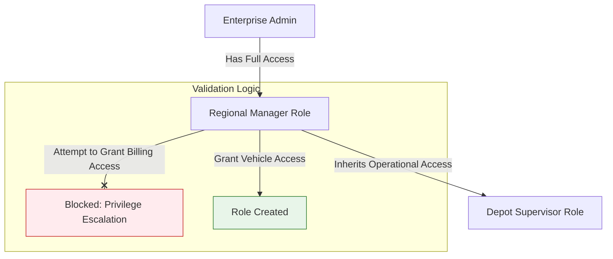

# Role-Based Access Control (RBAC)

Bolt V2 employs a centralized **Role-Based Access Control (RBAC)** system. This feature allows Administrators to define exactly _who_ can access _what_ within the platform. By creating granular roles, you ensure that a "Depot Manager" has full control over their warehouse but zero access to the company's "Billing & Wallet" settings.

#### 1. The RBAC Hierarchy Model

Understanding how permissions flow is critical to platform security. Bolt V2 follows a strict **Inheritance Rule**.

**The Golden Rule of Permissions:**

> "An Administrator can never grant a permission they do not possess themselves."

This prevents privilege escalation. If you are a "Regional Manager" without access to _Financial Reports_, you cannot create a role for your subordinate that allows _Financial Reports_ access.

**Permission Flow Diagram:**

#### 2. Default System Roles

When a new **Parent Organization** is created, the system automatically provisions two immutable roles to get you started:

| Role Name   | Access Level       | Intended Use                                                                        |
| ----------- | ------------------ | ----------------------------------------------------------------------------------- |
| **Admin**   | Full Manage (CRUD) | For the business owner or head IT administrator. Has control over all modules.      |
| **Visitor** | View Only          | For stakeholders or auditors who need to see maps and reports but cannot edit data. |

> **Note:** Child Organizations (Branches) do **not** receive these default roles automatically. You must create specific operational roles for sub-branches to maintain strict security boundaries.

#### 3. Creating & Managing Custom Roles

For most operations, you will need custom roles (e.g., "Fleet Operator," "Security Guard," "Accountant").

**3.1 The Role Creation Workflow**

1. Navigate to **Management Hub > User Roles**.
2. Click the **"Create Role"** button to open the configuration side-panel.
3. **Role Name:** Give it a descriptive title (e.g., "North\_Region\_Dispatcher").
4. **Organization:** Select which branch this role belongs to.

<figure><figcaption></figcaption></figure>

**3.2 Configuring Granular Permissions**

The RBAC engine allows you to toggle access at three levels: **Module**, **Feature**, and **Action**.

For each feature (e.g., _TripHub_), you can select:

* **No Access:** The module is completely hidden from the navigation bar.
* **View Only:** User can see data but cannot create or edit.
* **Manage:** User has full Create, Read, Update, Delete (CRUD) rights.

**Key Permission Modules:**

* **Management Hub:** Control over Users, Devices, Geofences, and SIM Inventory.
* **TripHub:** Access to Routes, HaltPoints, and Ad-Hoc Trip creation.
* **Settings:** Financial Wallet, Billing Plans, and Notification Recipients.
* **Reports:** Ability to generate or schedule specific analytic reports.
* **Map:** Real-time tracking, Immobilization, and Historical Replay.

<figure><figcaption></figcaption></figure>

<figure><figcaption></figcaption></figure>

**3.3 Editing an Existing Role**

Operational responsibilities often change. You can update a custom role at any time to add or remove capabilities.

1. Locate the specific role in the **User Roles** list.
2. Click the **Edit (Pencil)** icon.
3. The side-panel will reopen with the current permissions pre-loaded.
4. Adjust the toggles (e.g., upgrade "Map" from _View_ to _Manage_).
5. **Save Changes.**
   * **Impact:** The update applies instantly. Any user currently logged in with this role will see the new features appear (or disappear) immediately without needing to log out.

> **Constraint:** You cannot edit the system-defined **Admin** or **Visitor** roles. If you need a slightly modified Admin, clone it by creating a new role with similar permissions.

**3.4 Activating & Deactivating Roles**

If a role is no longer needed (e.g., "Seasonal Driver") but you don't want to delete it, you can disable it.

* **Deactivate:** Toggle the status switch to **OFF**.
  * **Result:** All users assigned to this role will lose access to the platform immediately. They may still be able to log in, but they will see a blank dashboard or "Permission Denied" errors.
* **Activate:** Toggle the switch back to **ON** to restore access permissions instantly.

<figure><figcaption></figcaption></figure>

**3.5 Viewing Role Details**

To audit a role without the risk of accidentally changing permissions:

1. Click the **View (Eye)** icon on the role row.
2. A read-only summary panel will appear.
3. This view provides a clear breakdown of every enabled module, which is useful for security audits or verifying what a specific user can see.

#### 4. User Assignment

Once a role is defined, it must be assigned to a user.

1. Navigate to **Management Hub > Users**.
2. Select a user or invite a new one via email.
3. **Role Assignment:** Select the Organization and the specific **Role** you just created.
4. **Impersonation (Admin Only):** To verify the role works as intended, Admins can use the "Impersonate" feature to temporarily log in as that user and see exactly what they see.

#### 5. Specialized Security Use Cases

**UC1: The "Ops-Only" Dispatcher**

* **Scenario:** A user needs to manage vehicles and trips but shouldn't see invoice data.
* **Configuration:**
  * **TripHub:** Set to `Manage`.
  * **Map:** Set to `View` + `Immobilize`.
  * **Settings/Billing:** Set to `No Access`.

**UC2: The "Finance" Auditor**

* **Scenario:** Needs to download invoices and recharge the wallet but shouldn't be able to stop vehicles.
* **Configuration:**
  * **Settings/Wallet:** Set to `Manage`.
  * **Map:** Set to `View Only`.
  * **Devices:** Set to `No Access`.

#### 6. Troubleshooting Permissions

| Error Message                      | Likely Cause                                          | Resolution                                                                                               |
| ---------------------------------- | ----------------------------------------------------- | -------------------------------------------------------------------------------------------------------- |
| **"Permission Validation Failed"** | You are trying to assign a permission you don't have. | Ask a Super Admin to upgrade your own role first.                                                        |
| **"Module Not Visible"**           | Role disabled or cache issue.                         | Ensure the Role is marked "Enabled" and refresh the browser to clear the sidebar cache.                  |
| **"Cannot Edit Admin Role"**       | System Constraint.                                    | Default roles cannot be modified. Clone the Admin role to a new "Super User" role and edit that instead. |

> **Audit Trail:** Every permission change—creating a role, editing access, or disabling a user—is logged in the **System Audit Trail** for compliance tracking.
