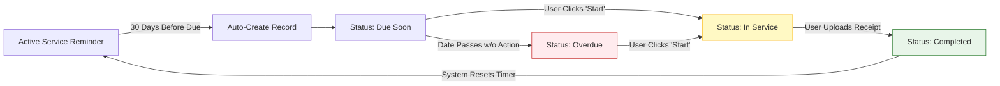

# Service Management System

The **Service Management System** in Bolt V2 is your centralized hub for preventing vehicle downtime. It automates maintenance schedules based on time, distance, or engine hours, ensuring your fleet remains compliant and operational.

The module is divided into two primary sections: **Service Reminders** (the automation engine) and **Service Records** (the actual execution history).

#### 1. Service Reminders (Automated Scheduling)

A Service Reminder is an automated rule you set up to alert you _before_ maintenance is required.

**1.1 Creating a Reminder**

1. Navigate to **Service Management > Service Reminders**.
2. Click the **"Create Service Reminder"** button to open the 3-step wizard.

**Step 1: Basic Information**

* **Device Group:** Select the specific group of vehicles this rule applies to.
* **Service Task:** Choose one or more standardized tasks (e.g., _Oil Change, A/C Diagnosis, Tyre Replacement_).

**Step 2: Configuration (The Rules)**

* **One-Time Config:** Use this if you only need a single alert (e.g., "Check battery next week").
* **Recurring Config:** Use this for continuous maintenance cycles.
  * **Due After (Days):** _Mandatory._ Sets the baseline time cycle (e.g., every 90 days).
  * **Due After (Km / Engine Hours):** _Optional._ The system will trigger the reminder based on whichever condition is met _first_.

**Step 3: Notification Receivers** Select who gets alerted (via Email, SMS, Push, etc.) when the service is due.

<figure><figcaption></figcaption></figure>

#### 2. Service Records (Tracking Execution)

While Reminders are the "rules," **Service Records** represent the actual maintenance events.

**2.1 How Records are Created**

* **Automatic Creation:** 30 days before a Recurring Reminder is due, the system automatically generates a Service Record and marks its status as **"Due Soon."**
* **Manual Creation:** If a vehicle breaks down unexpectedly, you can click **"Create Service Record"** to manually log an ad-hoc repair.

<figure><figcaption></figcaption></figure>

#### 3. The Servicing Lifecycle

Once a Service Record is created, it moves through a strict operational lifecycle to ensure accountability.

**Phase 1: Start Service**

When the vehicle arrives at the workshop:

1. Locate the record (Status: **Due Soon** or **Overdue**).
2. Click the **"Edit/Action"** menu and select to Start the service.
3. Enter the **Started On** date.

* _Result:_ The status updates to **"In Service."**

<figure><figcaption></figcaption></figure>

**Phase 2: Complete Service**

When the mechanic finishes the job:

1. Locate the record (Status: **In Service**).
2. Enter the **Completed On** date.
3. **Upload Service Receipt:** Attach the mechanic's invoice or job card (PDF/JPG) for your digital audit trail.

* _Result:_ The status updates to **"Completed."**

#### 4. Process Flow Diagram

The following diagram illustrates how the system loops from a Reminder to a completed Record, and back again.

#### 5. Troubleshooting & Edge Cases

| Scenario                                 | System Behavior                                                                                                                                                 |
| ---------------------------------------- | --------------------------------------------------------------------------------------------------------------------------------------------------------------- |
| **Service is delayed past the due date** | The record status automatically shifts from "Due Soon" to **"Overdue."** Notifications may escalate depending on your settings.                                 |
| **I paused a Service Reminder**          | Disabling a reminder stops future records from generating. When you Re-enable it, the countdown timer restarts based on your recurring configuration.           |
| **I need to view past service receipts** | Navigate to the "Completed" records, click the record row, and view the **Service History** panel. You can download historical receipts directly from the grid. |

<figure><figcaption></figcaption></figure>
