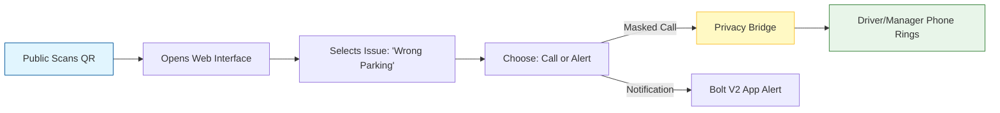

# StiQR

**StiQR** is a privacy-first communication tool that bridges the gap between your physical fleet and the public. By placing a secure, unique QR code on your vehicles or heavy assets, you enable citizens, authorities, or other drivers to contact you immediately regarding blocked driveways, emergencies, or parking issues—**without ever exposing your personal phone number.**

#### 1. How StiQR Works

The system is designed for speed and privacy. It removes the friction of "finding the owner" while protecting your driver's identity.

**The Public Interaction Flow:**

#### 2. Generating & Assigning StiQRs

Before a QR code can be used, it must be generated and linked to an asset in the Bolt V2 platform.

**2.1 Creating a New Batch**

1. Navigate to **Management Hub > StiQR**.
2. Click **"Generate New Batch"**.
3. **Select Quantity:** You can generate single codes or bulk batches for your entire fleet.
4. **Download:** The system produces a high-resolution print file (PDF/SVG) ready for sticker printing.

<figure><figcaption></figcaption></figure>

**2.2 Linking to a Vehicle**

Once printed and stuck to a vehicle (e.g., on the windshield or bumper):

1. Open the **Bolt Mobile App** or Web Dashboard.
2. Select the **Vehicle** you are onboarding.
3. Choose **"Link StiQR"** and scan the physical sticker (or enter the unique ID manually).
4. **Validation:** The system checks your license count. If valid, the QR is instantly active and mapped to that vehicle's primary contact.

#### 3. Privacy & Communication Settings

You have full control over _how_ the public can reach you. These settings can be configured at the Fleet level or Asset level.

* **Masked Calling:** The caller dials a virtual number. The system forwards the call to your driver, but the caller never sees the driver's real mobile number.
* **Wi-Fi / VoIP Call:** Allows contact via data connection, useful if the vehicle is in a roaming zone.
* **Emergency Alert Only:** If you prefer not to receive calls, you can restrict interaction to "Notifications Only." The user will select a reason, and you will receive a high-priority push notification.

<figure><figcaption></figcaption></figure>

#### 4. Operational Use Cases

**UC1: The "Blocked Driveway" Scenario**

* **Situation:** Your delivery truck is temporarily blocking a resident's garage.
* **Old Way:** Resident calls the police or a tow truck.
* **StiQR Way:** Resident scans the code, taps **"Vehicle Blocking Way,"** and the driver gets an instant alert to move the vehicle. **Result:** No fines, no towing.

**UC2: Emergency Safety (Pet/Baby Onboard)**

* **Situation:** A passerby notices a pet locked in a vehicle on a hot day.
* **Action:** They scan the QR and select **"Emergency / Safety Issue."**
* **System Response:** This triggers a "Critical Alert" that bypasses Do-Not-Disturb settings on the Fleet Manager's phone.

**UC3: Asset Replacement**

* **Situation:** A windshield is replaced, destroying the old sticker.
* **Action:** Peel off a new StiQR sticker, scan it in the app, and select **"Relink to \[Vehicle ID]."**
* **Result:** The old QR is deactivated immediately. All historical data and contact rules are seamlessly transferred to the new sticker.

#### 5. Managing the StiQR Lifecycle

The **StiQR Dashboard** gives you an overview of public interactions.

* **Scan Logs:** See how many times a vehicle was scanned and the GPS location of the scanner. High scan rates might indicate a driver who frequently parks poorly.
* **Deactivation:** If a vehicle is sold, simply click **"Unlink/Deactivate"** to render the QR code useless, ensuring the new owner receives no calls meant for you.

#### 6. Troubleshooting

| Issue                        | Likely Cause   | Solution                                                                 |
| ---------------------------- | -------------- | ------------------------------------------------------------------------ |
| **"QR Invalid" Message**     | Not Linked     | The sticker is fresh but hasn't been mapped to a vehicle in the app yet. |
| **Calls not connecting**     | License/Credit | Check your "Masked Calling" credit balance in the Wallet.                |
| **"Owner Disabled Calling"** | Privacy Mode   | The fleet manager has set this vehicle to "Notification Only."           |
