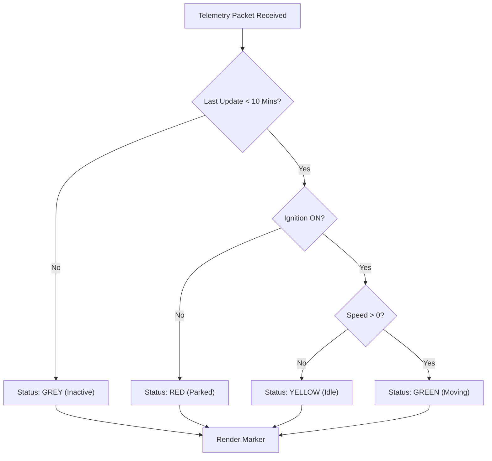

# Vehicle Status & Marker Legend

The Live Tracking map uses a comprehensive visual language to communicate the real-time status of your fleet at a glance. Understanding these color codes and icons is essential for quick decision-making and operational awareness.

#### 1. Vehicle Status Colors

Each vehicle marker on the map is color-coded based on its real-time telemetry data. This "Traffic Light" system allows you to instantly assess fleet activity.

| Status       | Color      | Hardware Condition              | Operational Meaning                                                                                                                       |
| ------------ | ---------- | ------------------------------- | ----------------------------------------------------------------------------------------------------------------------------------------- |
| **Moving**   | **Green**  | Ignition **ON** + Speed **> 0** | The vehicle is on an active trip and moving towards its destination.                                                                      |
| **Idle**     | **Yellow** | Ignition **ON** + Speed **= 0** | The engine is running, but the vehicle is stationary. Excessive idling may indicate traffic, loading/unloading, or fuel wastage.          |
| **Parked**   | **Red**    | Ignition **OFF**                | The vehicle is completely shut down. The engine is off, and it is parked at a location.                                                   |
| **Inactive** | **Grey**   | No Data > **10 Mins**           | The device has stopped communicating with the server. This could be due to a power cut, dead battery, or cellular network loss (No GPRS). |

> \[!SCREENSHOT\_MARKER] **Capture Location:** The Live Map view (`src/app/portal/maps/components/maps`). **Target:** A cluster or group of vehicles showing examples of Green (Moving), Yellow (Idle), Red (Parked), and Grey (Inactive) markers side-by-side.

#### 2. Vehicle Type Icons

Bolt V2 differentiates assets not just by status, but by type. The system renders distinct SVG silhouettes for various asset classes to help dispatchers distinguish between resources.

* **Car:** Standard sedan silhouette.
* **Truck:** Heavy-duty logistics vehicle profile.
* **Bike:** Motorcycle icon for last-mile delivery.
* **Ambulance:** Emergency vehicle marked with a medical cross.
* **ID Card:** Used for personal trackers or high-value cargo tags (non-vehicular).

> \[!SCREENSHOT\_MARKER] **Capture Location:** The "Asset Type" filter dropdown or a map view populated with mixed vehicle types. **Target:** Distinct icons for a Truck, Bike, and Ambulance visible on the map.

#### 3. Advanced Status Indicators

Beyond the basic color, the marker itself can display badges to indicate critical alerts or configurations.

**3.1 Immobilization Badge**

* **Symbol:** A small **Lock Icon** overlaying the vehicle marker.
* **Meaning:** The vehicle's starter relay has been remotely cut via the "Immobilize" command. The driver will not be able to restart the engine until it is unlocked.

**3.2 Alert Pulsing**

* **Visual:** The marker radiates a concentric "Pulse" animation.
* **Meaning:** A high-priority alert (SOS/Panic Button, Crash Detection, or Geofence Breach) has been triggered within the last minute.

> \[!SCREENSHOT\_MARKER] **Capture Location:** A vehicle marker on the map that has been "Immobilized." **Target:** Close-up of the marker showing the overlay "Lock" icon.

#### 4. Logic Flow: Status Determination

The system follows a strict hierarchy to determine which color to display. "Inactive" status always takes precedence over ignition data to ensure you know when data is stale.

#### 5. Troubleshooting Status Issues

| Symptom                                 | Likely Cause       | Resolution                                                                                      |
| --------------------------------------- | ------------------ | ----------------------------------------------------------------------------------------------- |
| **Marker stuck on "Moving"**            | GPS Latch / Freeze | The device may have lost GPS fix while moving. Check the "Satellites" count in the sensor card. |
| **Vehicle is running but shows "Grey"** | Network Blindspot  | The vehicle is in a basement or tunnel. Data will "burst" upload once connectivity is restored. |
| **"Idle" for hours**                    | Driver Behavior    | Driver may be sleeping with AC on. Check "Fuel Consumption" to verify waste.                    |

> \[!SCREENSHOT\_MARKER] **Capture Location:** The Vehicle Detail/Sensor Card panel (`src/app/portal/maps/components/mapsScreen`). **Target:** The "Satellites" and "Last Updated" fields which are critical for diagnosing status issues.
