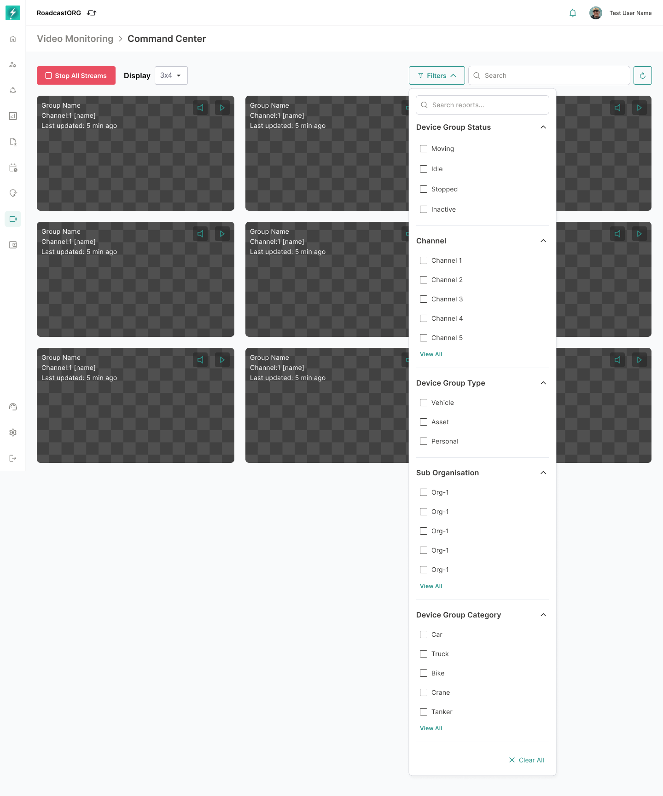

## 10. Command Center Filters, Search and Sorting

Command Center must support fast narrowing of stream cards.

*Filter panel and applied filtering behavior for narrowing the live-stream grid.*

### 10.1 Filter Categories

The current interface includes the following filter categories:

- Device Group Status.
- Device Group Type.
- Device Group Category.
- Sub Organisation.
- View by Incident.
- Channel Streams.
- Channels.
- Favourites.

### 10.2 Search

Search should support device group name, vehicle number, owner/driver name and channel labels where available.

### 10.3 Applied Filter State

When filters are applied:

- Show applied chips.
- Allow individual chip removal.
- Provide `Clear filters & reload` when no streams match.
- Maintain selected layout and sort state.

### 10.4 Sorting

Sorting should support operationally useful fields such as:

- Last updated.
- Incident priority.
- Stream status.
- Device group name.
- Vehicle status.
- Favourites.

Default sorting rule:

- By default, devices/streams are sorted by `Last Updated`, with the most recently updated stream shown first.
- Sorting should be applied before pagination wherever technically possible. This ensures Page 1 contains the most recently updated streams from the full eligible result set, not just the newest streams within a pre-loaded chunk.
- The default sort should be deterministic. If two streams have the same last-updated value, use device group name or device ID as the secondary sort.
- Active real-time incidents should be highlighted with a red border, but they should not automatically override the default `Last Updated` sort.
- If the user selects `Incident Priority`, active incident streams should be shown first, ordered by severity and then by last updated.
- Sort choice should persist during the session and should not reset when filters are applied, removed or when the user moves between paginated pages.

---
