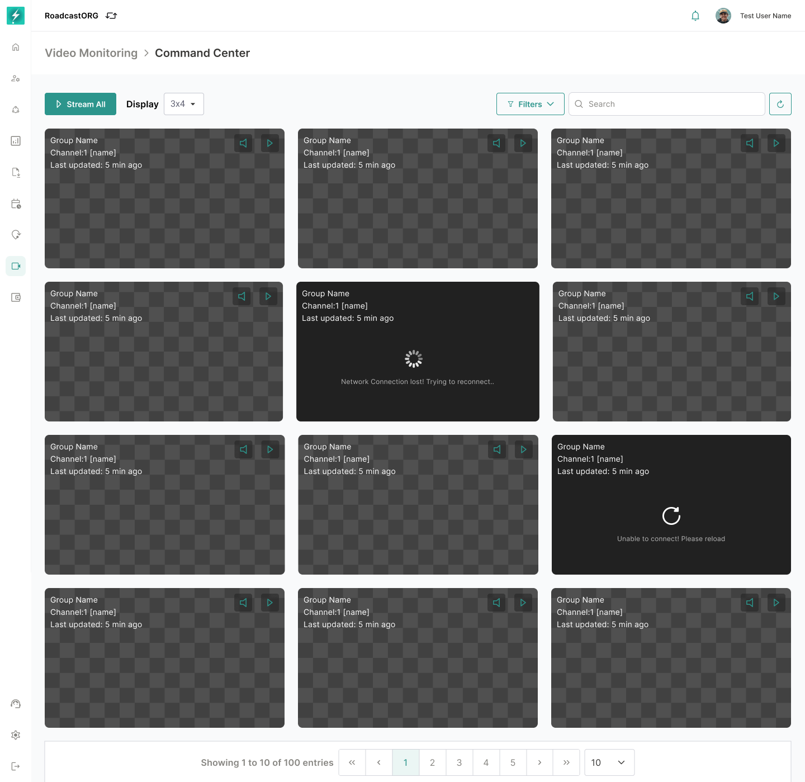
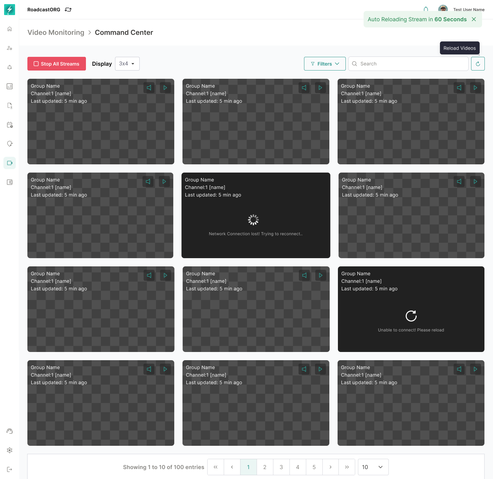

## 9. Command Center

Command Center is the main live monitoring workspace. It should give users a high-density overview of camera streams while still surfacing the most important risk signals through the AI Insights panel.

*Command Center showing the stream grid, stream states, controls, pagination and monitoring workspace.*

### 9.1 Layout

The page contains:

- Breadcrumb: `Video Monitoring > Command Center`.
- Primary stream action: `Stream All` or `Stop All Streams` depending on active state.
- Grid layout selector.
- Sort control.
- Filters control.
- Search input.
- Optional view switcher for grid/list view where supported.
- Fullscreen action.
- Stream grid.
- Right-side AI Insights panel.

The stream grid must remain the primary focus. AI insights should guide attention without taking over the monitoring layout.

### 9.2 Grid Layouts

The current module supports layout options such as `3x4`, `4x3`, `5x3` and `6x3`.

Implementation rule:

- Supported layouts should be configurable based on performance capacity and screen size.
- Layout naming should be consistent across product and design.
- The selected layout should persist for the user where possible.
- Fullscreen mode should preserve the selected layout and hide non-critical chrome.

### 9.3 Pagination and Chunk Loading

Streams are paginated and loaded in chunks. The Command Center should not attempt to load every accessible stream into the browser at once.

Rules:

- The stream grid should support a page view of up to 50 stream cards.
- All eligible streams on the current page view, up to 50, can be played simultaneously.
- Pagination should work together with search, filters, sorting and selected grid layout.
- Sorting and filters should be applied to the eligible dataset before pagination wherever backend support is available, so the user does not only sort the currently loaded chunk.
- `Stream All` applies to eligible streams on the current page view only.
- `Stop All Streams` stops streams on the current page view.
- When the user changes page, the system should release or stop stream sessions that are no longer visible unless a separate background-play behavior is explicitly introduced later.
- The UI should show pagination state clearly, such as current page, total entries and entries shown.

### 9.4 Stream Card

Each stream card should show:

- Device group or vehicle label.
- Channel label.
- Last updated timestamp.
- Live/offline/reconnecting state.
- Active incident label where applicable.
- Stream video or placeholder.
- Data rate where available.
- Channel actions.
- Selection/favourite state where supported.

When a real-time incident is happening on a stream, the stream card must enter an active incident state. The active incident state is shown through a red border around the stream box and an incident label on the card.

Rules:

- Apply the red border only to streams with an active real-time incident.
- Show the active incident name where space allows, such as Drowsiness, Distraction, Smoking, Harsh Braking, Forward Collision, Seatbelt or Driver Not in View.
- Keep the red border visible while the incident is active or until the incident expires based on system timeout.
- If multiple incidents are active on the same stream, show the highest-severity incident first.
- The red border is a visual alert state and should not automatically move the stream card unless the user changes the sort option to incident priority.
- Normal live streams should not use the red border, even if the device has older historical incidents.

### 9.5 Stream States

| State | UI Behavior |
|---|---|
| Not started | Shows placeholder and can be started manually or through Stream All. |
| Connecting | Shows loading indicator and connection progress. |
| Live | Shows current video feed and live status. |
| Network issue | Shows failure state with retry option and auto-retry messaging. |
| Reconnecting | Shows reconnecting status and should not duplicate stream sessions. |
| Offline | Shows unavailable state and prevents repeated unnecessary retry calls. |
| No match | Empty state when filters/search remove all streams from the view. |

The user must be able to differentiate a camera/device issue from a filter issue.

### 9.6 Bulk Stream Actions

`Stream All` should attempt to start all eligible streams on the current paginated page view. Because a page view supports up to 50 streams, Stream All may start up to 50 simultaneous streams when all streams on the page are eligible.

`Stop All Streams` should stop active streams in the current paginated page view and release resources.

Rules:

- Disabled or unsupported channels should be skipped and counted separately if required.
- Bulk actions should respect the current page, filters and stream eligibility.
- Bulk actions should not override filters silently.
- If some streams fail, show partial-success feedback.
- Stopping all streams should not clear the selected filters or layout.
- The system should prevent repeated rapid clicks from creating duplicate stream sessions.

### 9.7 Stream Recovery

*Stream recovery states showing failed connections, retry controls and auto-reload behavior.*

When streams fail, the system should show a clear error such as `Network issue`, `Connection to stream lost` or `Unable to connect`. Recovery behavior should include:

- Manual retry at stream-card level.
- Page-level retry where multiple streams fail.
- Auto-retry countdown where supported.
- Clear indication of how many streams failed.
- Stream health counts in the AI Insights/status area.

The UI should avoid making users guess whether the problem is device offline, network failure, browser failure or unavailable stream token.

---
