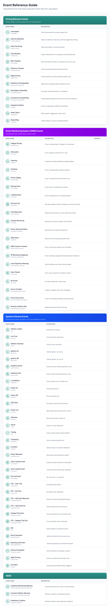

## 18. Event Reference Guide

The Event Reference Guide should help users understand what each system-generated event means.

*Event reference panel grouping driving, driver-monitoring, device and ADAS event definitions.*

The reference guide groups events into:

- Driving Behavior Events.
- Driver Monitoring System events.
- System & Device Events.
- ADAS events.

Each event definition should include:

- Event name.
- Description.
- Severity mapping.
- Supported camera/device models.
- Whether video evidence is expected.
- Whether it appears in Command Center insights, PAP Incidents or both.

This guide should be accessible from PAP Incidents and potentially from the event filter or incident detail page.

---
