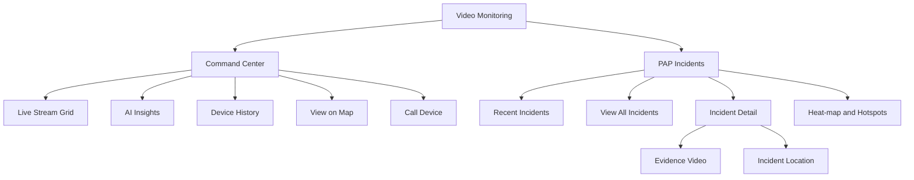

## 7. Information Architecture

The Video Monitoring module should contain two primary navigation entries:

1. **Command Center**
   - Live stream grid.
   - Stream controls.
   - Search, sort, filters and favourites.
   - AI Insights panel.
   - Fleet distribution and stream/device status.
   - Actions: snapshot, recording, call, map, history, incident-centric view.

2. **PAP Incidents**
   - Recent incidents.
   - View all incidents.
   - Severity metrics.
   - Incident cards.
   - Incident detail.
   - Incident heat-map and hotspots.
   - Event reference guide.

Supporting workflows are opened from these pages:

- Device History.
- View on Map.
- Incident Details.
- Evidence download.
- Incident-centric live stream view.

---
