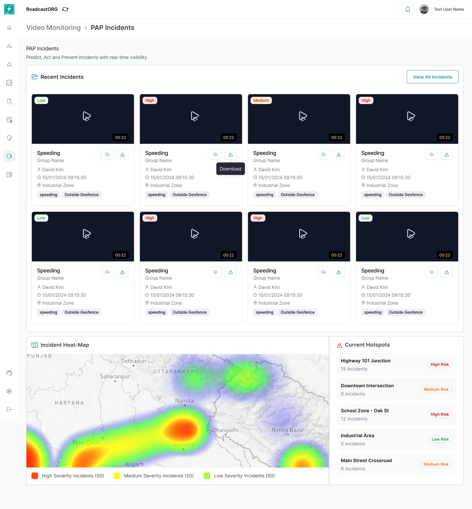
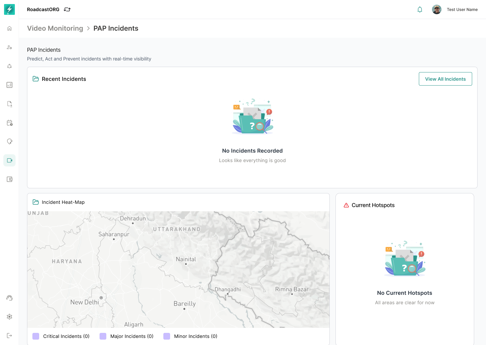

## 14. PAP Incidents

PAP Incidents is the evidence and incident-intelligence page. PAP stands for Predict, Act and Prevent as reflected in the product copy.

*PAP Incidents dashboard with recent incidents, severity summaries, heat-map and current hotspots.*

### 14.1 Landing Page

The page should show:

- Breadcrumb: `Video Monitoring > PAP Incidents`.
- Title and helper copy.
- Recent incident cards.
- `View All Incidents` action.
- Severity summary metrics.
- Incident heat-map.
- Current hotspots.

### 14.2 Empty State

When no incidents exist:

*Empty PAP Incidents state with no recorded incidents and no current hotspots.*

- Show `No Incidents Recorded` or equivalent copy.
- Do not show misleading severity counts.
- Hotspot area should show `No Current Hotspots`.
- The page should still allow navigation back to Command Center.

### 14.3 Severity Metrics

The current interface shows high, medium and low severity counts. The wider platform may also use critical, major and minor labels.

Implementation rule:

- Use one severity taxonomy consistently across Video Monitoring.
- Recommended taxonomy: `Critical`, `High`, `Medium`, `Low` if the wider Bolt alert system supports four levels.
- If the current backend only supports three levels, use `High`, `Medium`, `Low` and map legacy critical/major/minor labels during migration.

### 14.4 Incident Card

Each card should show:

- Thumbnail/video preview.
- Play affordance.
- Severity badge.
- Incident name.
- Device/group identifier.
- Timestamp.
- Location.
- Download action where permitted.

Cards should open Incident Details when clicked.

---
