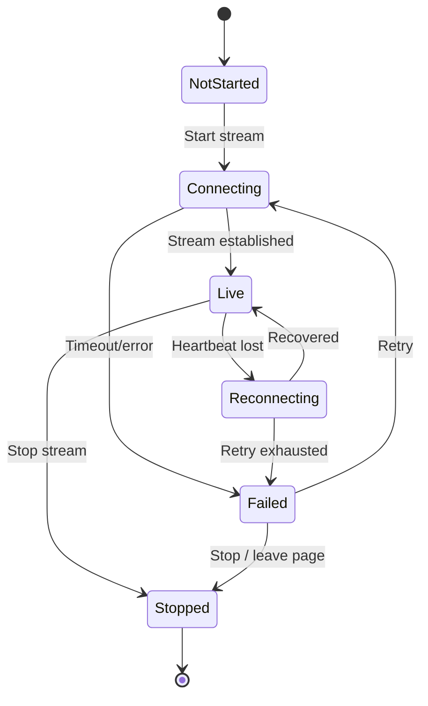

## 21. System Rules

### 21.1 Stream Eligibility

A camera channel can be streamed only when:

- The user has video permission.
- The device is assigned to the user's accessible organisation/device group.
- The device supports live streaming.
- A valid stream token/session can be created.
- Device/network status allows a stream attempt.

### 21.2 Channel Capability

Not all devices support every action. The system should check capability before showing or enabling:

- Live stream.
- Intercom/call.
- Snapshot.
- Recording.
- Device History.
- Multi-channel playback.
- AI incident generation.

Unsupported actions should be hidden or disabled with a clear reason.

### 21.3 Stream Lifecycle

### 21.4 Evidence Integrity

Incident evidence must preserve:

- Original timestamp.
- Device/channel source.
- Location context.
- Incident type and severity.
- Clip generation status.
- User access and download audit.

Evidence metadata should not be overwritten by later edits to vehicle name, driver assignment or group name. Display names may update, but raw identifiers and original event metadata must remain traceable.

---
